## git 一些实践操作

## 1 基本操作

创建`git`仓库，初始化仓库，创建`learn.txt`文件，初始化并作提交

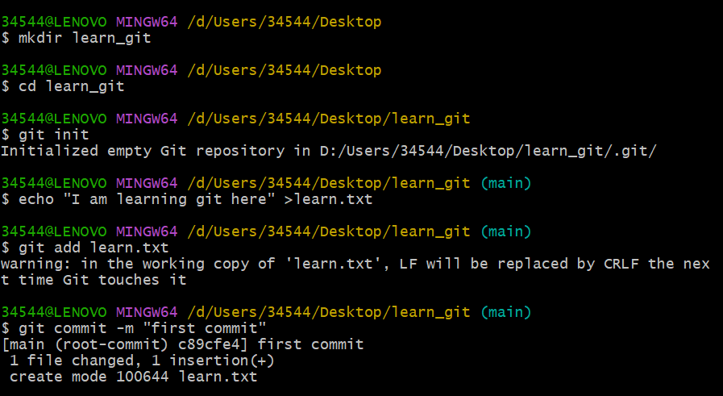

创建`develop`分支，进行修改并提交，回到`main`分支做不同的修改后提交，然后进行合并发现报错

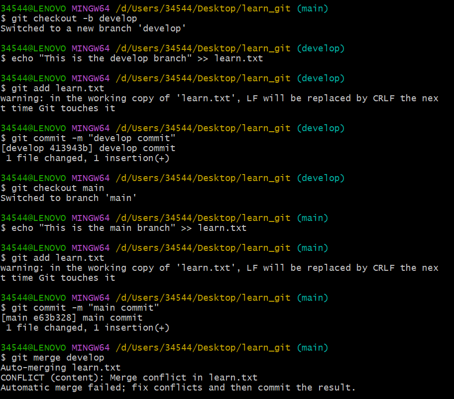

查看`learn.txt`


手动修改冲突：

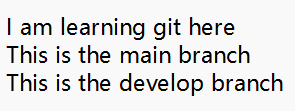

进行提交

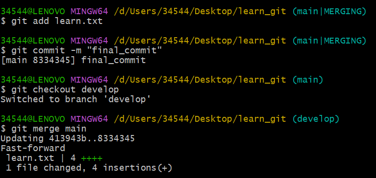

# 2 远程仓库操作

创建远程仓库，`clone`到本地进行修改

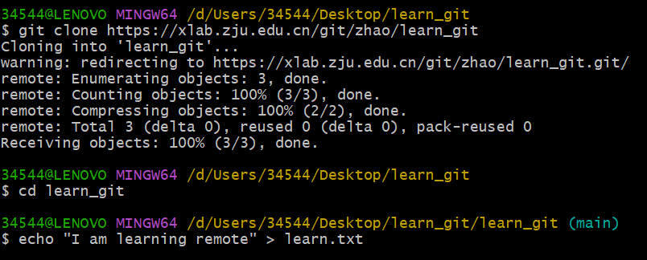

提交

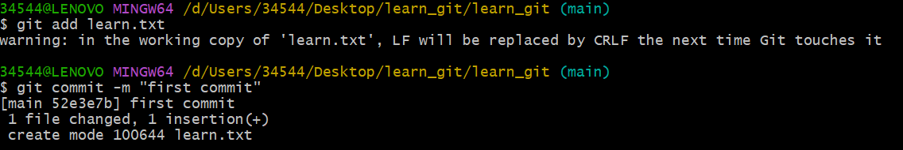

上传到远程仓库

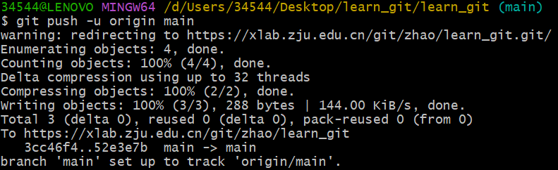

结果如下：

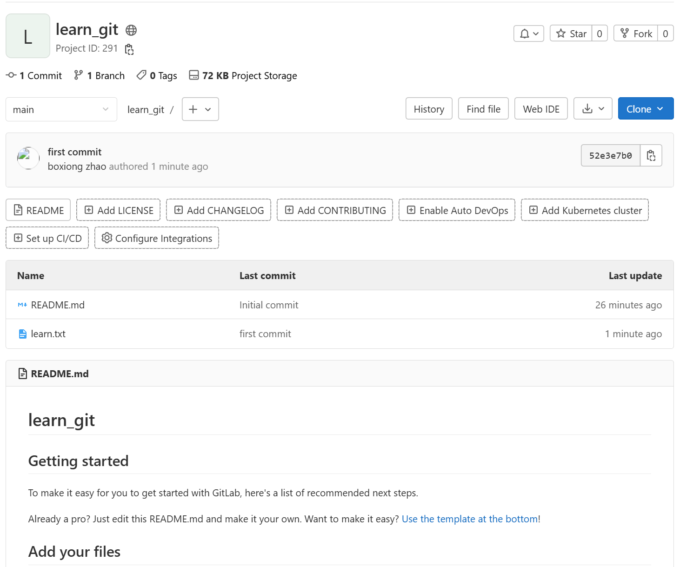


# 3 遇到的一些问题

> [!cAUTION]
>
> 我创建了远程仓库勾选了创建README，然后在本地创建仓库上传的时候报错说冲突，于是我把远程仓库`clone`到本地才进行了修改。实际上是这样的：
>
> >GitHub 创建新仓库时，**不要勾选初始化 README/License**，否则它就不是空仓库，第一次 push 会因为历史冲突失败。


> 下面是补充的一些内容

# 4 git 版本管控

> 参考文献：https://blog.csdn.net/lihefei_coder/article/details/103233768

### master(主分支)

存在一条主分支（master）。所有用户可见的正式版本，都从master发布。主分支作为稳定的唯一代码库，不做任何开发使用。

### develop(开发分支)

存在一条开发分支（develop）。这个分支维护了当前开发中代码的主线，始终保持代码新于master。持续集成、最新隔夜版本的生成等都是基于这个分支。由于当前版本迭代较快，开发分支只提供拉取，不进行实际开发。

### feature(功能分支)

临时性多个功能分支（feature）。从develop拉取。开发feature完成，merge回develop。为了降低对其他feature的影响，一般在提测前`mergre`回develop分支。

功能分支的名字，可以采用`feature-*` 的形式命名。

创建一个功能分支：

```bash
git chechout -b feature-x develop
```

开发完成后，将功能分支合并到develop分支：

```bash
git checkout develop 
git merge --no-ff feature-x
```

删除feature分支：

```bash
git branch -d feature-x
```

### release(预发布分支)

临时性多个预发布（测试）分支（release），用于QA测试。从develop拉取，测试完成merge回master和develop。如果测试期间，有其他版本合并入master，需要同步到release版本，并进行测试。

| 拉取源  | 合并目标         | 修改 | 生命期     |
| ------- | ---------------- | ---- | ---------- |
| develop | master & develop | 允许 | 合并后删除 |

创建一个预发布分支：

```bash
git checkout -b release-1.2 develop  #这里是基于develop分支进行创建分支
```

确认没有问题后，合并master分支：

```bash
git checkout master
git merge --no-ff release-1.2
```

对合并生成的新节点，做一个标签

```bash
git tag -a 1.2
```

再合并到develop分支：

```bash
git checkout deveop
git merge --no-ff release-1.2
```

最后，删除预发布分支：

```bash
git branch -d release-1.2
```

### hotfix(修补bug分支)

临时性多个bug修复分支（fixbug），用于修复线上问题。从master拉取，修复并测试完成merge回master和develop。

| 拉取源 | 合并目标         | 修改 | 生命期     |
| ------ | ---------------- | ---- | ---------- |
| master | master & develop | 允许 | 合并后删除 |


# 5 合并分支

> 首先有几个问题我之前理解错了

### 5.1 冲突的理解

```bash
# main 分支
README.md 改了一些文档

# dev 分支
code.py 改了算法逻辑
```

你改了你那边的，我改了我的，互不干扰，==无冲突==

****

```python
# 共同祖先版本
# main 分支改了第二行
def hello():
    print("Hello, user")

# dev 分支在函数后加了一行
def hello():
    print("Hello World")
```

虽然是同一个文件，但改动位置不冲突，Git 可以自动把它们合起来，仍然==无冲突==

------

==有冲突==的例子（修改相同行）

如果两个分支都对**同一行**代码做了不同修改，那 Git 就“傻住了”，不知道到底该保留哪一行。这时候就需要你手动来“评判”。

### 5.2 合并后的情况

* **无冲突合并：**Git 会自动完成合并，将结果直接提交到仓库（或快进更新），你无需手动 add 或 commit。

* **冲突合并：**解决冲突后需手动 add 冲突文件并 commit 完成合并。

### 5.3 关于合基与变基

> 首先几个问题不要理解错了：
>
> * 谁执行merge，谁的指针前移；被merge的分支，指针不动
> * **`git rebase` 只是将提交“移动”到另一个分支的后面**
>
> > 这里也错误理解了

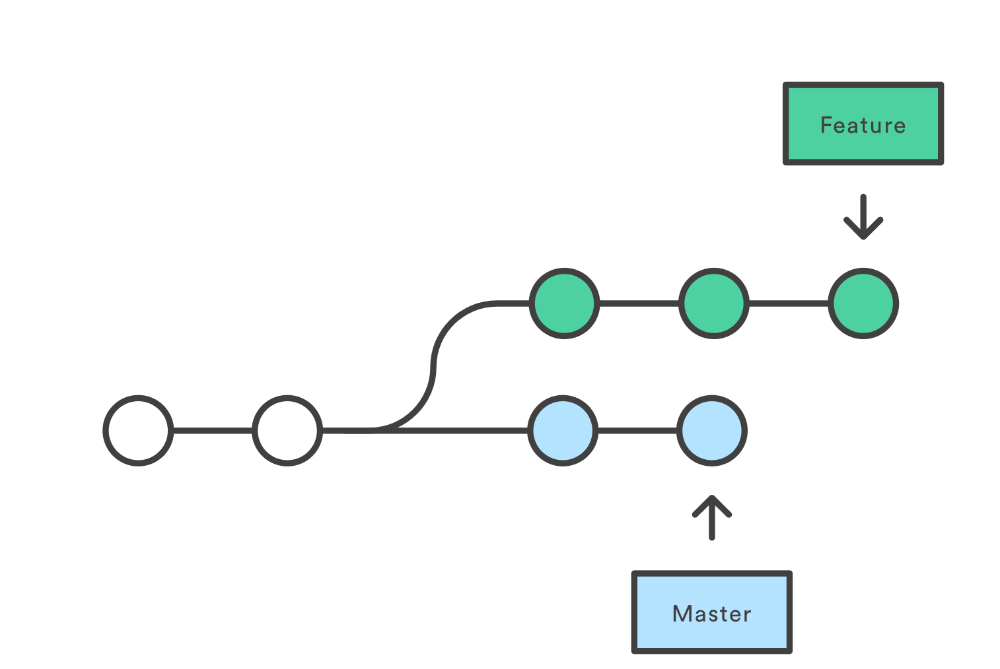

问题背景理解：你在一个专门的分支上开始开发一个新功能，然后另一个团队成员更新了 `main` 分支并添加了新的提交。

#### 合基

我们在feature合并main分支

```bash
git checkout feature
git merge main
#或者简化成一行，后面的是被合并的
git merge feature main
```

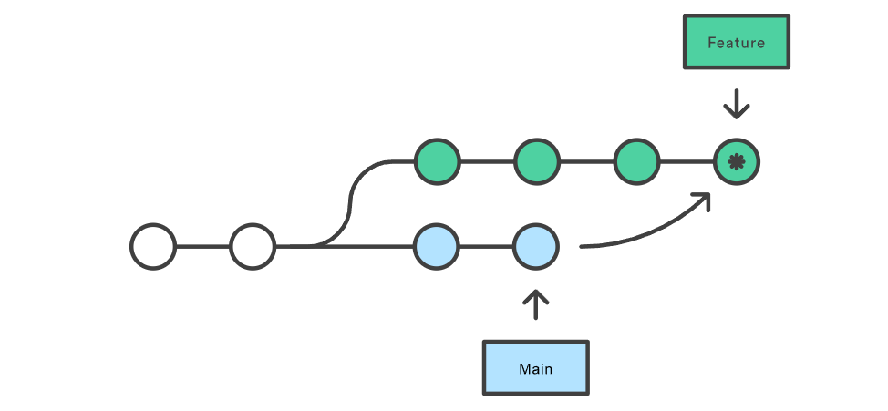

如果合并非常活跃，会污染功能分支的历史

#### 变基

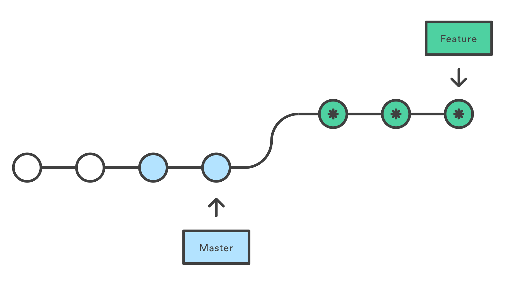

```bash
git checkout feature
git rebase main
```

> 参考文献：https://www.atlassian.com/git/tutorials/merging-vs-rebasing

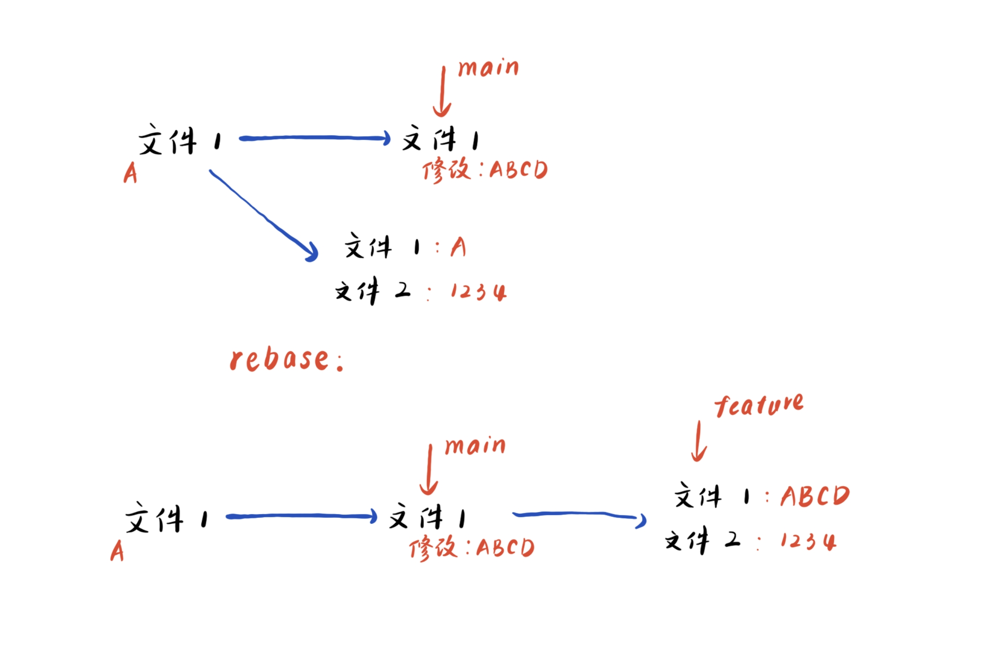

我搞错了。并不是文件内容没有变。相当于之前对main进行了修改，然后feature合并过去是相当于对这些main的修改再做修改。

就是对main的每个修改，都再执行一遍feature的修改

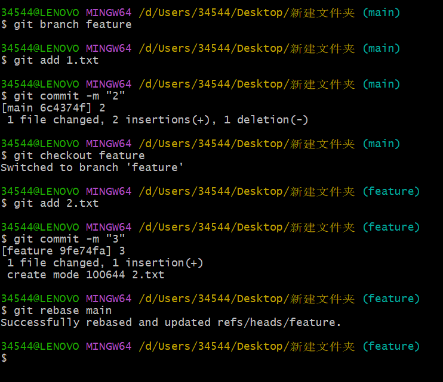

所以说这个还会有冲突的，如果修改了同一个位置会有冲突，还是需要手动解决的。