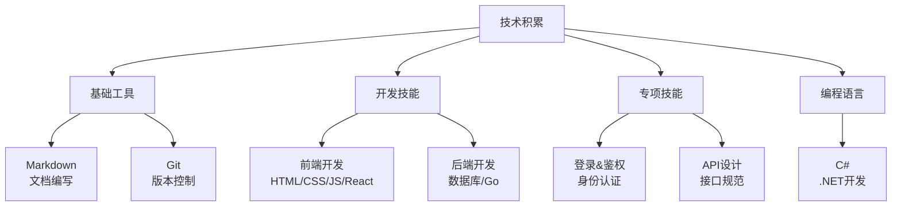

## 🧠 技术积累

欢迎来到技术积累区域！这里汇集了课外自学的各种技术知识和实践经验。

## 🎯 学习路线

### 📝 文档编写
- **[Markdown](markdown/index.md)** - 轻量级标记语言，文档编写首选
- **[Git](git/index.md)** - 版本控制系统，代码管理必备

### 💻 开发技能
- **[前端开发](前端/index.md)** - Web前端技术栈，用户界面开发
- **[后端开发](后端/index.md)** - 服务器端技术，业务逻辑处理

### 🔧 编程语言
- **[编程语言概览](编程语言/index.md)** - 各种编程语言学习记录
- **[C#](编程语言/C#.md)** - Microsoft .NET平台开发语言

### 🔐 专项技能
- **[登录&鉴权](登录&鉴权.md)** - 用户身份认证与权限管理
- **[API设计](api的制定.md)** - 接口设计规范与最佳实践

---

## 🗺️ 技术地图

---

## 📊 学习统计

| 技术领域 | 文档数量 | 学习状态 | 实践项目 |
|----------|----------|----------|----------|
| 📝 Markdown | 3篇 | ✅ 熟练 | 多个文档项目 |
| 📦 Git | 3篇 | ✅ 熟练 | 版本控制实践 |
| 🎨 前端开发 | 8篇 | 🟡 学习中 | 个人网站 |
| ⚙️ 后端开发 | 3篇 | 🟡 学习中 | 待实践 |
| 🔧 编程语言 | 2篇 | 🟡 学习中 | C#项目 |
| 🔐 专项技能 | 2篇 | 🟡 学习中 | 待实践 |

---

## 🚀 学习进度

### ✅ 已掌握
- **Markdown**: 文档编写、语法规范、工具使用
- **Git**: 版本控制、分支管理、协作开发

### 🟡 学习中
- **前端技术**: HTML、CSS、JavaScript、React框架
- **后端技术**: 数据库设计、Go语言开发
- **C#**: .NET平台开发、面向对象编程
- **登录鉴权**: 用户认证、权限管理、安全机制
- **API设计**: 接口规范、RESTful设计、文档编写

---

