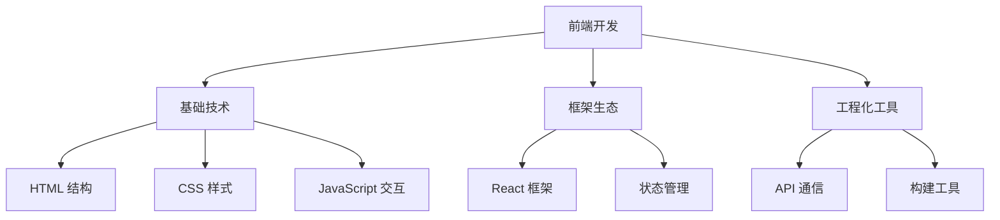

## 🎨 前端开发

前端开发专注于用户界面和用户体验，是Web开发的重要组成部分。

## 📚 学习路线图

---

## 🎯 核心技术栈

### 🏗️ 基础技术

#### HTML - 页面结构
掌握语义化标签和现代HTML特性。

[📖 学习HTML](../前端三大件/HTML.md){ .md-button .md-button--primary }

**主要内容:**
- 语义化标签使用
- 表单设计与验证
- 多媒体内容嵌入
- 响应式图片处理

#### 🎨 CSS - 样式设计
从基础样式到高级布局技术。

[🎨 学习CSS](../前端三大件/CSS.md){ .md-button .md-button--primary }

**主要内容:**
- 选择器与层叠规则
- Flexbox 与 Grid 布局
- 动画与过渡效果
- 响应式设计原理

#### ⚡ JavaScript - 动态交互
现代JavaScript编程技巧和ES6+特性。

[⚡ 学习JavaScript](../前端三大件/JS.md){ .md-button .md-button--primary }

**主要内容:**
- ES6+ 语法特性
- 异步编程模式
- DOM 操作技巧
- 模块化开发

---

### 🚀 框架与生态

#### ⚛️ React - 现代框架
构建复杂用户界面的利器。

[⚛️ 学习React](../前端三大件/React.md){ .md-button .md-button--primary }

**主要内容:**
- 组件化开发思想
- Hooks 使用技巧
- 状态管理方案
- 性能优化策略

#### 🌐 API通信
前后端数据交互的核心技术。

[🌐 学习Fetch API](../前端三大件/fatch api.md){ .md-button .md-button--primary }

**主要内容:**
- Fetch API 使用
- 异步数据处理
- 错误处理机制
- 跨域问题解决

---

## 📊 技能掌握度

| 技术栈 | 掌握程度 | 项目经验 | 学习重点 |
|--------|----------|----------|----------|
| 🏗️ HTML | ✅ 熟练 | 多个项目 | 语义化优化 |
| 🎨 CSS | ✅ 熟练 | 响应式布局 | 动画效果 |
| ⚡ JavaScript | 🟡 良好 | 交互功能 | 高级特性 |
| ⚛️ React | 🟡 学习中 | 小型项目 | 状态管理 |
| 🌐 API | 🔵 入门 | 简单调用 | 错误处理 |

---

## 🎯 学习建议

### 📈 推荐学习路径

!!! tip "循序渐进"
    1. **HTML基础** - 掌握页面结构设计
    2. **CSS样式** - 学会美化页面外观
    3. **JavaScript** - 实现动态交互功能
    4. **React框架** - 构建复杂应用
    5. **API集成** - 实现前后端通信

### 🛠️ 实践项目

!!! info "推荐项目"
    - 📱 **个人作品集网站** - 综合应用HTML/CSS/JS
    - 🛒 **电商产品页面** - 练习响应式设计
    - 📝 **待办事项应用** - 学习React状态管理
    - 🔗 **API数据展示** - 掌握前后端交互

### 📚 学习资源

- **[前端开发概览](../前端三大件/关于前端.md)** - 了解前端开发全貌
- **MDN Web Docs** - 权威技术文档
- **React官方文档** - 最新框架特性
- **GitHub项目** - 优秀开源项目学习 