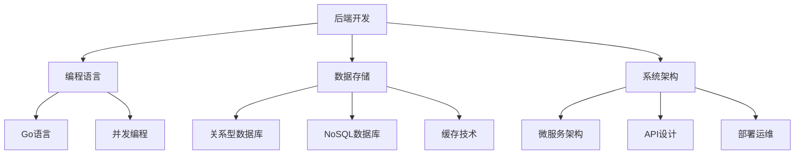

## ⚙️ 后端开发

后端开发专注于服务器端逻辑、数据库设计和API开发，是应用程序的核心引擎。

## 📚 技术栈概览

---

## 🚀 核心技术

### 🗄️ 数据库技术
数据存储和管理的核心技能。

[🗄️ 学习数据库](数据库.md){ .md-button .md-button--primary }

**主要内容:**
- **关系型数据库 (MySQL/PostgreSQL)**
  - SQL语法与查询优化
  - 表设计与关系建模
  - 索引策略与性能调优
  - 事务管理与并发控制

- **NoSQL数据库 (MongoDB/Redis)**
  - 文档型数据库设计
  - 缓存策略与实现
  - 数据一致性保证

---

### 🐹 Go语言开发
现代后端开发的主流语言。

[🐹 学习Go语言](Go.md){ .md-button .md-button--primary }

**主要内容:**
- **语言基础**
  - 基本语法与数据类型
  - 函数式编程特性
  - 错误处理机制
  - 包管理与模块化

- **并发编程**
  - Goroutine协程模型
  - Channel通信机制
  - 并发安全与锁机制
  - 性能优化技巧

- **Web开发**
  - HTTP服务器搭建
  - RESTful API设计
  - 中间件使用
  - 数据库集成

---

## 📊 学习进度统计

| 技术领域 | 学习状态 | 项目经验 | 技能重点 |
|----------|----------|----------|----------|
| 🗄️ 数据库设计 | 🟡 学习中 | 简单CRUD | 查询优化 |
| 📊 SQL编程 | 🟡 良好 | 数据分析 | 复杂查询 |
| 🐹 Go基础语法 | 🟡 学习中 | 小项目 | 并发编程 |
| 🌐 API开发 | 🔵 入门 | 简单接口 | RESTful设计 |
| 🚀 性能优化 | 🔵 规划中 | 待实践 | 系统调优 |

---

## 🎯 实践项目规划

### 🛠️ 基础项目
- **📚 个人博客后端** - 用户管理、文章CRUD
- **📝 待办事项API** - RESTful接口设计
- **🔐 用户认证系统** - JWT令牌管理

### 🚀 进阶项目
- **🛒 电商系统后端** - 商品管理、订单处理
- **💬 实时聊天系统** - WebSocket通信
- **📊 数据分析平台** - 大数据处理

---

## 💡 学习路线建议

### 📈 阶段性目标

!!! tip "第一阶段：数据库基础 (1-2个月)"
    - 掌握SQL基本语法
    - 理解数据库设计原则
    - 完成简单的CRUD操作
    - 学会使用数据库管理工具

!!! info "第二阶段：Go语言入门 (2-3个月)"
    - 熟悉Go语言基础语法
    - 理解并发编程模型
    - 搭建简单的Web服务
    - 实现数据库连接与操作

!!! warning "第三阶段：项目实战 (3-6个月)"
    - 设计完整的API接口
    - 实现用户认证与授权
    - 优化查询性能
    - 部署与运维实践

### 🔗 相关技能
- **[登录&鉴权](../登录&鉴权.md)** - 用户身份认证
- **[API设计](../api的制定.md)** - 接口规范制定
- **前后端协作** - 与前端团队配合

---

## 📚 推荐学习资源

- **Go官方文档** - 语言权威指南
- **《高性能MySQL》** - 数据库优化圣经
- **《设计数据密集型应用》** - 系统架构设计
- **开源项目** - GitHub优秀Go项目学习 