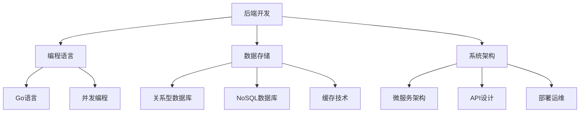

## ⚙️ 后端开发

后端开发专注于服务器端逻辑、数据库设计和API开发，是应用程序的核心引擎。

## 📚 技术栈概览

---

## 🚀 核心技术

### 🗄️ 数据库技术
数据存储和管理的核心技能。

[🗄️ 学习数据库](数据库.md){ .md-button .md-button--primary }

---

### 🐹 Go语言开发
现代后端开发的主流语言。

[🐹 学习Go语言](Go.md){ .md-button .md-button--primary }

---

## 📊 学习进度统计

| 技术领域 | 学习状态 | 项目经验 | 技能重点 |
|----------|----------|----------|----------|
| 🗄️ 数据库设计 | 🔵 入门   | 简单CRUD | 查询优化 |
| 📊 SQL编程 | 🔵 入门 | 数据分析 | 复杂查询 |
| 🐹 Go基础语法 | 🔵 入门   | 小项目 | 并发编程 |
| 🌐 API开发 | 🔵 入门 | 简单接口 | RESTful设计 |
| 🚀 性能优化 | 🔵 规划中 | 待实践 | 系统调优 |

---

