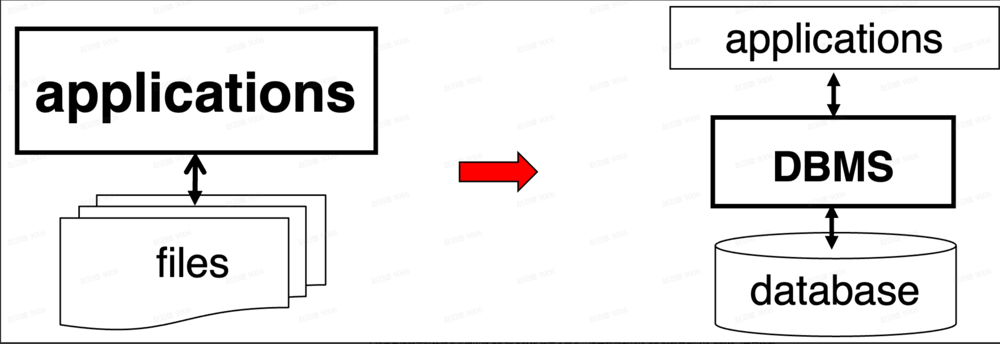
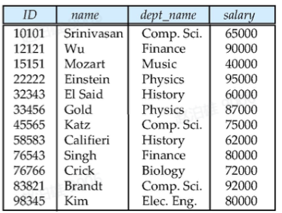

## 概述

## 为何使用数据库

大家在之前的软件开发经验中（主要是 C 语言）应该都有过**数据管理**与**数据持久化**的需求。例如，如果你想要开发一个迷宫小游戏（来自遥远的已消失的 C 大程），或许会考虑以下设计范式：

- 设计一套数据结构来表示迷宫地图
- 用文件存储地图和用户的游玩信息

接下来，你新建了一个 `map.txt` 文件，以文本的方式记录了整张地图和点位的细节信息：

```Plain
> MAP 1 EASY2GO
##########
#S.......#
#..#..#.#
#.##.##.#
#......G#
##########
(3, 5) = TREASURE  # has treasure at (3, 5)
(2, 4) = POISON    # has poison at (2, 4)
...
```

接下来，你在程序的开始使用 C 语言的文件接口与文件进行交互，实现地图信息的读取和持久化：

```C
FILE *file;
char filename[] = "map.txt";
file = fopen(filename, "r");
while (fgets(line, sizeof(line), file) != NULL)
...
```

这样的设计其实挺好，对迷宫问题来说是一个不错的解决方案，但如果我们面对更复杂的需求，例如在一个购物查询软件中：

- 实现用户注册、登录功能，管理用户信息
- 建立商品库，能够保存商品的名称、详情、价格等信息
- 用户可以订阅某一商品，并查询订阅商品的信息

我们发现，我们不仅仅要存储用户、商品等大量信息到不同的文件，还可能需要连接不同文件的信息（例如**订阅**操作，要把用户信息和商品信息联系起来）。如果数据增多、逻辑变复杂，文件就不太高效了。

> 事实上，上面描述的两个场景分别是基于文件和基于数据库的两种应用设计范式，不过在很多应用中我们会同时用到它们。
>
> 
>
> 举上面的这两个例子，是为了让大家直观地感受到基于文件和基于数据库的应用设计有何异同。大家可以在接下来的开发过程中继续体会。

面对电商场景，我们就需要一种更高效的方式来完成对数据的操作（大家可能听过 CRUD，对应对数据的增删查改）。

## 什么是数据库

> In computing, a **database** is an organized collection of data or a type of data store based on the use of a **database management system** (**DBMS**), the software that interacts with end users, applications, and the database itself to capture and analyze the data.
>
> ——[Database (Wikipedia)](https://en.wikipedia.org/wiki/Database)

上述来自维基百科的概念中提出了 DB 和 DBMS 这两个概念，通常我们在讨论 DB 时就是在讨论 DBMS（常见的有耳熟能详的 MySQL, PostgreSQL, MongoDB 等），我们通过与 DBMS 进行交互，来实现对它所管理的一系列数据集合的操作。

**数据库在文件系统的基础上，针对管理数据的新范式，**以非常高效的方式为我们实现了如下需求：

- 并发控制。
- 数据一致性。
- 数据完整性。
- ......

## 数据模型

不同的数据库使用不同的数据模型，如下是一些常见的数据模型：

- **关系模型：**基于表格，数据以行和列的形式存储在表中。
- **基于对象的数据模型：**将数据视为对象的集合，每个对象都有自己的属性和方法。它强调数据的封装和抽象。
- **半结构化数据模型：**用于处理具有部分结构但不完全符合传统关系模型的数据，如 XML 和 JSON。

在这里，我们主要介绍**关系模型（Relational Model）**。



如图，是关系型数据库的一个实例。例如在这个教职员工 Teacher 表中：

- 每一行称为一个“元组”（Tuple），是每位教职工对应的一个记录；
- 每一列称为一个“属性”（Attribute），它们共同组成并表示了 Teacher 这一 Relation。

关系模型的核心是关系代数和关系演算，同时它支持强大的查询语言（如SQL）。

## SQL 入门

可能你读到这里还是一头雾水（或者觉得上面这些都是过于显然的废话），对于不关心数据库系统原理的 Web 应用开发者来说，我们最关心的是如何与数据库交互来实现业务需求。我们先引入 SQL 语言。

> 在基于文件的应用中，我们用文件作为数据载体，用 C 语言的接口 `fopen` 等作为与文件交互的方式。
>
> 而如果类比到数据库的场景中，可以简单地认为，数据库成为了数据载体，**SQL 语言**成为与数据库交互的方式。

首先贴一份比较好的 SQL 教程，你可以选择参考它，然后直接跳到下一节的内容。

https://www.w3schools.com/sql/

P.S. 如果你觉得英文实在有困难的话可以看看菜鸟教程：[SQL 教程 | 菜鸟教程](https://www.runoob.com/sql/sql-tutorial.html)

为了比较方便地上手 SQL，推荐直接上网搜索一些在线的 SQL 编辑器，这样可以避免在本机安装数据库软件，例如：[SQL Online Compiler - Next gen SQL Editor](https://sqliteonline.com/)，我们接下来的演示也会基于它进行。

不过在实际开发过程中，我们也最好掌握使用命令行书写 SQL、与数据库进行交互的方法，具体的步骤可以移步【Golang基础 -> PostgreSQL 环境配置】～

进入网页后，可以看到初始化的 `demo` 表与初始查询结果。


## 简单SQL语法入门

# SQL 语法

SQL（Structured Query Language）是一种用于管理和操作关系数据库的标准语言，包括数据查询、数据插入、数据更新、数据删除、数据库结构创建和修改等功能。。

------

## 数据库表

一个数据库通常包含一个或多个表，每个表有一个名字标识（例如:"Websites"），表包含带有数据的记录（行）。

在本教程中，我们在 MySQL 的 RUNOOB 数据库中创建了 Websites 表，用于存储网站记录。

我们可以通过以下命令查看 "Websites" 表的数据：


```
mysql> use RUNOOB;
Database changed

mysql> set names utf8;
Query OK, 0 rows affected (0.00 sec)

mysql> SELECT * FROM Websites;
+----+--------------+---------------------------+-------+---------+
| id | name         | url                       | alexa | country |
+----+--------------+---------------------------+-------+---------+
| 1  | Google       | https://www.google.cm/    | 1     | USA     |
| 2  | 淘宝          | https://www.taobao.com/   | 13    | CN      |
| 3  | 菜鸟教程      | http://www.runoob.com/    | 4689  | CN      |
| 4  | 微博          | http://weibo.com/         | 20    | CN      |
| 5  | Facebook     | https://www.facebook.com/ | 3     | USA     |
+----+--------------+---------------------------+-------+---------+
5 rows in set (0.01 sec)
```

### 解析

- **use RUNOOB;** 命令用于选择数据库。
- **set names utf8;** 命令用于设置使用的字符集。
- **SELECT \* FROM Websites;** 读取数据表的信息。
- 上面的表包含五条记录（每一条对应一个网站信息）和5个列（id、name、url、alexa 和country）。

------

## SQL 语句

您需要在数据库上执行的大部分工作都由 SQL 语句完成。

下面的 SQL 语句从 "Websites" 表中选取所有记录：

## 实例

SELECT * FROM Websites;

在本教程中，我们将为您讲解各种不同的 SQL 语句。

------

## 请记住...

- SQL 对大小写不敏感：SELECT 与 select 是相同的。

------

## SQL 语句后面的分号？

某些数据库系统要求在每条 SQL 语句的末端使用分号。

分号是在数据库系统中分隔每条 SQL 语句的标准方法，这样就可以在对服务器的相同请求中执行一条以上的 SQL 语句。

在本教程中，我们将在每条 SQL 语句的末端使用分号。

------

## 一些最重要的 SQL 命令

- **SELECT** - 从数据库中提取数据
- **UPDATE** - 更新数据库中的数据
- **DELETE** - 从数据库中删除数据
- **INSERT INTO** - 向数据库中插入新数据
- **CREATE DATABASE** - 创建新数据库
- **ALTER DATABASE** - 修改数据库
- **CREATE TABLE** - 创建新表
- **ALTER TABLE** - 变更（改变）数据库表
- **DROP TABLE** - 删除表
- **CREATE INDEX** - 创建索引（搜索键）
- **DROP INDEX** - 删除索引

以下是一些常用的 SQL 语句和语法：

**SELECT**：用于从数据库中查询数据。

```
SELECT column_name(s)
FROM table_name    #指定哪个数据进行查询
WHERE condition
ORDER BY column_name [ASC|DESC]
```

- `column_name(s)`: 要查询的列。
- `table_name`: 要查询的表。
- `condition`: 查询条件（可选）。
- `ORDER BY`: 排序方式，`ASC` 表示升序，`DESC` 表示降序（可选）。

**INSERT INTO**：用于向数据库表中插入新数据。

```
INSERT INTO table_name (column1, column2, ...)
VALUES (value1, value2, ...)
```

- `table_name`: 要插入数据的表。
- `column1, column2, ...`: 要插入数据的列。
- `value1, value2, ...`: 对应列的值。

**UPDATE**：用于更新数据库表中的现有数据。

```
UPDATE table_name
SET column1 = value1, column2 = value2, ...
WHERE condition
```

- `table_name`: 要更新数据的表。
- `column1 = value1, column2 = value2, ...`: 要更新的列及其新值。
- `condition`: 更新条件。

**DELETE**：用于从数据库表中删除数据。

```
DELETE FROM table_name
WHERE condition
```

- `table_name`: 要删除数据的表。
- `condition`: 删除条件。

**CREATE TABLE**：用于创建新的数据库表。

```
CREATE TABLE table_name (
    column1 data_type constraint,
    column2 data_type constraint,
    ...
)
```

- `table_name`: 要创建的表名。
- `column1, column2, ...`: 表的列。
- `data_type`: 列的数据类型（如 `INT`、`VARCHAR` 等）。
- `constraint`: 列的约束（如 `PRIMARY KEY`、`NOT NULL` 等）。

**ALTER TABLE**：用于修改现有数据库表的结构。

```
ALTER TABLE table_name
ADD column_name data_type
```

- `table_name`: 要修改的表。
- `column_name`: 要添加的列。
- `data_type`: 列的数据类型。

或：

```
ALTER TABLE table_name
DROP COLUMN column_name
```

- `column_name`: 要删除的列。

**DROP TABLE**：用于删除数据库表。

```
DROP TABLE table_name
```

- `table_name`: 要删除的表。

**CREATE INDEX**：用于创建索引，以加快查询速度。

```
CREATE INDEX index_name
ON table_name (column_name)
```

- `index_name`: 索引的名称。
- `column_name`: 要索引的列。

**DROP INDEX**：用于删除索引。

```
DROP INDEX index_name
ON table_name
```

- `index_name`: 要删除的索引名称。
- `table_name`: 索引所在的表。

**WHERE**：用于指定筛选条件。

```
SELECT column_name(s)
FROM table_name
WHERE condition
```

- `condition`: 筛选条件。

**ORDER BY**：用于对结果集进行排序。

```
SELECT column_name(s)
FROM table_name
ORDER BY column_name [ASC|DESC]
```

- `column_name`: 用于排序的列。
- `ASC`: 升序（默认）。
- `DESC`: 降序。

**GROUP BY**：用于将结果集按一列或多列进行分组。

```
SELECT column_name(s), aggregate_function(column_name)
FROM table_name
WHERE condition
GROUP BY column_name(s)
```

- `aggregate_function`: 聚合函数（如 COUNT、SUM、AVG 等）。

**HAVING**：用于对分组后的结果集进行筛选。

```
SELECT column_name(s), aggregate_function(column_name)
FROM table_name
GROUP BY column_name(s)
HAVING condition
```

- `condition`: 筛选条件。

**JOIN**：用于将两个或多个表的记录结合起来。

```
SELECT column_name(s)
FROM table_name1
JOIN table_name2
ON table_name1.column_name = table_name2.column_name
```

- `JOIN`: 可以是 INNER JOIN、LEFT JOIN、RIGHT JOIN 或 FULL JOIN。

**DISTINCT**：用于返回唯一不同的值。

```
SELECT DISTINCT column_name(s)
FROM table_name
```

- `column_name(s)`: 要查询的列。

------

## 演示数据库

在本教程中，我们将使用 RUNOOB 样本数据库。

下面是选自 "Websites" 表的数据：

```
+----+--------------+---------------------------+-------+---------+
| id | name         | url                       | alexa | country |
+----+--------------+---------------------------+-------+---------+
| 1  | Google       | https://www.google.cm/    | 1     | USA     |
| 2  | 淘宝          | https://www.taobao.com/   | 13    | CN      |
| 3  | 菜鸟教程      | http://www.runoob.com/    | 4689  | CN      |
| 4  | 微博          | http://weibo.com/         | 20    | CN      |
| 5  | Facebook     | https://www.facebook.com/ | 3     | USA     |
+----+--------------+---------------------------+-------+---------+
```

------

## SELECT Column 实例

下面的 SQL 语句从 "Websites" 表中选取 "name" 和 "country" 列：

## 实例

SELECT name,country FROM Websites;

输出结果为:


------

## SELECT * 实例

下面的 SQL 语句从 "Websites" 表中选取所有列：

## 实例

SELECT * FROM Websites;

输出结果为:


## 数据表的 CRUD

我们首先介绍对数据表最基础的 CRUD。你可以在该网站分别执行下面的语句并观察结果，感受 SQL 语句的用法。

- **向表中插入数据**：尝试在代码框中粘贴如下内容，并点击 `RUN`，可以看到该条数据已经被插入。

```SQL
INSERT INTO demo
VALUES (28, 'sql', 'hi');
```

或者你也可以指定特定的列（属性），而将其他列留空，例如我只插入 `ID` 而把其他列留空：

```SQL
INSERT INTO demo (ID)
VALUES (29);
```

- **查询表中数据：**

```SQL
SELECT * FROM demo;    # 选取所有属性，查询表中所有数据
SELECT name, hint FROM demo;    # 选取特定属性
```

使用 `WHERE` 来添加谓词：

```SQL
SELECT name, hint FROM demo
WHERE name='sql';
```

- **更新表中数据：**

```SQL
UPDATE demo
SET name='SQL'
WHERE hint='hi';
```

- **删除表中数据：**

```SQL
DELETE FROM demo
WHERE id = 29;
```

## 完整性约束

> 完整性约束是一组规则，用于确保数据库中存储的数据满足预定义的条件，从而保证数据的**准确性**和**一致性**。例如**实体完整性，**确保每条记录都有唯一标识；**参照完整性，**维护表与表之间的关联性等等。

如果你尝试过重复执行这一条 SQL 语句，会发现从第二次开始就得到如下报错：

阅读报错后，我们发现是 `demo.ID` 触发了唯一性约束。你可能注意到了网站中默认的 demo 表定义：

```SQL
demo
🔑 ID INTEGER
🪟 Name varchar(20)
🪟 Hint TEXT
```

它可以用如下的 SQL 语句来创建：

```SQL
CREATE TABLE demo (
    id INTEGER PRIMARY KEY AUTOINCREMENT,
    name VARCHAR(20),
    hint TEXT    
);
```

在 `id` 之后跟随的 `PRIMARY KEY` ，即主键🔑，就是错误触发的原因。那么，我们为什么要把 `id` 设置成主键呢？下面，我们引出完整性约束的概念。

在一个数据库中，我们为了维护数据的完整性，需要对数据表进行约束，常用的属性有这些：

- NOT NULL：非空，指示该数据表的某一字段值不能为空。
- PRIMARY KEY：主键，用于唯一标识表中的每一行记录。
  - **唯一性**：主键值必须是唯一的，不能有重复值。
  - **非空性**：主键字段不能为`NULL`。在插入或更新数据时，主键字段必须有值。
  - **不变性**：主键的值通常不会更改。（数据库为了提高查询性能，通常会在主键上建立索引）
- FOREIGN KEY：外键，一个表中的字段，其值必须匹配被引用表中的主键（或唯一键）的值，或者为`NULL`。外键的主要作用是维护表之间关系的完整性，确保数据引用关系的正确性。
- ......

主键的作用大家已经认识到了，下面，我们举一个外键的例子。我们创建 `student` 和 `department` 这两张表，其中 `student` 表中的院系应该被 `department` 约束（请在左侧的数据库中选择 MariaDB 再创建表，SQLite 疑似无法识别外键约束）：

```SQL
CREATE TABLE department(
  dept_name varchar(20) PRIMARY KEY,
  building varchar(20)
);

CREATE TABLE student (
  ID varchar(5) PRIMARY KEY,
  name varchar(20) not NULL,
  dept_name varchar(20),
  FOREIGN KEY (dept_name) REFERENCES department(dept_name)
);
```

这是因为外键约束需要确保 `dept_name` 的值在 `department` 表中存在。

请你尝试先在 `department` 表中插入几条信息，然后再往 `student` 表中进行插入，体会外键的作用。

在外键的约束中，我们有多时候也会用到**级联**操作，常见的有 `on `**`delete/update`**`  cascade/set null/restrict/set default` 等。以 `on delete cascade` 为例，当 `department` 表中的某一院系名被删除时，所有属于该院系的学生都会被删除，这在许多场景中都是非常有用的，你可以自行上网检索其他操作的含义和用法。

## 你应该掌握的数据库操作

上面，我们已经介绍了一些最简单的数据库操作，但在学习阶段仅仅掌握它们是不够的（虽然在我们的实习项目中，掌握它们就差不多了）。

你需要**认真阅读**之前给出的外链教程来学会更进阶的用法（但仍然只是冰山一角），在下面列举的操作中进行对应，并在思考题中检验你的学习成果。

当然，必须承认，这一节的内容相当无聊，你可以在之后的练习和使用过程中边用边学。

不过，我们还是建议大家先通读一遍这里的操作，以便有一个大概的印象。

### 数据库的 CRUD

- 创建数据库：

  - ```SQL
    CREATE DATABASE databasename;
    ```

- 转换或者使用数据库：

  - ```SQL
    USE databasename;
    ```

- 查看当前有哪些数据库：

  - ```SQL
    SHOW databases;
    ```

- 删除数据库：

  - ```SQL
    DROP DATABASE databasename;
    ```

### 数据表的 CRUD

- MySQL 中的数据类型：[SQL Data Types for MySQL, SQL Server, and MS Access](https://www.w3schools.com/sql/sql_datatypes.asp) 中的对应章节。下面，我们列举一些常用的数据类型。

  - `VARCHAR(size)` 变长字符串
  - `TEXT(size)` 文本
  - `DECIMAL(`*`size`*`, `*`d`*`)` 定精度数值（例如表示**余额**时，精确到小数点后两位）
  - ......

- 创建数据表：

  - ```SQL
    CREATE TABLE table_name (
        column1 datatype,
        column2 datatype,
        column3 datatype,
       ....
    );
    ```

- 展示当前数据库中所有的表：

  - ```SQL
    SHOW tables;
    ```

- 删除某一数据表：

  - ```SQL
    DROP TABLE table_name；
    ```

- 向数据表中插入元组：

  - 插入一条具有某些属性的元组

  - ```SQL
    INSERT INTO table_name (column1, column2, column3, ...)
    VALUES (value1, value2, value3, ...);
    ```

  - 插入一条具有所有属性的元组

  - ```SQL
    INSERT INTO table_name
    VALUES (value1, value2, value3, ...);
    ```

- 查询表中数据：

  - ```SQL
    SELECT column1, column2, ...
    FROM table_name
    WHERE condition;
    ```

- 更新表中数据：

  - ```SQL
    UPDATE table_name
    SET column1 = value1, column2 = value2, ...
    WHERE condition;
    ```

- 删除表中数据

  - ```SQL
    DELETE FROM table_name WHERE condition;
    ```

### 表的连接

有的时候，我们需要把不同表的信息整合起来完成查询，例如在上述的 `student` 和 `department` 表中，我想知道每名学生所在的院系楼是哪一栋。

或许你又会问，为什么我们不把所有的数据都存在一张表里呢？例如我直接删除 `department` 表，把关于院系的信息附在 `dept_name` 之后，但这样做有诸多不利之处：

1. 维护困难。如果一座院系搬迁，我就要把所有 `building` 相关的信息全改一遍，可能出现数据不一致和数据冗余。
2. 查询困难。很多时候，我们并不需要关于 `department` 的全部信息，因此我们只在需要更详细信息的时候进行表的连接，这样就可以少一步 `select` 筛选操作。

但又有时候，这样做是有必要的：例如，如果在某一场景中， `student_name, building` 这组信息需要被频繁用到，由于表的连接操作比较耗时，我们可以用**物化视图**（materialized view）的方式来将这组关系实例化。

可以看到，数据库和数据表的设计中也处处存在 trade off，需要我们仔细权衡。

- 连接（JOIN）：

  - 普通的连接操作用 `FROM` 就可以直接实现，它对应于笛卡尔积（Cartesian Product）——

  - 

  -  单纯的笛卡尔积不是非常实用，更常用的是加入 `WHERE` 语句加入限定谓词，例如

  - ```SQL
    SELECT name, course_id
    FROM instructor, teaches
    WHERE instructor.ID = teaches.ID
    ```

- 自然连接（NATURAL JOIN）：它比连接操作更为实用，它不会对两张表的每条记录简单地进行两两组合，而是只把不同表中拥有相同属性值的部分连接起来。例如如下两张表：

  - 

  - ```SQL
    instructor(ID, name, dept_name, salary）
    teaches(ID, course_id, sec_id, semester, year)
    ```

  - 你可以对它执行这样的操作：

  - ```SQL
    SELECT name, course_id
    FROM instructor natural join teaches
    
    # 它等价于（如果你使用 JOIN 的话）
    SELECT name, course_id
    FROM instructor, teaches
    WHERE instructor.ID = teaches.ID;
    ```

### 聚合函数

在查询时，我们有时候需要对某一些属性的值进行统计，这时就要用到聚合函数。常用的聚合函数有：

- **avg:** 平均值
- **min, max:**  最小、最大值
- **sum:**  值的和
- **count:**  值的计数

例如，我想统计 `course` 表中一共有几门课程：

```SQL
SELECT count (*) FROM course;
```

我想统计计算机学院老师们的平均薪资：

```SQL
SELECT avg(salary)
FROM instructor
WHERE dept_name= 'Comp. Sci.';
```

有时候，我们希望为特定属性进行分组统计，例如我想统计不同院系老师们的平均薪资，这个时候我们就要用到 `GROUP BY` 进行分组：

```SQL
SELECT dept_name, avg(salary)
FROM instructor
GROUP BY dept_name;
```

### 限定词

- 首先，我们来看看在 `SELECT` 语句中常用的限定词——我们可以指定筛选出来的属性值在结果中是唯一的（即在筛选出结果后进行去重），或者保留重复值：

```SQL
# distinct 表示唯一
select distinct dept_name
from instructor

# all 表示不去重
select all dept_name
from instructor
```

- 接下来，我们来看看 `WHERE` 中会用到的一些谓词：

```SQL
# between 限定查询区间
select name
from instructor
where salary between 90000 and 100000

# 用 and, or, not 对谓词进行连接
select name
from instructor
where dept_name = 'Comp. Sci.'  and salary > 80000
```

- 我们可以对筛选结果进行排序或者限定：

```SQL
# 对 instructor 的名字进行去重后按字母序降序输出
select distinct name
from    instructor
order by name desc
# limit 3  -> 再加一行这个，仅输出最前面的三项
```

### 简单的复杂查询

考虑到本文篇幅，这部分内容可见进阶文档。

## 事务

> 事务是数据库管理系统中执行的一组操作的逻辑单元，它确保对数据的修改具有**一致性**和**可靠性**。事务必须满足 ACID 特性（将在下面介绍）。

为了让你意识到“事务”存在的必要性，我们先来看看**银行转账的"原子"危机**——假设你正在开发一个银行系统，用户 A 向用户 B 转账 100 元。这个操作需要两个步骤：

1. 从A的账户扣除100元
2. 向B的账户增加100元

如果没有事务机制，当系统在完成步骤 1 后突然断电，就会出现：

- A的账户被扣款但B未收到钱
- 银行系统出现100元的资金缺口
- 用户信任度急剧下降

这就是数据库事务存在的意义——**确保操作要么全做，要么全不做！**

### 事务的本质特性

我们可以对事务的特性做以下概括：

- **原子工作单元**：一组不可分割的SQL操作集合，如同单个操作
- **安全防护罩**：任意步骤失败时，自动回滚到初始状态
- **状态一致性保证**：无论成功与否，数据库始终处于合法状态

在上面的银行转账场景中，我们可以用如下方式将整个过程变成一个事务：

```SQL
BEGIN;
UPDATE accounts SET balance = balance - 100 WHERE user = 'A';
UPDATE accounts SET balance = balance + 100 WHERE user = 'B';
COMMIT;
```

事实上，我们可以用 ACID 来深入理解事务的特性：

| 特性       | 保障机制                 | 现实类比                       |
| ---------- | ------------------------ | ------------------------------ |
| **原子性** | 全成功或全失败，无中间态 | 要么成功转账，像从未发生过异常 |
| **一致性** | 数据约束永不破坏         | 总金额在转账前后保持不变       |
| **隔离性** | 并发事务互不干扰         | 多人同时转账互不影响           |
| **持久性** | 提交后变更永久保存       | 转账记录永不丢失               |

### 事务控制常用语法

```SQL
-- 开启事务
BEGIN;  -- 或 START TRANSACTION

-- 提交变更
COMMIT;  -- 如同确认保存文件

-- 回滚操作
ROLLBACK;  -- 类似撤销所有未保存的修改
```

为了验证事务操作的正确性，我们可以打开两个数据库交互窗口，其中一个执行事务，另外一个在事务提交前后分别观察数据是否被更改：

- **操作窗口A**

```SQL
BEGIN;
INSERT INTO customers VALUES (4, 'Chaitali', 25, 'Mumbai', 6500);
INSERT INTO customers VALUES (5, 'Hardik', 27, 'Bhopal', 8500);
-- 此时其他会话看不到新增数据
COMMIT;  -- 数据永久可见
```

- **验证窗口B**：

```SQL
SELECT * FROM customers;  -- 提交前无新数据，提交后可见完整结果
```

### 事务设计的一些原则

1. **尽量简短**：减少锁定资源的时间，提升并发度
2. **明确边界**：避免嵌套事务带来的复杂性
3. **异常处理**：配合 TRY-CATCH 结构使用
4. **隔离级别**：根据场景选择合适的事务隔离级别

