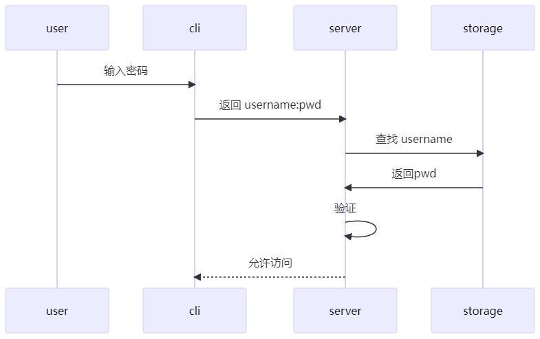

>主要是了解cookie, session, token的原理、区别以及使用。

## 1 简单的登录



user:用户

cli:客户端(注册或登陆界面)

server:服务端

storage:数据库

> 这里pwd指的是password

## 1.2 过程描述

1.当我们第一次使用网站时，需要在注册或登录界面输入username和password

2.接着client会将username和password发送给server

3.然后server会查询数据库，检查用户名是否重复：

​    (1)如果该用户名并不存在，则注册成功，username和password都会被存储到数据库中

​    (2)但如果用户名重复，就要返回错误信息

4.当我们后续登录时，client同样会将我们输入的username和password发送给server，由server查询数据库，并进行验证

## 2 http与https

好的，我们来详细了解一下 HTTP 和 HTTPS：

**HTTP (HyperText Transfer Protocol，超文本传输协议)**

- **定义：** HTTP 是一种用于传输超媒体文档（例如 HTML 文件）的应用层协议。它是万维网（WWW）数据通信的基础。简单来说，当您在浏览器中输入网址时，您的浏览器就会通过 HTTP 协议与网站服务器进行沟通，请求并接收网页内容。
- **运作方式：** HTTP 采用请求-响应模型。客户端（通常是网页浏览器）向服务器发送 HTTP 请求，服务器处理请求后再回传 HTTP 响应给客户端。
- 特性：
  - **无状态 (Stateless)：** 服务器不会保留先前请求的任何信息。每个请求都被视为独立的。
  - **明文传输 (Plain Text)：** HTTP 传输的数据是未加密的，这意味着任何能够拦截网络流量的人都可以读取传输的内容，例如用户名、密码、信用卡信息等。这使得 HTTP 在处理敏感信息时非常不安全。
  - **默认端口号：** HTTP 通常使用 TCP/IP 协议的 80 端口进行通信。

**HTTPS (HyperText Transfer Protocol Secure，超文本传输安全协议)**

- **定义：** HTTPS 是 HTTP 的安全版本。它在 HTTP 的基础上加入了 SSL/TLS 加密层，用于保护数据在传输过程中的安全性和完整性。

- 运作方式：

   HTTPS 的运作方式与 HTTP 类似，但加入了以下安全机制：

  - **加密 (Encryption)：** 在数据传输之前，HTTPS 会使用 SSL (Secure Sockets Layer) 或 TLS (Transport Layer Security) 协议对数据进行加密。这意味着即使数据被拦截，窃听者也无法读取其内容，因为它看起来像一堆随机字符。
  - **身份验证 (Authentication)：** HTTPS 使用数字证书（由受信任的证书颁发机构 Certificate Authority, CA 签发）来验证网站服务器的身份。这有助于防止用户连接到伪冒的网站（钓鱼网站）。当您浏览 HTTPS 网站时，浏览器会检查网站的证书是否有效且受信任。
  - **数据完整性 (Data Integrity)：** SSL/TLS 协议还能确保数据在传输过程中没有被篡改。

- 特性：

  - **安全性高：** 由于数据加密和身份验证，HTTPS 能够有效保护敏感信息，如登录凭证、付款信息等。
  - **默认端口号：** HTTPS 通常使用 TCP/IP 协议的 443 端口进行通信。
  - **SEO 优势：** Google 等搜索引擎会将 HTTPS 网站视为更安全的网站，并可能在搜索结果中给予更高的排名。
  - **浏览器信任：** 现代浏览器会对未使用 HTTPS 的网站标记为“不安全”，而 HTTPS 网站则会显示锁形图标，给予用户更大的信任感。

**HTTP 与 HTTPS 的主要差异总结**

| **特性**       | **HTTP**                         | **HTTPS**                                        |
| -------------- | -------------------------------- | ------------------------------------------------ |
| **安全性**     | 低 (数据以明文传输)              | 高 (数据经过 SSL/TLS 加密)                       |
| **加密**       | 无                               | 有 (使用 SSL/TLS 协议)                           |
| **身份验证**   | 无                               | 有 (通过数字证书验证服务器身份)                  |
| **数据完整性** | 无保证                           | 有保证 (防止数据在传输中被篡改)                  |
| **默认端口号** | 80                               | 443                                              |
| **网址开头**   | `http://`                        | `https://`                                       |
| **浏览器显示** | 可能标记为“不安全”               | 通常显示锁形图标，表示安全连接                   |
| **适用场景**   | 简单的、不涉及敏感信息的内容展示 | 任何涉及敏感信息（如登录、付款、个人资料）的网站 |

**总结来说：**

HTTP 是一种基础的网页数据传输协议，但其传输的数据是未加密的，容易受到窃听。而 HTTPS 则是 HTTP 的安全版本，通过 SSL/TLS 加密机制，确保数据在传输过程中的机密性、完整性和服务器的真实性。在现代网络环境中，使用 HTTPS 是保护网站和用户安全的标准做法。

## 3 Cookie

>上述流程中，每次需要验证权限的操作，都需要向服务端传递密码。如果每次让用户手动输入，那体验想必是极差的，但是要把用户密码在客户端缓存，又会产生额外的安全问题。另外，虽然我们保证了传输过程是比较安全的，但是要是每次请求都带有密码，请求次数一但增多，谁能保证攻击者不从中分析出有用的信息呢。

解决此问题的方法是将权限验证分为两个过程，Login & Authentication。登录被单独拿出来作为一个单独的操作，用户需要传递密码或以其他方式证明身份来登录，登录后，其他的请求则不需要用户再传递密码。为此，我们需要一些机制，能够让网站知道用户已经登录过了，这就涉及到**cookie**等技术。

>使用F12切换到开发者模式，点击Network标签，随便点开某个fetch请求，我们基本能在请求标头中找到Cookie信息

## 3.1 Cookie属性

### 3.1.1 生命周期

> 浏览器为 cookie 提供了过期设置，浏览器会区分两类来管理 token 的生命周期：

**Permanent cookie：**

浏览器提供了 **ExpiredAt** 和 **MaxAge** 两个属性来控制 token 何时过期。前者是绝对时间的形式，后者是设置时间+offset的形式。如果两者同时被设置，浏览器以 MaxAge 为准。

MaxAge 可以设置非正数，如果这么设置，浏览器会立即删除该 cookie，请求方经常利用这点来删除 cookie。

**Session cookie：**

如果没有设置前面说的两个生命周期属性，浏览器会将其视作 session cookie，其会在整个 "session" 内保留，直到 "session" 结束后被删除。

不同浏览器对 "session" 的定义不一定相同，比如，如果一个浏览器定义关闭浏览器后 session 才结束，那不关闭浏览器的话，session cookie 就永远不会过期（当然这样不太安全，大多浏览器都是设置了一个最大时间）。

### 3.1.2 访问限制

>Cookie 只是存在客户端本地的一段文本信息，本身十分不安全。为了提高 cookie 的安全性，浏览器限制了其访问途径。
>
>一般来说，cookie 是通过 http 请求设置和传递的，在一个请求头中携带 Header `Set-Cookie`就能让浏览器自动设置好 cookie，已经设置过的 cookie 会被携带在`Cookie` 中发送/返回：
>
>```HTTP
>HTTP/2.0 200 OK
>Content-Type: text/html
>Set-Cookie: yummy_cookie=choco
>Set-Cookie: tasty_cookie=strawberry
>
>
>GET /sample_page.html HTTP/2.0
>Host: www.example.org
>Cookie: yummy_cookie=choco; tasty_cookie=strawberry
>```
>
>这个过程中 cookie 的管理全部由浏览器完成，但是，前端也可以主动访问并设置 cookie，比如，js 可以通过 `document` 访问这个页面的 cookie:
>
>```JavaScript
>document.cookie="username=John Doe; expires=Thu, 18 Dec 2043 12:00:00 GMT";
>```
>
>浏览器提供了 **HttpOnly** 属性来限制前端以这种方式访问 cookie，这样 cookie 就只能在 http 请求中携带。
>
>虽然但是，浏览器只是限制了部分 js 访问接口，还是有很多方式能获取到 cookie 的（比如有些 php 网页就能访问到 HttpOnly 的 cookie），这个属性不代表绝对安全。
>
>**Secure** 属性可以限制只有使用 https 协议的请求可以携带/设置 cookie，这样可以尽可能防止 cookie 在传输过程中被泄露。

### 3.1.3 **Session**

> 只用cookie是不够的。

一方面，Cookie的大小有限，如果需要记录的东西较多，那么显然应当由服务端来存储，比如有的网站的用户购物车、填写了一半的表单等。

另一方面，如果只有浏览器存储了信息，而服务端什么都不记录，那么服务器就无法确认请求者的身份，好比客人上门拜访，主人必须认得出对方是谁，更不能把小偷当成客人。所以我们需要在服务端存储一些信息，这就需要Session。

当我们访问网站时，服务器会创建一个Session,并把SessionID伴随Cookie一同发送给浏览器，浏览器会把它们保存在本地，下次访问该网站时，会把它发送给服务器，服务器通过Session ID来识别用户，并查询该Session进行到哪了。

看得出来,Session是**基于Cookie**实现的

## 3.2 代码实现

对于客户端的请求，我们尝试通过.Cookie()方法获取Cookie,若请求标头中并没有携带Cookie，即首次访问，那么该方法会返回错误，此时我们通过.SetCookie()方法设置一个Cookie

```Go
package main

import (
   "github.com/gin-gonic/gin"
   "fmt"
)

func main() {
   // 创建路由
   r := gin.Default()
   // 访问localhost:8000/cookie时，会调用后面的这个函数
   r.GET("cookie", func(c *gin.Context) {
      
      cookie, err := c.Cookie("key_cookie")
      if err != nil {
         cookie = "NotSet"
         c.SetCookie("key_cookie", "value_cookie", 60, "/",
            "localhost", false, true)
        //参数分别表示Cookie的名称，值，过期时间，所在目录，所属域名，使用http还是https，是否允许别人通过js获取该cookie
      }
      fmt.Printf("cookie的值是： %s\n", cookie)
   })
   r.Run(":8000")
}
```

下面是一个简单的例子，感受下==session==大概是怎么工作的（看不懂思密达）

```Go
package main

import (
    "net/http"

    "github.com/gin-gonic/gin"
    "github.com/gorilla/sessions"
)

// 创建一个存储器，可以用.Get()方法来获取特定名字的Session,如果没有会自动创建
var store = sessions.NewCookieStore([]byte("Your-Secret-Key"))

func main() {
    r := gin.Default()
    //通过修改store.Options的MaxAge属性，可以设置Session的过期时间
    store.Options.MaxAge = 30
    //登录时，我们在存储中创建或查询特定的会话，并修改键值对
    r.GET("/login", func(c *gin.Context) {
        session, _ := store.Get(c.Request, "Your-Session-Name")
        session.Values["authenticated"] = true
        session.Values["username"] = "Username from your frontend"

        session.Save(c.Request, c.Writer)
        c.String(http.StatusOK, "Login success")
    })
    //当访问主页面时，确认Session中键值对是否符合预期
    r.GET("/home", func(c *gin.Context) {
        session, _ := store.Get(c.Request, "Your-Session-Name")
        if session.Values["authenticated"] == true {
            c.String(http.StatusOK, "Welcome "+session.Values["username"].(string))
            //短期内有使用，那可以考虑重新计时
            session.Options.MaxAge = 30
        } else {
            c.String(http.StatusUnauthorized, "Please login first")
        }
    })
    //我们可以通过删除Session来实现注销
    r.GET("/logout", func(c *gin.Context) {
        session, _ := store.Get(c.Request, "Your-Session-Name")
        session.Options.MaxAge = -1 //设置MaxAge为负数，表示立即销毁Session
        session.Save(c.Request, c.Writer)
        c.String(http.StatusOK, "Logout success")
    })
    r.Run(":8000")
}
```

页面风格