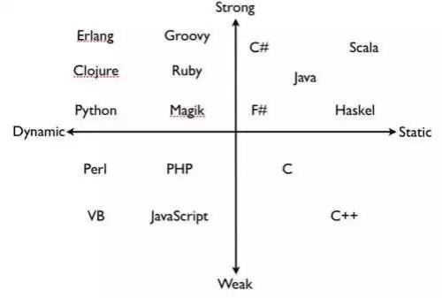

## C#是什么

编程分类：动态如python，静态如C等




## .net

.NET 是微软开发的跨平台、开源的开发框架，它提供了一系列的库和工具，用于开发各种类型的应用程序。


## 命名空间

命名空间：类似C中的库。要引用这个库，就要用`using`

命名空间的设计目的是提供一种让一组名称与其他名称分隔开的方式。在一个命名空间中声明的类的名称与另一个命名空间中声明的相同的类的名称不冲突。

命名空间的定义是以关键字 namespace 开始，后跟命名空间的名称，

如下所示：

```c#
namespace namespace_name
{
// 代码声明
}
```

```c#
using System;
using SomeNameSpace;
using SomeNameSpace.Nested;

namespace SomeNameSpace
{
    public class MyClass 
    {
        static void Main() 
        {
            Console.WriteLine("In SomeNameSpace");
            Nested.NestedNameSpaceClass.SayHello();
        }
    }

    // 内嵌命名空间
    namespace Nested   
    {
        public class NestedNameSpaceClass 
        {
            public static void SayHello() 
            {
                Console.WriteLine("In Nested");
            }
        }
    }
}
```

这个就感觉像头文件，必须声明他，你在别的地方才可以使用，不然就会报错。

如果不用`using System`，就要用`System.Console.log`进行一个输出。（不过好像可以用，不过这个是常用的`System`，这里只是举例）


## 接受来自用户的值

**System** 命名空间中的 **Console** 类提供了一个函数 **ReadLine()**，用于接收来自用户的输入，并把它存储到一个变量中。

例如：

```c#
int num;
num = Convert.ToInt32(Console.ReadLine());
```

函数 **Convert.ToInt32()** 把用户输入的数据转换为 int 数据类型，因为 **Console.ReadLine()** 只接受字符串格式的数据。

```c#
using System;

namespace CalculatorApplication
{
   class NumberManipulator
   {
      public int FindMax(int num1, int num2)
      {
         /* 局部变量声明 */
         int result;

         if (num1 > num2)
            result = num1;
         else
            result = num2;

         return result;
      }
      static void Main(string[] args)
      {
         /* 局部变量定义 */
         int a = 100;
         int b = 200;
         int ret;
         NumberManipulator n = new NumberManipulator();

         //调用 FindMax 方法
         ret = n.FindMax(a, b);
         Console.WriteLine("最大值是： {0}", ret );
         Console.ReadLine();
      }
   }
}
```

注意实例化一个类


## 数组

数组是一个存储相同类型元素的固定大小的顺序集合。数组是用来存储数据的集合，通常认为数组是一个同一类型变量的集合。

声明数组变量并不是声明 number0、number1、...、number99 一个个单独的变量，而是声明一个就像 numbers 这样的变量，然后使用 numbers[0]、numbers[1]、...、numbers[99] 来表示一个个单独的变量。数组中某个指定的元素是通过索引来访问的。

所有的数组都是由连续的内存位置组成的。最低的地址对应第一个元素，最高的地址对应最后一个元素。


### 1 声明数组

在 C# 中声明一个数组，您可以使用下面的语法：

```c#
datatype[] arrayName;
```

其中，

- *datatype* 用于指定被存储在数组中的元素的类型。
- *[ ]* 指定数组的秩（维度）。秩指定数组的大小。
- *arrayName* 指定数组的名称。

例如：

```c#
double[] balance;
```

### 2 初始化数组

声明一个数组不会在内存中初始化数组。当初始化数组变量时，您可以赋值给数组。

数组是一个引用类型，所以您需要使用 **new** 关键字来创建数组的实例。

例如：

```c#
double[] balance = new double[10];
```

### 3 赋值给数组

您可以通过使用索引号赋值给一个单独的数组元素，比如：

```c#
double[] balance = new double[10];
balance[0] = 4500.0;
```

您可以在声明数组的同时给数组赋值，比如：

```c#
double[] balance = { 2340.0, 4523.69, 3421.0};
```

您也可以创建并初始化一个数组，比如：

```c#
int [] marks = new int[5]  { 99,  98, 92, 97, 95};
```

在上述情况下，你也可以省略数组的大小，比如：

```c#
int [] marks = new int[]  { 99,  98, 92, 97, 95};
```

您也可以赋值一个数组变量到另一个目标数组变量中。在这种情况下，目标和源会指向相同的内存位置：

```c#
int [] marks = new int[]  { 99,  98, 92, 97, 95};
int[] score = marks;
```

当您创建一个数组时，C# 编译器会根据数组类型隐式初始化每个数组元素为一个默认值。例如，int 数组的所有元素都会被初始化为 0。

### 4 访问数组元素

元素是通过带索引的数组名称来访问的。这是通过把元素的索引放置在数组名称后的方括号中来实现的。例如：

```c#
double salary = balance[9];
```

下面是一个实例，使用上面提到的三个概念，即声明、赋值、访问数组：

```c#
using System;
namespace ArrayApplication
{
   class MyArray
   {
      static void Main(string[] args)
      {
         int []  n = new int[10]; /* n 是一个带有 10 个整数的数组 */
         int i,j;


         /* 初始化数组 n 中的元素 */         
         for ( i = 0; i < 10; i++ )
         {
            n[ i ] = i + 100;
         }

         /* 输出每个数组元素的值 */
         for (j = 0; j < 10; j++ )
         {
            Console.WriteLine("Element[{0}] = {1}", j, n[j]);
         }
         Console.ReadKey();
      }
   }
}
```

当上面的代码被编译和执行时，它会产生下列结果：

```
Element[0] = 100
Element[1] = 101
Element[2] = 102
Element[3] = 103
Element[4] = 104
Element[5] = 105
Element[6] = 106
Element[7] = 107
Element[8] = 108
Element[9] = 109
```

### 5 使用 *foreach* 循环

在前面的实例中，我们使用一个 for 循环来访问每个数组元素，您也可以使用一个 **foreach** 语句来遍历数组。

以下实例我们使用 foreach 来遍历一个数组：

```c#
using System;

namespace ArrayApplication
{
   class MyArray
   {
      static void Main(string[] args)
      {
         int []  n = new int[10]; /* n 是一个带有 10 个整数的数组 */


         /* 初始化数组 n 中的元素 */         
         for ( int i = 0; i < 10; i++ )
         {
            n[i] = i + 100;
         }

         /* 输出每个数组元素的值 */
         foreach (int j in n )
         {
            int i = j-100;
            Console.WriteLine("Element[{0}] = {1}", i, j);
         }
         Console.ReadKey();
      }
   }
}
```

当上面的代码被编译和执行时，它会产生下列结果：

```
#Element[0] = 100
Element[1] = 101
Element[2] = 102
Element[3] = 103
Element[4] = 104
Element[5] = 105
Element[6] = 106
Element[7] = 107
Element[8] = 108
Element[9] = 109
```


## 字符串

在 C# 中，您可以使用字符数组来表示字符串，但是，更常见的做法是使用 **string** 关键字来声明一个字符串变量。string 关键字是 **System.String** 类的别名。

### 1 创建 String 对象

您可以使用以下方法之一来创建 string 对象：

- 通过给 String 变量指定一个字符串
- 通过使用 String 类构造函数
- 通过使用字符串串联运算符（ + ）
- 通过检索属性或调用一个返回字符串的方法
- 通过格式化方法来转换一个值或对象为它的字符串表示形式

下面的实例演示了这点：

```c#
using System;

namespace StringApplication
{
    class Program
    {
        static void Main(string[] args)
        {
           //字符串，字符串连接
            string fname, lname;
            fname = "Rowan";
            lname = "Atkinson";

            string fullname = fname + lname;
            Console.WriteLine("Full Name: {0}", fullname);

            //通过使用 string 构造函数
            char[] letters = { 'H', 'e', 'l', 'l','o' };
            string greetings = new string(letters);
            Console.WriteLine("Greetings: {0}", greetings);

            //方法返回字符串
            string[] sarray = { "Hello", "From", "Tutorials", "Point" };
            string message = String.Join(" ", sarray);
            Console.WriteLine("Message: {0}", message);

            //用于转化值的格式化方法
            DateTime waiting = new DateTime(2012, 10, 10, 17, 58, 1);
            string chat = String.Format("Message sent at {0:t} on {0:D}", 
            waiting);
            Console.WriteLine("Message: {0}", chat);
            Console.ReadKey() ;
        }
    }
}
```

当上面的代码被编译和执行时，它会产生下列结果：

```
Full Name: RowanAtkinson
Greetings: Hello
Message: Hello From Tutorials Point
Message: Message sent at 17:58 on Wednesday, 10 October 2012
```

### 2 String 类的方法

String 类有许多方法用于 string 对象的操作。下面的表格提供了一些最常用的方法：

| 序号 | 方法名称 & 描述                                              |
| :--- | :----------------------------------------------------------- |
| 1    | **public static int Compare( string strA, string strB )** 比较两个指定的 string 对象，并返回一个表示它们在排列顺序中相对位置的整数。该方法区分大小写。 |
| 2    | **public static int Compare( string strA, string strB, bool ignoreCase )** 比较两个指定的 string 对象，并返回一个表示它们在排列顺序中相对位置的整数。但是，如果布尔参数为真时，该方法不区分大小写。 |
| 3    | **public static string Concat( string str0, string str1 )** 连接两个 string 对象。 |
| 4    | **public static string Concat( string str0, string str1, string str2 )** 连接三个 string 对象。 |
| 5    | **public static string Concat( string str0, string str1, string str2, string str3 )** 连接四个 string 对象。 |
| 6    | **public bool Contains( string value )** 返回一个表示指定 string 对象是否出现在字符串中的值。 |
| 7    | **public static string Copy( string str )** 创建一个与指定字符串具有相同值的新的 String 对象。 |
| 8    | **public void CopyTo( int sourceIndex, char[] destination, int destinationIndex, int count )** 从 string 对象的指定位置开始复制指定数量的字符到 Unicode 字符数组中的指定位置。 |
| 9    | **public bool EndsWith( string value )** 判断 string 对象的结尾是否匹配指定的字符串。 |
| 10   | **public bool Equals( string value )** 判断当前的 string 对象是否与指定的 string 对象具有相同的值。 |
| 11   | **public static bool Equals( string a, string b )** 判断两个指定的 string 对象是否具有相同的值。 |
| 12   | **public static string Format( string format, Object arg0 )** 把指定字符串中一个或多个格式项替换为指定对象的字符串表示形式。 |
| 13   | **public int IndexOf( char value )** 返回指定 Unicode 字符在当前字符串中第一次出现的索引，索引从 0 开始。 |
| 14   | **public int IndexOf( string value )** 返回指定字符串在该实例中第一次出现的索引，索引从 0 开始。 |
| 15   | **public int IndexOf( char value, int startIndex )** 返回指定 Unicode 字符从该字符串中指定字符位置开始搜索第一次出现的索引，索引从 0 开始。 |
| 16   | **public int IndexOf( string value, int startIndex )** 返回指定字符串从该实例中指定字符位置开始搜索第一次出现的索引，索引从 0 开始。 |
| 17   | **public int IndexOfAny( char[] anyOf )** 返回某一个指定的 Unicode 字符数组中任意字符在该实例中第一次出现的索引，索引从 0 开始。 |
| 18   | **public int IndexOfAny( char[] anyOf, int startIndex )** 返回某一个指定的 Unicode 字符数组中任意字符从该实例中指定字符位置开始搜索第一次出现的索引，索引从 0 开始。 |
| 19   | **public string Insert( int startIndex, string value )** 返回一个新的字符串，其中，指定的字符串被插入在当前 string 对象的指定索引位置。 |
| 20   | **public static bool IsNullOrEmpty( string value )** 指示指定的字符串是否为 null 或者是否为一个空的字符串。 |
| 21   | **public static string Join( string separator, string[] value )** 连接一个字符串数组中的所有元素，使用指定的分隔符分隔每个元素。 |
| 22   | **public static string Join( string separator, string[] value, int startIndex, int count )** 连接一个字符串数组中的指定位置开始的指定元素，使用指定的分隔符分隔每个元素。 |
| 23   | **public int LastIndexOf( char value )** 返回指定 Unicode 字符在当前 string 对象中最后一次出现的索引位置，索引从 0 开始。 |
| 24   | **public int LastIndexOf( string value )** 返回指定字符串在当前 string 对象中最后一次出现的索引位置，索引从 0 开始。 |
| 25   | **public string Remove( int startIndex )** 移除当前实例中的所有字符，从指定位置开始，一直到最后一个位置为止，并返回字符串。 |
| 26   | **public string Remove( int startIndex, int count )** 从当前字符串的指定位置开始移除指定数量的字符，并返回字符串。 |
| 27   | **public string Replace( char oldChar, char newChar )** 把当前 string 对象中，所有指定的 Unicode 字符替换为另一个指定的 Unicode 字符，并返回新的字符串。 |
| 28   | **public string Replace( string oldValue, string newValue )** 把当前 string 对象中，所有指定的字符串替换为另一个指定的字符串，并返回新的字符串。 |
| 29   | **public string[] Split( params char[] separator )** 返回一个字符串数组，包含当前的 string 对象中的子字符串，子字符串是使用指定的 Unicode 字符数组中的元素进行分隔的。 |
| 30   | **public string[] Split( char[] separator, int count )** 返回一个字符串数组，包含当前的 string 对象中的子字符串，子字符串是使用指定的 Unicode 字符数组中的元素进行分隔的。int 参数指定要返回的子字符串的最大数目。 |
| 31   | **public bool StartsWith( string value )** 判断字符串实例的开头是否匹配指定的字符串。 |
| 32   | **public char[] ToCharArray()** 返回一个带有当前 string 对象中所有字符的 Unicode 字符数组。 |
| 33   | **public char[] ToCharArray( int startIndex, int length )** 返回一个带有当前 string 对象中所有字符的 Unicode 字符数组，从指定的索引开始，直到指定的长度为止。 |
| 34   | **public string ToLower()** 把字符串转换为小写并返回。       |
| 35   | **public string ToUpper()** 把字符串转换为大写并返回。       |
| 36   | **public string Trim()** 移除当前 String 对象中的所有前导空白字符和后置空白字符。 |

上面的方法列表并不详尽，请访问 MSDN 库，查看完整的方法列表和 String 类构造函数。

### 3 一些常见用法与写法

在 C# 中，字符串 (string) 是一个特殊的引用类型。字符串是不可变的，这意味着一旦创建了一个字符串对象，它的内容就不能被改变。任何看起来修改字符串的操作（例如连接）实际上都会创建一个新的字符串对象。

*  空字符串：string.Empty

* string.Join(sep)：使用指定分隔符连接

* StringBuilder: 当需要频繁修改或连接大量字符串时使用

是 C# 6.0 引入的一项功能，它提供了一种更简洁、可读性更强的方式来构造包含变量或表达式的字符串。你不再需要使string.Format() 或字符串连接操作符 +。

```c#
string name = "Alice";
int age = 30;
string message = $"Hello, my name is {name} and I am {age} years old.";
Console.WriteLine(message);
// 输出: Hello, my name is Alice and I am 30 years old.
```

普通拼接写法很繁琐：

```
string msg = "My name is " + name + ", and I am " + age + " years old.";
```

插值写法更清晰：

```c#
string msg = $"My name is {name}, and I am {age} years old.";
```

使用 @ 作为前缀，主要用于处理包含反斜杠的路径或多行字符串。

```c#
// 路径字符串，避免转义反斜杠
string filePath = @"C:\Program Files\MyApp\data.txt";
Console.WriteLine(filePath); // 输出: C:\ProgramFiles\MyApp\data.txt	
// 多行字符串
string multiLine = @"This is the first line.
This is the second line.
This line is indented.";
Console.WriteLine(multiLine);
```

> [!important]
>
> 注意这里字符串和字符数组是不一样的


## 循环语句

**var** 关键字允许在声明局部变量时，让编译器根据初始化表达式推断变量的类型。

**foreach** 提供了一种简洁、可读性高的方式来依次访问集合中的所有项，而无需手动管理索引或迭代器。

这两个东西经常混在一起用：

```c#
List<int> numbers = new List<int>{1, 2, 3, 4, 5};
foreach (var number in numbers)
{
	Console.WriteLine(number);
}
```


## 枚举

声明枚举的一般语法：

```c#
enum <enum_name>
{ 
    enumeration list 
};
```

其中

- *enum_name* 指定枚举的类型名称。
- *enumeration list* 是一个用逗号分隔的标识符列表。

枚举列表中的每个符号代表一个整数值，一个比它前面的符号大的整数值。默认情况下，第一个枚举符号的值是 0.例如：

```c#
enum Days { Sun, Mon, tue, Wed, thu, Fri, Sat };
```

```c#
using System;

public class EnumTest
{
    enum Day { Sun, Mon, Tue, Wed, Thu, Fri, Sat };

    static void Main()
    {
        int x = (int)Day.Sun;
        int y = (int)Day.Fri;
        Console.WriteLine("Sun = {0}", x);
        Console.WriteLine("Fri = {0}", y);
    }
}
//输出
Sun = 0
Fri = 5
```


## C#类

### 1 核心概念：类是“蓝图”

**类 (Class)** 是创建**对象 (Object)** 的**蓝图、模板或设计图**。

它定义了一类事物应该具有的 **状态（数据）** 和 **行为（功能）**。

*   **蓝图 (类):** `class Car`
    *   **状态/属性:** 颜色、品牌、当前速度...
    *   **行为/方法:** 加速()、刹车()、鸣笛()...

*   **实体 (对象):** `new Car()`
    *   一辆红色的法拉利（一个对象）
    *   一辆黑色的宝马（另一个对象）

每个对象都是根据同一份蓝图创建的，但它们是独立的个体，可以有各自不同的状态（比如颜色不同）。

### 2 类的四大核心组成部分

我们用一个完整的 `Person` 类来贯穿讲解这四个部分。

```csharp
// 这是一个完整的“人”的蓝图 (Class)
public class Person
{
    // 1. 字段 (Fields) -> 内部数据存储
    private string _socialSecurityNumber; // 私有的，外部无法直接访问

    // 2. 属性 (Properties) -> 对外暴露的数据窗口
    public string Name { get; set; }
    public int Age { get; private set; } // Age 外部只读，内部可写

    // 3. 构造函数 (Constructor) -> 对象的“出生仪式”
    public Person(string name, int age, string ssn)
    {
        Console.WriteLine("一个人正在被创建...");
        this.Name = name;
        this.Age = age;
        this._socialSecurityNumber = ssn;
    }

    // 4. 方法 (Methods) -> 对象的“行为能力”
    public void Introduce()
    {
        Console.WriteLine($"大家好，我叫 {this.Name}，今年 {this.Age} 岁了。");
    }
}
```

##### a. 字段 (Fields) 和 属性 (Properties) —— 代表“状态”

*   **字段 (Field)**: 类内部的普通变量，用于存储数据。通常设为 `private`，以保护数据不被外部随意修改。就像人的基因，是内部核心信息。
    *   `private string _socialSecurityNumber;`

*   **属性 (Property)**: “智能”的字段，是外部访问内部数据的**唯一窗口**。它通过 `get` 和 `set` 访问器来控制数据的读取和写入。这是**封装 (Encapsulation)** 思想的核心体现。
    *   `public string Name { get; set; }`：这是自动属性，最简洁的写法，允许外部自由读写。
    *   `public int Age { get; private set; }`：这表示 `Age` 属性，外部代码只能读取 (`get`)，但只有 `Person` 类内部的代码可以修改 (`private set`)。

##### b. 构造函数 (Constructor) —— 代表“创建”

*   当你使用 `new Person(...)` 时，构造函数被**自动调用**。
*   它的工作是**初始化对象**，确保对象一被创建就处于一个有效的、有意义的状态。
*   在我们的例子中，构造函数强制要求创建 `Person` 时必须提供姓名、年龄和社保号。

##### c. 方法 (Methods) —— 代表“行为”

*   方法定义了对象能做什么。
*   `public void Introduce()` 就是 `Person` 对象的一个行为能力。

### 3 如何使用类：从蓝图到实体

```csharp
// 使用 new 关键字，根据 Person 蓝图创建一个真实的对象 zhangSan
// "张三", 30, "123..." 这些参数会传递给构造函数
Person zhangSan = new Person("张三", 30, "123456789");

// zhangSan 是一个具体的对象了，我们可以和他交互
// 1. 访问他的属性
Console.WriteLine(zhangSan.Name); // 输出: 张三

// 2. 调用他的方法
zhangSan.Introduce(); // 输出: 大家好，我叫 张三，今年 30 岁了。

// 3. 尝试修改只读属性
// zhangSan.Age = 31; // 编译错误！因为 Age 的 set 是 private 的。
```

### 4 类的三大支柱思想

为什么我们要用类？因为它能帮助我们更好地组织代码，并实现这三大强大的思想：

1.  **封装 (Encapsulation)**
    *   **是什么**：将数据（字段）和操作这些数据的方法（属性、方法）捆绑在一个单元（类）中，并对外部隐藏内部的实现细节。
    *   **如何实现**：通过 `private` 字段和 `public` 属性/方法。
    *   **好处**：保护数据安全，简化外部使用。

2.  **继承 (Inheritance)**
    *   **是什么**：一个类（子类）可以继承另一个类（父类）的属性和方法，并可以添加自己的新功能或修改现有功能。
    *   **如何实现**：使用冒号 `:`。 `public class Student : Person { ... }`
    *   **好处**：代码重用。`Student` 类无需重复编写 `Name`, `Age`, `Introduce` 等代码。

3.  **多态 (Polymorphism)**
    *   **是什么**：“多种形态”。允许不同类的对象对同一个消息（方法调用）做出不同的响应。
    *   **如何实现**：通过 `virtual` (在父类中标记方法可被重写) 和 `override` (在子类中重写方法)。
    *   **好处**：极大地提高了代码的灵活性和可扩展性。

---

### 5 总结：所有知识点的串联

*   你定义一个 **类 (Class)** 作为蓝图。
*   类里面有 **属性 (Property)** 描述状态，**方法 (Method)** 描述行为。
*   **构造函数 (Constructor)** 负责在对象创建时进行初始化。
*   你使用 **`new` 关键字** 来调用构造函数，从而创建一个真实的对象。
*   **依赖注入 (DI)** 是一种高级的设计模式，它建议你不要在构造函数里 `new` 依赖，而是把依赖作为参数从外部传进来，其目的就是为了让类与类之间的关系更加松散、灵活。（后话

类是 C# 乃至所有面向对象语言的基石。掌握了它，你就掌握了构建复杂软件系统的基础。


## C#方法

方法理解成定义在类中的函数，而构造函数是用于创建对象的特殊方法。它的主要目的是确保对象在首次使用之前处于有效的状态。

函数（也称为方法）是一段执行特定任务的代码块，函数在 C# 中应该定义在类中。

```c#
函数（也称为方法）是一段执行特定任务的代码块，函数在 C# 中应该定义在类中。
// 这里是一个类，这个待会会详细讲解
public class MyFunctions
{
    // 定义一个不带参数，无返回值的函数
    public void Greet()
    {Console.WriteLine("你好，世界！");}
    // 定义一个带参数，有返回值的函数
    public int Add(int a, int b){return a + b;}
}
```


## 方法重载 

### 1 核心概念

**方法重载** 就是 **“一个名字，多种用途”**。

它允许在同一个类中定义多个**同名的方法**，但它们的**参数列表必须不同**。

### 2 实现规则

满足以下任意一条即可构成重载：

*   **参数个数不同**
*   **参数类型不同**
*   **参数顺序不同**（前提是参数类型因此而不同）

### 3 关键禁忌

*   **仅返回值类型不同**：不能构成重载。
*   **仅参数名称不同**：不能构成重载。

### 4 编译器如何选择

当你调用一个重载方法时，编译器会按以下顺序寻找最佳匹配：

1.  **完美匹配**：寻找参数类型和数量完全一致的版本。
2.  **隐式转换匹配**：如果没有完美匹配，尝试通过安全的类型转换（如 `int` 转 `double`）来寻找一个可用的版本。
3.  **编译失败**：如果找不到任何匹配项，则代码无法通过编译。

### 5 主要优点

*   **简洁性**：调用者只需记住一个方法名即可处理多种数据类型（如 `Console.WriteLine()`）。
*   **可读性**：代码意图更清晰，方法名统一。
*   **灵活性**：为同一个功能提供多种方便的调用方式。

```csharp
public class Printer
{
    // 重载 1: 打印整数
    public void Print(int data)
    {
        Console.WriteLine("整数: " + data);
    }

    // 重载 2: 打印字符串
    public void Print(string data)
    {
        Console.WriteLine("字符串: " + data);
    }
    
    // 重载 3: 打印两个数
    public void Print(int a, int b)
    {
        Console.WriteLine($"两个数: {a}, {b}");
    }
}

// 调用
Printer p = new Printer();
p.Print(100);          // -> 输出 "整数: 100"
p.Print("Hello");      // -> 输出 "字符串: Hello"
p.Print(5, 10);        // -> 输出 "两个数: 5, 10"
```


## 构造函数

类的 **构造函数** 是类的一个特殊的成员函数，当创建类的新对象时执行。

构造函数的名称与类的名称完全相同，它没有任何返回类型。

下面的实例说明了构造函数的概念：

```c#
using System;
namespace LineApplication
{
   class Line
   {
      private double length;   // 线条的长度
      public Line()
      {
         Console.WriteLine("对象已创建");
      }

      public void setLength( double len )
      {
         length = len;
      }
      public double getLength()
      {
         return length;
      }

      static void Main(string[] args)
      {
         Line line = new Line();    
         // 设置线条长度
         line.setLength(6.0);
         Console.WriteLine("线条的长度： {0}", line.getLength());
         Console.ReadKey();
      }
   }
}
```

当上面的代码被编译和执行时，它会产生下列结果：

```
对象已创建
线条的长度： 6
```

**默认的构造函数**没有任何参数。但是如果你需要一个带有参数的构造函数可以有参数，这种构造函数叫做**参数化构造函数**。这种技术可以帮助你在创建对象的同时给对象赋初始值，具体请看下面实例：

```c#
using System;
namespace LineApplication
{
   class Line
   {
      private double length;   // 线条的长度
      public Line(double len)  // 参数化构造函数
      {
         Console.WriteLine("对象已创建，length = {0}", len);
         length = len;
      }

      public void setLength( double len )
      {
         length = len;
      }
      public double getLength()
      {
         return length;
      }

      static void Main(string[] args)
      {
         Line line = new Line(10.0);
         Console.WriteLine("线条的长度： {0}", line.getLength()); 
         // 设置线条长度
         line.setLength(6.0);
         Console.WriteLine("线条的长度： {0}", line.getLength()); 
         Console.ReadKey();
      }
   }
}=
```

当上面的代码被编译和执行时，它会产生下列结果：

```
对象已创建，length = 10
线条的长度： 10
线条的长度： 6
```


## C# 类的静态成员

我们可以使用 **static** 关键字把类成员定义为静态的。当我们声明一个类成员为静态时，意味着无论有多少个类的对象被创建，只会有一个该静态成员的副本。

关键字 **static** 意味着类中只有一个该成员的实例。静态变量用于定义常量，因为它们的值可以通过直接调用类而不需要创建类的实例来获取。静态变量可在成员函数或类的定义外部进行初始化。你也可以在类的定义内部初始化静态变量。

下面的实例演示了**静态变量**的用法：

```c#
using System;
namespace StaticVarApplication
{
    class StaticVar
    {
       public static int num;
        public void count()
        {
            num++;
        }
        public int getNum()
        {
            return num;
        }
    }
    class StaticTester
    {
        static void Main(string[] args)
        {
            StaticVar s1 = new StaticVar();
            StaticVar s2 = new StaticVar();
            s1.count();
            s1.count();
            s1.count();
            s2.count();
            s2.count();
            s2.count();         
            Console.WriteLine("s1 的变量 num： {0}", s1.getNum());
            Console.WriteLine("s2 的变量 num： {0}", s2.getNum());
            Console.ReadKey();
        }
    }
}
```

当上面的代码被编译和执行时，它会产生下列结果：

```
s1 的变量 num： 6
s2 的变量 num： 6
```

> [!important]
>
> 静态变量只会有一个，所以不管是实例s1调用.count还是s2调用.count，都会在同一个变量上进行运算

你也可以把一个**成员函数**声明为 **static**。这样的函数只能访问静态变量。静态函数在对象被创建之前就已经存在。下面的实例演示了**静态函数**的用法：

```c#
using System;
namespace StaticVarApplication
{
    class StaticVar
    {
        public static int num;
        public void count()
        {
            num++;
        }
        public static int getNum()
        {
            return num;
        }
    }
    class StaticTester
    {
        static void Main(string[] args)
        {
            StaticVar s = new StaticVar();
            s.count();
            s.count();
            s.count();                   
            Console.WriteLine("变量 num： {0}", StaticVar.getNum());
            Console.ReadKey();
        }
    }
}
```

当上面的代码被编译和执行时，它会产生下列结果：

```
变量 num： 3
```


## 类中的属性

> [!note]
>
> 属性：通过对外暴露的属性来修改字段

```c#
public class BankAccount
{
    private decimal balance; // 字段，不能直接被外部访问

    public decimal Balance    // 属性，用来间接访问字段
    {
        get { return balance; }
        set
        {
            if (value >= 0) // 控制逻辑：余额不能为负
                balance = value;
        }
    }
}
//外部调用
……
    BankAccount my = new BankAccount();

    // 设置余额（使用 set）
    my.Balance = 70;

    // 获取余额（使用 get）
    decimal a = my.Balance;
```

这是一个语法糖，正常可以直接用`{get,set}`来使用。

>> 为什么不直接把字段 `public`？这样不是更简单？
>
>答案是：**可以，但不建议。**
>
>------
>
>####  1. **封装性（Encapsulation）**
>
>如果字段是 `public`，你就**无法控制它的读写行为**，任何代码都能随意赋值甚至赋错值：
>
>```c#
>class BankAccount
>{
>   public decimal balance;  // ❌ 没有控制
>}
>...
>var acc = new BankAccount();
>acc.balance = -10000000;    // 💥 完全合法，但明显不合理
>```
> 
>而使用属性你可以**加上逻辑判断**：
>
>```c#
>decimal Balance
>{
>   get { return balance; }
>   set
>   {
>       if (value >= 0)
>           balance = value;
>   }
> }
> ```
> 
> ------
> 
> #### 2. **更强的可维护性和灵活性**
>
>假设你最初让字段 `public`，后来又想加判断逻辑，那你就要：
>
>- 把所有用过这个字段的代码都找出来重改一遍（可能已经到处用了）
>- 兼容各种旧写法，维护负担大
>
>但如果一开始就用了属性，即使内部实现方式变了（比如以后 balance 不再保存在变量中，而是去查数据库），外部访问方式都**不用改**！
>
>```c#
>decimal Balance
>{
>   get { return GetFromDatabase(); }
>   set { SaveToDatabase(value); }
>}
>```
>
>------
> 
> #### 3. **支持只读 / 只写 / 计算型属性**
>
>属性可以设置只读、只写，或者根据其他变量计算，不一定有 backing field：
>
>```c#
>public string FullName => FirstName + " " + LastName;  // ✅ 计算型属性
>csharpCopyEditpublic int Age
>{
>   get { return DateTime.Now.Year - birthYear; }  // ✅ 只读
>}
>```
>

### 两种主要写法

##### a. 自动实现属性 (Auto-Implemented Property)

这是最常见、最简洁的写法。当你不需要任何额外的逻辑时，就用它。

```csharp
// 编译器会自动在后台为你创建一个私有的、看不见的字段来存储数据
public class Person
{
    public string Name { get; set; }
    public int Age { get; set; }
}

// 使用起来就像一个公共变量
Person p = new Person();
p.Name = "李四";      // 这里调用了 set 访问器
string name = p.Name; // 这里调用了 get 访问器
```

##### b. 完整实现属性 (Full Property)

当你需要对数据的读写进行控制时（例如，数据验证），就需要这种写法。

这种写法需要你**手动声明一个私有字段**（通常以下划线 `_` 开头）来存储数据。

```csharp
public class Product
{
    private string _name; // 私有的“后备字段” (Backing Field)

    public string Name
    {
        get
        {
            // get 访问器：直接返回私有字段的值
            return _name;
        }
        set
        {
            // set 访问器：在赋值前进行检查
            if (string.IsNullOrEmpty(value))
            {
                throw new ArgumentException("产品名称不能为空！");
            }
            // 'value' 是一个特殊的关键字，代表你赋过来的值
            _name = value;
        }
    }
}
```


## 继承

继承是面向对象程序设计中最重要的概念之一。继承允许我们根据一个类来定义另一个类，这使得创建和维护应用程序变得更容易。同时也有利于重用代码和节省开发时间。

当创建一个类时，程序员不需要完全重新编写新的数据成员和成员函数，只需要设计一个新的类，继承了已有的类的成员即可。这个已有的类被称为的**基类**，这个新的类被称为**派生类**。

继承的思想实现了 **属于（IS-A）** 关系。例如，哺乳动物 **属于（IS-A）** 动物，狗 **属于（IS-A）** 哺乳动物，因此狗 **属于（IS-A）** 动物。

>**继承**是指一个类（**子类/派生类**）可以继承另一个类（**父类/基类**）的成员（字段、方法、属性等）。
>
>这样可以实现 **代码复用**，并为**多态（Polymorphism）**打下基础。

```c#
class 父类名
{
    // 字段、方法、属性等
}

class 子类名 : 父类名
{
    // 子类可以新增成员，或重写父类成员
}
```

```c#
class Animal
{
    public void Eat()
    {
        Console.WriteLine("Animal is eating.");
    }
}

public class Dog : Animal  // Dog 继承 Animal
{
    public void Bark()
    {
        Console.WriteLine("Dog is barking.");
    }
}
csharpCopyEditDog dog = new Dog();
dog.Eat();  // 继承自 Animal
dog.Bark(); // 自己的方法
```

如果父类有构造函数，子类可以通过 `base` 调用它：

```c#
class Animal
{
    public string Name;
    public Animal(string name)
    {
        Name = name;
    }
}

public class Dog : Animal
{
    public Dog(string name) : base(name)
    {
        Console.WriteLine("Dog created: " + Name);
    }
}
```

>new Dog("Tom")
>  ↓
>Dog构造函数的name参数 = "Tom"
>  ↓
>调用 base(name)，父类Animal的构造函数接收参数"Tom"
>  ↓
>Animal的构造函数执行：this.Name = "Tom"
>  ↓
>Dog对象的Name字段被赋值为"Tom"（继承自Animal）

ps：C#中大括号一般要换行

派生类继承了基类的成员变量和成员方法。因此父类对象应在子类对象创建之前被创建。您可以在成员初始化列表中进行父类的初始化。

下面的程序演示了这点：

```c#
using System;
namespace RectangleApplication
{
   class Rectangle
   {
      // 成员变量
      protected double length;
      protected double width;
      public Rectangle(double l, double w)
      {
         length = l;
         width = w;
      }
      public double GetArea()
      {
         return length * width;
      }
      public void Display()
      {
         Console.WriteLine("长度： {0}", length);
         Console.WriteLine("宽度： {0}", width);
         Console.WriteLine("面积： {0}", GetArea());
      }
   }//end class Rectangle  
   class Tabletop : Rectangle
   {
      private double cost;
      public Tabletop(double l, double w) : base(l, w)   //调用父类构造函数
      { }
      public double GetCost()
      {
         double cost;
         cost = GetArea() * 70;
         return cost;
      }
      public void Display()
      {
         base.Display();
         Console.WriteLine("成本： {0}", GetCost());
      }
   }
   class ExecuteRectangle
   {
      static void Main(string[] args)
      {
         Tabletop t = new Tabletop(4.5, 7.5);
         t.Display();
         Console.ReadLine();
      }
   }
}
```

当上面的代码被编译和执行时，它会产生下列结果：

```
长度： 4.5
宽度： 7.5
面积： 33.75
成本： 2362.5
```


## 接口

### 1 核心概念：接口是“合同”或“规范”

**接口 (Interface)** 是一种**纯粹的抽象类型**，它只定义了**“应该做什么” (What)**，而不关心**“具体怎么做” (How)**。

可以把它理解为一份**合同、规范或一份能力清单**。任何类如果想“签署”这份合同，就必须实现合同中规定的所有条款（方法、属性等）。

### 2 为什么使用接口？

使用接口的主要目的是为了实现**松散耦合 (Loose Coupling)**，这带来了巨大的好处：

1.  **实现多态**：允许你编写一段代码来处理**任何**实现了该接口的对象，而无需关心对象的具体类型。
2.  **强制统一规范**：确保一组不相关的类都具有某些共同的功能，并遵循同样的方法签名。
3.  **支持依赖注入 (DI)**：这是现代软件架构的基石。程序依赖于稳定的“接口合同”，而不是依赖于易变的“具体实现”。
4.  **方便单元测试**：可以轻松地创建接口的“模拟”实现 (Mock Object) 来进行测试。

### 3 核心语法和规则

##### a. 定义接口

*   使用 `interface` 关键字。
*   接口名称通常以大写字母 `I` 开头（例如 `IComparable`, `IDisposable`），这是一个广泛遵循的命名约定。
*   接口成员**不能有**访问修饰符（如 `public`），因为它们**默认就是公开的**。
*   接口成员**不能有**方法体（实现代码）。（注：C# 8.0+ 引入了“默认接口实现”，但基本用法中仍视为空方法体）

```csharp
// 定义一个“可发出声音”的合同
public interface ISoundable
{
    // 属性规范：必须有一个只读的 Volume 属性
    int Volume { get; }
    // 方法规范：必须有一个 MakeSound 方法
    void MakeSound();
}
```

##### b. 实现接口

*   类通过在类名后使用冒号 `:` 来实现一个或多个接口。
*   一个类可以继承一个基类，同时实现多个接口。
*   **必须实现接口中定义的所有成员**。

```csharp
// Dog 类签署了 ISoundable 合同
public class Dog : ISoundable
{
    // 实现合同规定的 Volume 属性
    public int Volume { get; private set; } = 80;

    // 实现合同规定的 MakeSound 方法
    public void MakeSound()
    {
        Console.WriteLine("汪汪汪！");
    }
}

// Car 类也签署了 ISoundable 合同
public class Car : ISoundable
{
    public int Volume { get; private set; } = 100;

    public void MakeSound()
    {
        Console.WriteLine("嘀嘀嘀！");
    }
}
```

##### c. 使用接口

使用接口的最大威力在于，你可以**面向接口编程**，而不是面向具体类编程。

```csharp
// 这个方法不关心传来的是 Dog 还是 Car，它只关心对象是否“可发出声音”
public void TriggerSound(ISoundable soundMaker)
{
    Console.WriteLine($"音量: {soundMaker.Volume}");
    soundMaker.MakeSound();
}

// 使用
Dog myDog = new Dog();
Car myCar = new Car();

TriggerSound(myDog); // 正常工作
TriggerSound(myCar); // 正常工作

// 还可以把它们放在一个接口类型的集合中
List<ISoundable> soundMakers = new List<ISoundable> { myDog, myCar };
foreach (var item in soundMakers)
{
    item.MakeSound(); // 多态的体现
}
```

### 4 继承接口

一个接口可以继承自一个或多个其他接口，派生接口继承了基接口的所有成员。

派生接口可以扩展基接口的成员列表，但不能改变它们的访问修饰符。

```c#
interface IBaseInterface
{
    void Method1();
}

interface IDerivedInterface : IBaseInterface
{
    void Method2();
}
```

继承接口的实例可以通过以下方式来实现：

```c#
using System;

// 定义一个基接口
interface IBaseInterface
{
    void Method1();
}

// 定义一个派生接口，继承自基接口
interface IDerivedInterface : IBaseInterface
{
    void Method2();
}

// 实现派生接口的类
class MyClass : IDerivedInterface
{
    public void Method1()
    {
        Console.WriteLine("Method1 implementation");
    }

    public void Method2()
    {
        Console.WriteLine("Method2 implementation");
    }
}

class Program
{
    static void Main(string[] args)
    {
        // 创建 MyClass 类的实例
        MyClass obj = new MyClass();

        // 调用继承自基接口的方法
        obj.Method1();

        // 调用派生接口新增的方法
        obj.Method2();
    }
}
```

以上实例中 MyClass 类实现了 IDerivedInterface 接口，因此必须提供 IDerivedInterface 中定义的所有方法，包括从 IBaseInterface继承的 Method1() 方法。 在 Main 方法中，我们创建了 MyClass 的实例 obj 并调用了它的方法。

输出结果为：

```
Method1 implementation
Method2 implementation
```

### 5 C#多重继承

多重继承指的是一个类别可以同时从多于一个父类继承行为与特征的功能。与单一继承相对，单一继承指一个类别只可以继承自一个父类。

**C# 不支持多重继承**。但是，您可以使用接口来实现多重继承。下面的程序演示了这点：

```c#
using System;
namespace InheritanceApplication
{
   class Shape 
   {
      public void setWidth(int w)
      {
         width = w;
      }
      public void setHeight(int h)
      {
         height = h;
      }
      protected int width;
      protected int height;
   }

   // 基类 PaintCost
   public interface PaintCost 
   {
      int getCost(int area);

   }
   // 派生类
   class Rectangle : Shape, PaintCost
   {
      public int getArea()
      {
         return (width * height);
      }
      public int getCost(int area)
      {
         return area * 70;
      }
   }
   class RectangleTester
   {
      static void Main(string[] args)
      {
         Rectangle Rect = new Rectangle();
         int area;
         Rect.setWidth(5);
         Rect.setHeight(7);
         area = Rect.getArea();
         // 打印对象的面积
         Console.WriteLine("总面积： {0}",  Rect.getArea());
         Console.WriteLine("油漆总成本： ${0}" , Rect.getCost(area));
         Console.ReadKey();
      }
   }
}
```

当上面的代码被编译和执行时，它会产生下列结果：

```
总面积： 35
油漆总成本： $2450
```


## 依赖注入

### 1 核心思想

依赖注入的核心思想非常简单：**不要在类内部创建它所依赖的对象，而是通过外部传递（注入）给它。**

### 2 优势

*   **松散耦合 (Loose Coupling)**：类不再依赖于具体的实现，而是依赖于抽象（接口）。这使得系统更容易修改和扩展。
*   **易于测试 (Testability)**：在单元测试时，可以轻松地传入一个“假的”依赖对象（Mock Object），从而独立地测试一个类的逻辑，而不用管它依赖的真实组件。
*   **灵活性和可维护性**：当需要更换一个依赖的实现时（比如日志组件从写入文件改成写入数据库），你只需要在“DI容器”中修改一处配置即可，而不需要改动任何业务代码。

---

### 3 代码

##### a. 没有DI (紧密耦合 - The Bad Way)

```csharp
// 依赖的具体实现
public class EmailService 
{
    public void Send(string message) { /* 发送邮件... */ }
}

// 使用者
public class NotificationService
{
    private EmailService _emailService;

    public NotificationService()
    {
        // 问题所在：自己在内部创建了依赖！
        // NotificationService 和 EmailService 紧紧地绑在了一起。
        _emailService = new EmailService(); 
    }

    public void Notify(string message)
    {
        _emailService.Send(message);
    }
}
```

##### b. 使用DI (松散耦合 - The Good Way)

**第1步：依赖于接口 (抽象)**

```csharp
// 1. 定义一个接口（合同）
public interface IMessageService
{
    void Send(string message);
}

// 2. 具体的实现
public class EmailService : IMessageService
{
    public void Send(string message) { /* 发送邮件... */ }
}

public class SmsService : IMessageService 
{
    public void Send(string message) { /* 发送短信... */ }
}
```

**第2步：通过构造函数注入依赖**

```csharp
public class NotificationService
{
    // 只依赖于接口，不关心具体是谁
    private readonly IMessageService _messageService; 

    // 关键：依赖通过构造函数从外部“注入”进来
    public NotificationService(IMessageService messageService)
    {
        _messageService = messageService;
    }

    public void Notify(string message)
    {
        _messageService.Send(message);
    }
}
```

### 4 注入的三种主要方式

1.  **构造函数注入 (Constructor Injection)**
    *   通过构造函数传入依赖。
    *   **最常用、最推荐的方式**。它能保证对象在创建完成后，其所有必要的依赖都已准备就绪。

2.  **属性注入 (Property Injection)**
    *   通过公共属性传入依赖。
    *   适用于可选的依赖。

3.  **方法注入 (Method Injection)**
    *   依赖只在某个特定方法中被需要时，通过该方法的参数传入。


## this关键字

```c#
class MyClass
{
    public int a { get; set; }

    public MyClass(int a)   //这个就是构造函数
    {
        this.a = a;
    }
}
```

**左边的 `this.a`** 是对象的属性（成员变量）；

**右边的 `a`** 是构造函数传进来的参数；

把参数 `a` 的值 **赋值** 给属性 `a`。

这样就可以区分两个`this`了


## 异常处理

**核心作用**：捕获和处理程序运行时发生的错误（异常），防止程序崩溃，保证代码健壮性。

### 1 基本结构

```csharp
try
{
    // 1. 尝试执行: 可能会出错的代码
    // 例如：int result = 10 / 0; 
}
catch (ExceptionType ex) // 2. 捕获: 如果try中发生特定类型的错误
{
    // 3. 处理: 在这里处理错误，例如记录日志
    Console.WriteLine("捕获到错误: " + ex.Message);
}
finally
{
    // 4. 最终执行: 无论是否出错，总会执行（用于资源清理）
    Console.WriteLine("清理工作完成。");
}
```

### 2 关键组件

*   **`try`**: 包裹可能抛出异常的代码。
*   **`catch (ExceptionType ex)`**: 如果 `try` 块中发生 *指定类型* 的异常，则执行此块。`ex` 对象包含错误详情。
*   **`finally`**: 无论是否发生异常，这里的代码 **总是** 会被执行。主要用于释放资源（如关闭文件、数据库连接）。

### 3 核心规则与最佳实践

1. **捕获顺序：从具体到通用**
   `catch (FileNotFoundException)` 这种具体的异常，必须放在 `catch (Exception)` 这种通用的异常前面。

   ```csharp
   try { /* ... */ }
   catch (ArgumentNullException ex) { /* 处理空参数 */ } // 最具体
   catch (Exception ex) { /* 处理其他所有错误 */ }      // 最通用
   ```

2. **不要“吞噬”异常**
   空的 `catch {}` 会隐藏问题，是危险的反模式。至少要记录日志。

3. **正确地重新抛出异常：使用 `throw;`**
   在 `catch` 块中若要将异常向上传递，请使用 `throw;` 而不是 `throw ex;`，以保留原始的错误堆栈信息，方便调试。

   ```csharp
   catch (Exception ex)
   {
       Log(ex); // 记录日志
       throw;   // 正确方式：保留原始堆栈信息
   }
   ```

4. **优先使用 `using` 语句进行资源管理**
   对于实现了 `IDisposable` 的对象（如文件流、数据库连接），`using` 是 `try-finally` 的最佳替代，能自动、安全地释放资源。

   ```csharp
   // 自动调用 myConnection.Dispose()，即使发生异常
   using (var myConnection = new SqlConnection(connectionString))
   {
       myConnection.Open();
       // ...
   }
   ```

5. **避免用异常控制程序流程**
   异常处理有性能开销。对于可预见的逻辑判断，应使用 `if-else` 或 `int.TryParse()` 等方法，而不是依赖 `try-catch`。

   ```csharp
   // 推荐
   if (int.TryParse(text, out int number)) { /* ... */ }
   
   // 不推荐
   // try { int number = int.Parse(text); } catch { /* ... */ }
   ```

| 异常类                            | 描述                                           |
| :-------------------------------- | :--------------------------------------------- |
| System.IO.IOException             | 处理 I/O 错误。                                |
| System.IndexOutOfRangeException   | 处理当方法指向超出范围的数组索引时生成的错误。 |
| System.ArrayTypeMismatchException | 处理当数组类型不匹配时生成的错误。             |
| System.NullReferenceException     | 处理当依从一个空对象时生成的错误。             |
| System.DivideByZeroException      | 处理当除以零时生成的错误。                     |
| System.InvalidCastException       | 处理在类型转换期间生成的错误。                 |
| System.OutOfMemoryException       | 处理空闲内存不足生成的错误。                   |
| System.StackOverflowException     | 处理栈溢出生成的错误。                         |


## 委托

这个委托其实就是类似函数指针，不过更加安全可靠。我们用委托来指向一个函数，这样可以方便很多为了减少麻烦，微软为我们省去了定义委托的这一步骤。

正常的函数定义委托，我们只是根据他的返回值类型和参数个数来进行区别。有了泛型后，我们只根据参数的个数进行区别。

### 1 委托的类别

于是有了以下几类委托：

#### 1.1 Action

**Action：**代表不返回值的方法。可以接受最多 16 个参数。

```c#
Action<string> printMessage = Console.WriteLine;
printMessage("Hello");
```

#### 1.2 Func

**Func**：代表有返回值的方法。最多接受 16 个参数，第一个参数是输入参数，最后一个参数是返回值类型。

```c#
Func<int, int, int> add = (x, y) => x + y;
Console.WriteLine(add(3, 4));  // 输出 7
```

#### 1.3 Predicate

**Predicate**：代表返回 bool 值的方法，通常用于条件判断。

```c#
Predicate<int> isEven = x => x % 2 == 0;
Console.WriteLine(isEven(4));  // 输出 True
```

------

### 2 注意事项

**类型安全：**委托是类型安全的，这意味着只有签名匹配的方法才能赋值给委托。

匿名方法和 lambda 表达式：你可以使用匿名方法或 lambda 表达式来创建委托实例，简化代码。

```c#
Func<int, int, int> add = (x, y) => x + y;
Console.WriteLine(add(5, 3));  // 输出 8
```

异步调用：可以将委托与 BeginInvoke 和 EndInvoke 方法一起使用，进行异步调用。

委托是 C# 中一个非常强大和灵活的特性，可以帮助实现事件驱动的编程、回调机制和函数式编程风格。它不仅提供了代码重用的能力，还提高了程序的模块化程度。理解和掌握委托的使用对于 C# 编程是非常重要的。

具体讲解：

以下例子的委托可被用于引用任何一个带有一个单一的 *string* 参数的方法，并返回一个 *int* 类型变量。

```c#
public delegate int MyDelegate (string s);
```

一旦声明了委托类型，委托对象必须使用 **new** 关键字来创建，且与一个特定的方法有关。当创建委托时，传递到 **new** 语句的参数就像方法调用一样书写，但是不带有参数。例如：

```c#
public delegate void printString(string s);
...
printString ps1 = new printString(WriteToScreen);
printString ps2 = new printString(WriteToFile);
```

示例如下：

```c#
using System;

delegate int NumberChanger(int n);
namespace DelegateAppl
{
   class TestDelegate
   {
      static int num = 10;
      public static int AddNum(int p)
      {
         num += p;
         return num;
      }

      public static int MultNum(int q)
      {
         num *= q;
         return num;
      }
      public static int getNum()
      {
         return num;
      }

      static void Main(string[] args)
      {
         // 创建委托实例
         NumberChanger nc1 = new NumberChanger(AddNum);
         NumberChanger nc2 = new NumberChanger(MultNum);
         // 使用委托对象调用方法
         nc1(25);
         Console.WriteLine("Value of Num: {0}", getNum());
         nc2(5);
         Console.WriteLine("Value of Num: {0}", getNum());
         Console.ReadKey();
      }
   }
}
```

输出：

```
Value of Num: 35
Value of Num: 175
```

### 3 委托的多播

委托对象可使用 **+** 运算符进行合并。

一个合并委托调用它所合并的两个委托，只有相同类型的委托可被合并。

使用委托的这个有用的特点，您可以创建一个委托被调用时要调用的方法的调用列表，这被称为委托的 **多播（multicasting）**，也叫组播。

下面的程序演示了委托的多播：

```c#
using System;

delegate int NumberChanger(int n);
namespace DelegateAppl
{
   class TestDelegate
   {
      static int num = 10;
      public static int AddNum(int p)
      {
         num += p;
         return num;
      }

      public static int MultNum(int q)
      {
         num *= q;
         return num;
      }
      public static int getNum()
      {
         return num;
      }

      static void Main(string[] args)
      {
         // 创建委托实例
         NumberChanger nc;
         NumberChanger nc1 = new NumberChanger(AddNum);
         NumberChanger nc2 = new NumberChanger(MultNum);
         nc = nc1;
         nc += nc2;
         // 调用多播
         nc(5);
         Console.WriteLine("Value of Num: {0}", getNum());
         Console.ReadKey();
      }
   }
}
```

输出：

```c
Value of Num: 75
```


## 泛型

**泛型（Generic）** 允许您延迟编写类或方法中的编程元素的数据类型的规范，直到实际在程序中使用它的时候。换句话说，泛型允许您编写一个可以与任何数据类型一起工作的类或方法。

您可以通过数据类型的替代参数编写类或方法的规范。当编译器遇到类的构造函数或方法的函数调用时，它会生成代码来处理指定的数据类型。下面这个简单的实例将有助于您理解这个概念：

```c#
using System;
using System.Collections.Generic;

namespace GenericApplication
{
    public class MyGenericArray<T>
    {
        private T[] array;
        public MyGenericArray(int size)
        {
            array = new T[size + 1];
        }
        public T getItem(int index)
        {
            return array[index];
        }
        public void setItem(int index, T value)
        {
            array[index] = value;
        }
    }
           
    class Tester
    {
        static void Main(string[] args)
        {
            // 声明一个整型数组
            MyGenericArray<int> intArray = new MyGenericArray<int>(5);
            // 设置值
            for (int c = 0; c < 5; c++)
            {
                intArray.setItem(c, c*5);
            }
            // 获取值
            for (int c = 0; c < 5; c++)
            {
                Console.Write(intArray.getItem(c) + " ");
            }
            Console.WriteLine();
            // 声明一个字符数组
            MyGenericArray<char> charArray = new MyGenericArray<char>(5);
            // 设置值
            for (int c = 0; c < 5; c++)
            {
                charArray.setItem(c, (char)(c+97));
            }
            // 获取值
            for (int c = 0; c < 5; c++)
            {
                Console.Write(charArray.getItem(c) + " ");
            }
            Console.WriteLine();
            Console.ReadKey();
        }
    }
}
```

### 1 泛型的特性

使用泛型是一种增强程序功能的技术，具体表现在以下几个方面：

- 它有助于您最大限度地重用代码、保护类型的安全以及提高性能。
- 您可以创建泛型集合类。.NET 框架类库在 *System.Collections.Generic* 命名空间中包含了一些新的泛型集合类。您可以使用这些泛型集合类来替代 *System.Collections* 中的集合类。
- 您可以创建自己的泛型接口、泛型类、泛型方法、泛型事件和泛型委托。
- 您可以对泛型类进行约束以访问特定数据类型的方法。
- 关于泛型数据类型中使用的类型的信息可在运行时通过使用反射获取。

### 2 泛型方法

在上面的实例中，我们已经使用了泛型类，我们可以通过类型参数声明泛型方法。下面的程序说明了这个概念：

```c#
using System;
using System.Collections.Generic;

namespace GenericMethodAppl
{
    class Program
    {
        static void Swap<T>(ref T lhs, ref T rhs)   //ref意思和指针差不多，可以修改参数
        {
            T temp;
            temp = lhs;
            lhs = rhs;
            rhs = temp;
        }
        static void Main(string[] args)
        {
            int a, b;
            char c, d;
            a = 10;
            b = 20;
            c = 'I';
            d = 'V';

            // 在交换之前显示值
            Console.WriteLine("Int values before calling swap:");
            Console.WriteLine("a = {0}, b = {1}", a, b);
            Console.WriteLine("Char values before calling swap:");
            Console.WriteLine("c = {0}, d = {1}", c, d);

            // 调用 swap
            Swap<int>(ref a, ref b);
            Swap<char>(ref c, ref d);

            // 在交换之后显示值
            Console.WriteLine("Int values after calling swap:");
            Console.WriteLine("a = {0}, b = {1}", a, b);
            Console.WriteLine("Char values after calling swap:");
            Console.WriteLine("c = {0}, d = {1}", c, d);
            Console.ReadKey();
        }
    }
}
```

### 3 泛型委托

您可以通过类型参数定义泛型委托。例如：

```
delegate T NumberChanger<T>(T n);
```

下面的实例演示了委托的使用：

```c#
using System;
using System.Collections.Generic;

delegate T NumberChanger<T>(T n);   //传入是T类型，返回也是T类型
namespace GenericDelegateAppl
{
    class TestDelegate
    {
        static int num = 10;
        public static int AddNum(int p)
        {
            num += p;
            return num;
        }

        public static int MultNum(int q)
        {
            num *= q;
            return num;
        }
        public static int getNum()
        {
            return num;
        }

        static void Main(string[] args)
        {
            // 创建委托实例
            NumberChanger<int> nc1 = new NumberChanger<int>(AddNum);
            NumberChanger<int> nc2 = new NumberChanger<int>(MultNum);
            // 使用委托对象调用方法
            nc1(25);
            Console.WriteLine("Value of Num: {0}", getNum());
            nc2(5);
            Console.WriteLine("Value of Num: {0}", getNum());
            Console.ReadKey();
        }
    }
}
```


## 简单LINQ

这是c#的一个特性

```c#
public class Student
{
    public int Id { get; set; }
    public string Name { get; set; }
    public int Age { get; set; }
    public string Major { get; set; }
}
```

相当于制作了一张表格，这里SQL语法是很好用的

```c#
var studentsAge20Method = students.Where(s => s.Age == 20);//就是一个匿名函数
//s就是一个函数参数，这个返回的是age==20，T or F，相当于把age为20的学生筛选出来

Console.WriteLine("\n年龄为 20 的学生 (方法语法):");
foreach (var student in studentsAge20Method)
{
	Console.WriteLine($"ID: {student.Id}, 姓名:{student.Name}, 年龄: {student.Age}");
}
```

```c#
var studentNamesAndMajorsMethod = students.Select(s => new{ s.Name, s.Major });
//相当于筛选出name和major
Console.WriteLine("\n学生姓名和专业 (方法语法):");
foreach (var item in studentNamesAndMajorsMethod)
{
	Console.WriteLine($"姓名: {item.Name}, 专业:{item.Major}");
}
```

排序：

```c#
var studentsSortedByAgeMethod = students.OrderBy(s => s.Age);
Console.WriteLine("\n按年龄升序排列的学生 (方法语法):");
foreach (var student in studentsSortedByAgeMethod)
{
	Console.WriteLine($"姓名: {student.Name}, 年龄: {student.Age}");
}
```

分组：

```c#
var studentsGroupedByMajorMethod = students.GroupBy(s => s.Major);
Console.WriteLine("\n按专业分组的学生 (方法语法): ");
foreach (var group in studentsGroupedByMajorMethod)
{
    Console.WriteLine($"专业: {group.Key}");
    foreach (var student in group)
	{
		Console.WriteLine($" 姓名: {student.Name}, 年龄: {student.Age}");
	}
}  //先遍历每个组，再遍历每个组的学生
```

聚合函数：

```c#
var averageAgeMethod = students.Select(s => s.Age).Average();  //计算平均年龄
```

还有Max/Min，Count，Sum


## 异步编程

未完待续……
