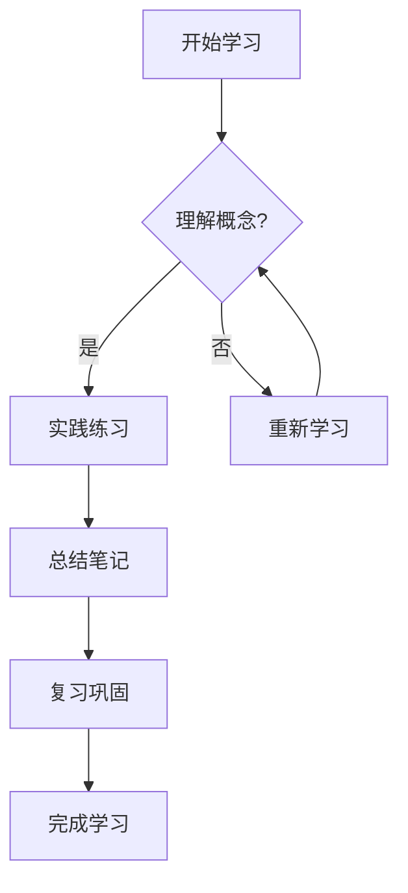

# 🎨 网站设计指南

> 充分利用这个现代化学习笔记主题的完整指南，让您的知识记录更加精美和专业

## 🌟 主题特色

<div class="card card-gradient">
  <h3>✨ 学习优化的现代主题</h3>
  <p>专为学习笔记设计的现代化主题，集成了强大的数学公式渲染、代码高亮、多媒体支持等功能。</p>
</div>

<div style="display: grid; grid-template-columns: repeat(auto-fit, minmax(280px, 1fr)); gap: 1rem; margin: 2rem 0;">
  <div class="card">
    <h4>🧮 双引擎数学渲染</h4>
    <p>KaTeX + MathJax 双引擎系统，支持复杂数学公式、化学方程式和图表。</p>
  </div>
  <div class="card">
    <h4>🎯 学习笔记专用</h4>
    <p>针对课堂笔记、读书笔记、技术积累等学习场景优化设计。</p>
  </div>
  <div class="card">
    <h4>🌙 智能主题切换</h4>
    <p>支持亮色/暗色模式自动切换，保护您的视力。</p>
  </div>
  <div class="card">
    <h4>📱 完美响应式</h4>
    <p>在桌面、平板、手机上都有出色的阅读和编辑体验。</p>
  </div>
  <div class="card">
    <h4>🔍 智能搜索</h4>
    <p>支持中文分词的全文搜索，快速定位知识点。</p>
  </div>
  <div class="card">
    <h4>🖼️ 多媒体增强</h4>
    <p>图片点击放大、Mermaid图表、代码块复制等功能。</p>
  </div>
</div>

## 🎪 核心组件使用指南

### 📋 卡片组件
创建美观的内容卡片：

```html
<div class="card">
  <h4>📚 学习要点</h4>
  <p>使用卡片组件突出显示重要的学习内容和知识点。</p>
</div>
```

**效果预览：**
<div class="card">
  <h4>📚 学习要点</h4>
  <p>使用卡片组件突出显示重要的学习内容和知识点。</p>
</div>

### 🌈 渐变卡片
突出显示重要信息：

```html
<div class="card card-gradient">
  <h3>🎯 重点内容</h3>
  <p>使用渐变背景卡片来强调核心概念和重要知识点。</p>
</div>
```

### 📊 网格布局
创建响应式内容网格：

```html
<div style="display: grid; grid-template-columns: repeat(auto-fit, minmax(250px, 1fr)); gap: 1rem; margin: 1rem 0;">
  <div class="card">
    <h4>🔧 概念A</h4>
    <p>详细说明...</p>
  </div>
  <div class="card">
    <h4>⚡ 概念B</h4>
    <p>详细说明...</p>
  </div>
  <div class="card">
    <h4>🎨 概念C</h4>
    <p>详细说明...</p>
  </div>
</div>
```

## 🧮 数学公式渲染

### 基础数学公式
支持行内和块级数学公式：

**行内公式**：使用 `$...$` 
```markdown
这是一个行内公式：$E = mc^2$，爱因斯坦质能方程。
```
效果：这是一个行内公式：$E = mc^2$，爱因斯坦质能方程。

**块级公式**：使用 `$$...$$`
```markdown
$$
\int_{-\infty}^{\infty} e^{-x^2} dx = \sqrt{\pi}
$$
```
效果：
$\int_{-\infty}^{\infty} e^{-x^2} dx = \sqrt{\pi}$


### 高级数学功能

**矩阵表示**：
```latex
$$
\begin{bmatrix}
a & b \\
c & d
\end{bmatrix}
\begin{bmatrix}
x \\
y
\end{bmatrix}
=
\begin{bmatrix}
ax + by \\
cx + dy
\end{bmatrix}
$$
```

**分段函数**：
```latex
$$
f(x) = \begin{cases}
x^2 & \text{if } x \geq 0 \\
-x^2 & \text{if } x < 0
\end{cases}
$$
```

**删除线公式**（用于演示推导过程）：
```latex
$$
\frac{\cancel{(x+1)}(x-2)}{\cancel{(x+1)}(x+3)} = \frac{x-2}{x+3}
$$
```

## 📝 Markdown 增强功能

### 🎯 提示框系统
支持多种类型的信息提示：

!!! tip "💡 学习技巧"
    这是一个学习技巧提示框，用于分享学习方法和经验。

!!! warning "⚠️ 注意事项"
    这是警告信息框，用于标注需要特别注意的内容。

!!! success "✅ 重要结论"
    这是成功/结论信息框，用于标注重要的学习成果。

!!! note "📋 课堂笔记"
    这是普通笔记框，适合记录课堂重点和个人思考。

!!! quote "📖 引用内容"
    这是引用框，用于引用书籍、论文或权威资料的内容。

### 💻 代码展示
支持语法高亮和一键复制：

```python title="算法示例：快速排序"
def quicksort(arr):
    """
    快速排序算法实现
    时间复杂度：O(n log n)
    """
    if len(arr) <= 1:
        return arr
    
    pivot = arr[len(arr) // 2]
    left = [x for x in arr if x < pivot]
    middle = [x for x in arr if x == pivot]
    right = [x for x in arr if x > pivot]
    
    return quicksort(left) + middle + quicksort(right)

# 使用示例
numbers = [3, 6, 8, 10, 1, 2, 1]
sorted_numbers = quicksort(numbers)
print(f"排序结果: {sorted_numbers}")
```

### 📊 表格增强
美观的响应式表格：

| 🏷️ 算法 | ⏰ 时间复杂度 | 💾 空间复杂度 | 🎯 适用场景 | ✨ 优缺点 |
|---------|-------------|-------------|----------|----------|
| 快速排序 | O(n log n) | O(log n) | 大数据集 | 快速但不稳定 |
| 归并排序 | O(n log n) | O(n) | 稳定排序 | 稳定但占用内存 |
| 插入排序 | O(n²) | O(1) | 小数据集 | 简单但效率低 |
| 堆排序 | O(n log n) | O(1) | 内存受限 | 不稳定但省内存 |


### 🎨 高亮文本
使用不同颜色突出重点：

这是==高亮文本==，用于标注重要概念。

这是~~删除文本~~，用于标注过时或错误的信息。

这是**粗体文本**，用于强调重要性。

这是*斜体文本*，用于标注术语或外文。

## 🎨 视觉设计元素

### 🌈 色彩方案

当前主题的色彩体系：

<div style="display: grid; grid-template-columns: repeat(auto-fit, minmax(200px, 1fr)); gap: 1rem; margin: 2rem 0;">
  <div style="background: linear-gradient(135deg, #667eea 0%, #764ba2 100%); color: white; padding: 1.5rem; border-radius: 12px; text-align: center; box-shadow: 0 4px 15px rgba(0,0,0,0.1);">
    <strong>🎯 主渐变</strong><br>
    #667eea → #764ba2<br>
    <small>用于重要内容突出</small>
  </div>
  <div style="background: linear-gradient(135deg, #f093fb 0%, #f5576c 100%); color: white; padding: 1.5rem; border-radius: 12px; text-align: center; box-shadow: 0 4px 15px rgba(0,0,0,0.1);">
    <strong>🌸 粉色系</strong><br>
    #f093fb → #f5576c<br>
    <small>用于警告和注意事项</small>
  </div>
  <div style="background: linear-gradient(135deg, #4facfe 0%, #00f2fe 100%); color: white; padding: 1.5rem; border-radius: 12px; text-align: center; box-shadow: 0 4px 15px rgba(0,0,0,0.1);">
    <strong>💙 蓝色系</strong><br>
    #4facfe → #00f2fe<br>
    <small>用于信息提示和链接</small>
  </div>
  <div style="background: linear-gradient(135deg, #43e97b 0%, #38f9d7 100%); color: white; padding: 1.5rem; border-radius: 12px; text-align: center; box-shadow: 0 4px 15px rgba(0,0,0,0.1);">
    <strong>💚 绿色系</strong><br>
    #43e97b → #38f9d7<br>
    <small>用于成功状态和完成标记</small>
  </div>
</div>

### 📐 间距和布局

**标准间距系统：**
- 小间距：`0.5rem` (8px)
- 中间距：`1rem` (16px) 
- 大间距：`2rem` (32px)
- 超大间距：`3rem` (48px)

**圆角系统：**
- 小圆角：`6px`
- 标准圆角：`12px`
- 大圆角：`20px`

## 🔧 实用功能配置

### 🎵 自定义样式
在需要时添加自定义CSS：

```html
<style>
.learning-highlight {
  background: linear-gradient(120deg, #a8edea 0%, #fed6e3 100%);
  padding: 1rem;
  border-radius: 8px;
  border-left: 4px solid #667eea;
  margin: 1rem 0;
}
</style>

<div class="learning-highlight">
  这是一个自定义的学习重点样式示例。
</div>
```

### 📱 响应式设计
确保内容在所有设备上都完美显示：

```html
<!-- 响应式图片 -->


<!-- 响应式视频 -->
<div style="position: relative; padding-bottom: 56.25%; height: 0; overflow: hidden; border-radius: 8px;">
  <iframe src="video-url" style="position: absolute; top: 0; left: 0; width: 100%; height: 100%; border: 0;"></iframe>
</div>
```

## 📚 学习笔记最佳实践

### 🎯 内容组织策略

1. **清晰的层次结构**
   - 使用合适的标题层级 (H1-H6)
   - 保持逻辑清晰的内容流
   - 善用列表和表格组织信息

2. **视觉引导原则**
   - 重要内容使用卡片或提示框突出
   - 适当使用emoji增强可读性
   - 保持一致的格式和风格

3. **交互性增强**
   - 添加任务清单追踪学习进度
   - 使用折叠内容节省空间
   - 合理使用链接建立知识关联

### 🎨 美化技巧

**创建学习卡片：**
```html
<div class="card" style="border-left: 4px solid #667eea;">
  <h4>📘 重要概念</h4>
  <p><strong>定义：</strong>这里是概念的具体定义...</p>
  <p><strong>应用：</strong>这里是概念的实际应用...</p>
  <p><strong>例子：</strong>这里是具体的例子...</p>
</div>
```

**创建时间线：**
```html
<div style="border-left: 3px solid #667eea; padding-left: 1rem; margin: 1rem 0;">
  <h4>📅 学习时间线</h4>
  <p><strong>第一周：</strong>基础概念学习</p>
  <p><strong>第二周：</strong>实践练习</p>
  <p><strong>第三周：</strong>项目应用</p>
</div>
```

## 🚀 高级功能

### 📊 Mermaid 图表
支持流程图、时序图等：



### 🎥 多媒体支持
嵌入视频、音频等学习资源：

```html
<!-- 视频嵌入 -->
<div style="text-align: center; margin: 2rem 0;">
  <video controls style="max-width: 100%; border-radius: 8px;">
    <source src="lecture-video.mp4" type="video/mp4">
    您的浏览器不支持视频播放。
  </video>
  <p style="margin-top: 0.5rem; color: #666; font-size: 0.9rem;">课堂讲解视频</p>
</div>
```

### 🔍 搜索优化
让您的笔记更容易被搜索到：

- 使用清晰的标题和关键词
- 添加标签和分类
- 保持内容的结构化组织

---

## 🎊 开始创作

现在您已经掌握了所有设计工具和技巧，开始创作精美的学习笔记吧！

**记住：**
- 内容为王，设计为辅
- 保持一致的风格
- 注重用户体验
- 持续优化和改进

> 💡 **提示**：好的设计不是为了炫耀技巧，而是为了更好地传达知识和思想。让设计服务于学习，让学习因设计而更加高效！ 