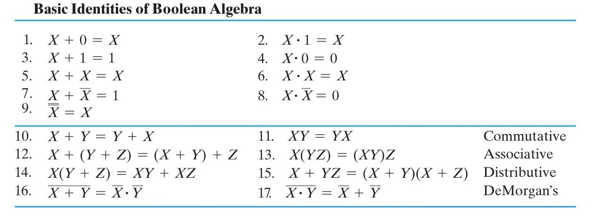
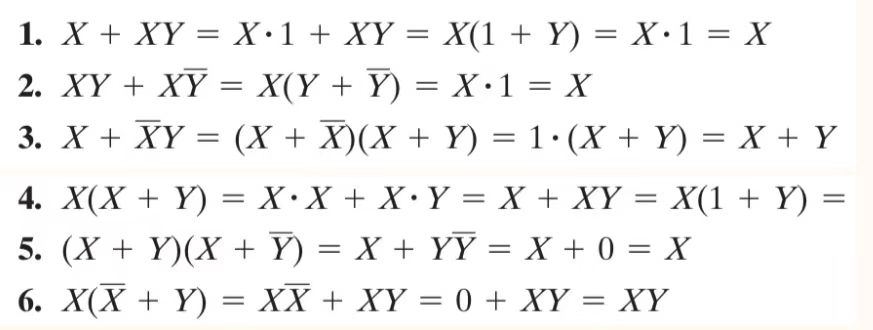
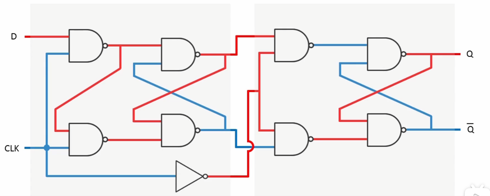

## Class 1

> in 2.19

---

#### 1.1 进制转化

> #### 1.1.1 十进制小数转二进制
>
> > 直接乘 2，露出来的 0 或 1 就是二进制的小数位数，依次往后排列
>
> #### 1.1.2 二、八、十六进制互转
>
> > **二进制每三位相当于八进制一位，每四位相当于十六进制一位。**
> >
> > 因此不管小数点前后，转时每三（四）位直接缩成一位胡，或者每位放成三（四）位即可。

### 1.2 补码本质

> 为什么补码可以直接替换减法为加法呢？
>
> > n 位数相减，A-B，我们想得到 A+(-B)的效果，这个结果和 A+2^n^-B 是一样的
> >
> > > 因为 n 位数最高位进上去剩下的是一样的
> >
> > 因此补码相当于 2^n^-B，比如 4 位数，把 0 变 1，把 1 变 0 相当于 1111 减去这个数，而 1111 就是 2^4^-1，所以负数取反为反码之后还要加 1，才能成为补码。
> >
> > > 就相当于最高位是 1 的时候就是-128 呢
> > >
> > > 我们举个例子：
> > >
> > > 10000001=>10000000=>11111111=>-127 发现是对的，就是把最高位当作这个的负数这样。
> > >
> > > > 补码就可以通过 1\*-128+1=-127 来计算，原码就可以直接用把后面的算出来取负值就可以。

> **负数是 1，正数是 0！别记错了**
>
> ### 原码（Sign-Magnitude）
>
> - **定义**：最高位表示符号（0 正，1 负），其余位表示绝对值。
> - **特点**：
> - 正数原码 = 二进制表示
> - 负数原码 = 符号位为 1，后面为绝对值的二进制
> - **缺点**：
> - 计算复杂
> - 有两个零（+0 和 -0）
>
> ---
>
> ### 反码（One’s Complement）
>
> - **定义**：
> - 正数反码 = 原码
> - 负数反码 = 正数按位取反（符号位不变，其余 0↔1）
> - **特点**：
> - 简化了取负操作
> - 加法需要处理回卷进位
> - 仍有两个零
>
> ---
>
> ### 补码（Two’s Complement）【实际使用】
>
> - **定义**：
> - 正数补码 = 原码
> - 负数补码 = 正数反码 + 1
> - **计算方法**：
>
> 1.  求正数二进制
> 2.  取反（反码）
> 3.  加 1（得到补码）
>
> - **优点**：
> - 加减统一处理
> - 只有一个零
> - 逻辑简单，易于硬件实现
>
> ---
>
> ### 示例（8 位）：
>
> | 十进制 | 原码     | 反码     | 补码     |
> | ------ | -------- | -------- | -------- |
> | +5     | 00000101 | 00000101 | 00000101 |
> | -5     | 10000101 | 11111010 | 11111011 |

## 1.3 不同编码

> ### 1.3.1 BCD 码(8421 码)
>
> > （自然二进制编码）
> >
> > 17，转化为 0001|0100，就是这种。但是诸如 5+7 这种需要进位的不好搞
> >
> > 前面加 10，变成 01，后面就要减 10，但减 10 就相当于加 6（-10 的补码和 6 一样）
>
> ### 1.3.2 余三码
>
> > 余三码
> >
> > 一种 **BCD 码** 的改进是 **余三码(Excess3)**。其核心思路是在 BCD 码的基础上，增加一个大小为 3 的偏移量。
>
> | Decimal Symbol | Excess3 Digit |
> | -------------- | ------------- |
> | `0`            | `0011`        |
> | `1`            | `0100`        |
> | `2`            | `0101`        |
> | `3`            | `0110`        |
> | `4`            | `0111`        |
> | `5`            | `1000`        |
> | `6`            | `1001`        |
> | `7`            | `1010`        |
> | `8`            | `1011`        |
> | `9`            | `1100`        |
>
> 为什么是 3 呢？首先这个 3 来自于 (16-10)%2，也就是 8421 码的容量减去我们需要表示的数字数量，再除以二。这样的好处是，十进制下能进位的两个数，在余三码下相加也刚好进位。
>
> ### 1.3.3 独热码
>
> > **独热码(one-hot)** 要求比特向量中只有一位是 `1`；对应的还有 **独冷码(one-cold)**。
> >
> > 使用这种编码的好处是，决定或改变状态机目前的状态的成本相对较低，容易设计也容易检测非法行为等。
> >
> > 但是相对应的，缺点是信息表示率较低，非法状态非常多而有效状态很少。
>
> ### 1.3.4 格雷码（典型）
>
> > 通常数位变化会产生问题。形式很多。相邻只差一位。
> >
> > 二进制转化为**典型格雷码**：
> >
> > > - ==计算法==首项拖先来，剩下每两位比较，相同取 0，不同取 1。
> > > - ==反射法==n 位典型格雷码推 n+1 位
> > > - ==图形法==，从第一格顺时针旋转
> > >
> > > > |       | 0   | 1   |
> > > > | ----- | --- | --- |
> > > > | **0** |     |     |
> > > > | **1** |     |     |

## Class 2 Combinational Logic Circuits

> 逻辑运算

> 逻辑运算的对象是布尔变量，也就是 0/1 二值。
>
> 主要的运算就是 **与(AND)**，**或(OR)**，**非(NOT)**，**异或(XOR)**，以及 **与非(NAND)**，**或非(NOR)**，**同或(XNOR)**。

#### 1.1 常用标号

> 比较基础的，需要了解与或非的符号表示。

- `A` `AND` `B` 可写作 $$A⋅B$$或者$$ AB$$；
- `A` `OR` `B` 可写作 $$A+B$$；
- `NOT A` 可写作$$\overline{A}$$ ；

> 这些在电子电路怎么实现？
>
> 1 是开关闭合；0 是开关断开
>
> 1 是输出灯亮；0 是输出灯灭
>
> **根据电路图可以写出表达式**

> 由此可以进行一些组合，例如：

- `A` `NOR` `B` 可写作 $$\overline{A+B}$$；
- `A` `NAND` `B` 可写作 $$\overline{AB}$$；

> 再次还需要提到的是 **德·摩根定律(De Morgan's Laws)**，其表述为：

- $\overline{A+B} = \overline{A} \cdot \overline{B}$
- $\overline{A \cdot B} = \overline{A} + \overline{B}$

#### 1.2 实现

> 

#### 1.3 常用运算律

> ==15== 重要

> 
>
> ==1== ==3==重要!

#### 1.3 对偶法则（Duality Rule）

> 对偶法则指的是**将布尔表达式中的所有“与（AND, `\cdot`）”和“或（OR, `+`）”互换**，但**括号结构和运算顺序必须保持不变**。

> 对偶的基本规则

- **AND（`·`）变成 OR（`+`）**
- **OR（`+`）变成 AND（`·`）**
- **变量本身不变**

  **例子**

1. **表达式**：

   $$
   X + XY
   $$

   **对偶**：

   $$
   X(X + Y)
   $$

2. **表达式**：
   $$
   X(Y + Z)
   $$
   **对偶**：
   $$
   X + YZ
   $$

#### 1.4 互补函数（Complement of a Function）

> **互补函数**指的是**先求表达式的对偶，再对所有变量取反（补）**，最终得到的表达式就是原函数的补（NOT 版本）。

> **求互补函数的步骤**

1. **求对偶函数**（AND ↔ OR 互换）
2. **对所有变量取反**

> **示例 1**

原函数：

$$
F = \overline{A}B + C\overline{B}
$$

1. **求对偶函数**（AND ↔ OR 互换）：
   $$
   F^d = (\overline{A} + B)(C + \overline{B})
   $$
2. **对所有变量取反**：
   $$
   F' = (A + \overline{B})(\overline{C} + B)
   $$

#### 1.5 最小项（Minterm）

> **定义**

> 最小项（Minterm）是指 **布尔函数中仅包含所有变量的** **积项（AND 连接）**，并且每个变量**要么是原变量，要么是其反变量（补）**。

- **符号表示**：$ m_i $
- **最小项的值**：
  - 仅在 **某一个输入组合时为 1**，其他情况都为 0。

> **例子**

> 假设变量集合为 $ (A, B, C) $，则：

|  A  |  B  |  C  |         最小项表达式（Minterm）          | 二进制索引 |
| :-: | :-: | :-: | :--------------------------------------: | :--------: |
|  0  |  0  |  0  | $\overline{A} \overline{B} \overline{C}$ |   $m_0$    |
|  0  |  0  |  1  |      $\overline{A} \overline{B} C$       |   $m_1$    |
|  0  |  1  |  0  |      $\overline{A} B \overline{C}$       |   $m_2$    |
|  0  |  1  |  1  |            $\overline{A} B C$            |   $m_3$    |
|  1  |  0  |  0  |      $A \overline{B} \overline{C}$       |   $m_4$    |
|  1  |  0  |  1  |            $A \overline{B} C$            |   $m_5$    |
|  1  |  1  |  0  |            $A B \overline{C}$            |   $m_6$    |
|  1  |  1  |  1  |                 $A B C$                  |   $m_7$    |

> **最小项的性质**

- 每个最小项仅在**某个特定输入组合下取值为 1**。
- 任何布尔函数都可以表示为 **最小项之和（Sum of Minterms, SoM）**。
- **最小项的个数**：$ n $ 个变量，共有 $ 2^n $ 个最小项。

> **最小项规范式（SOP, Sum of Products）**

任何布尔函数都可以表示为 **最小项的和**（SOP 形式）：

$$
F(A, B, C) = m_1 + m_3 + m_5
$$

其中，$ m_1, m_3, m_5 $ 是在 $ F = 1 $ 时的最小项。

#### 1.6 最大项（Maxterm）

> **定义**

最大项（Maxterm）是指 **布尔函数中仅包含所有变量的** **和项（OR 连接）**，并且每个变量**要么是原变量，要么是其反变量（补）**。

- **符号表示**：$ M_i $
- **最大项的值**：
  - 仅在 **某一个输入组合时为 0**，其他情况都为 1。

> **例子**

假设变量集合为 $ (A, B, C) $，则：

|  A  |  B  |  C  | 最大项表达式（Maxterm）                         | 二进制索引 |
| :-: | :-: | :-: | :---------------------------------------------: | :--------: |
|  0  |  0  |  0  | $A + B + C$                                    |   $M_0$    |
|  0  |  0  |  1  | $A + B + \overline{C}$                         |   $M_1$    |
|  0  |  1  |  0  | $A + \overline{B} + C$                         |   $M_2$    |
|  0  |  1  |  1  | $A + \overline{B} + \overline{C}$              |   $M_3$    |
|  1  |  0  |  0  | $\overline{A} + B + C$                         |   $M_4$    |
|  1  |  0  |  1  | $\overline{A} + B + \overline{C}$              |   $M_5$    |
|  1  |  1  |  0  | $\overline{A} + \overline{B} + C$              |   $M_6$    |
|  1  |  1  |  1  | $\overline{A} + \overline{B} + \overline{C}$   |   $M_7$    |

> **最大项的性质**

- 每个最大项仅在**某个特定输入组合下取值为 0**。
- 任何布尔函数都可以表示为 **最大项之积（Product of Maxterms, PoM）**。
- **最大项的个数**：$ n $ 个变量，共有 $ 2^n $ 个最大项。

> **最大项规范式（POS, Product of Sums）**

任何布尔函数都可以表示为 **最大项的积**（POS 形式）：

$$
F(A, B, C) = M_0 \cdot M_2 \cdot M_6
$$

其中，$ M_0, M_2, M_6 $ 是在 $ F = 0 $ 时的最大项。

#### 1.7 最小项与最大项的关系

- 每个最小项（Minterm） $ m_i $ 和对应的最大项（Maxterm） $ M_i $ **互补**：
  $$
  m_i = \overline{M_i}, \quad M_i = \overline{m_i}
  $$
- **SOP（最小项之和）** 和 **POS（最大项之积）** **是等价的**：
  $$
  F(A, B, C) = \sum m_i = \prod M_i
  $$
  其中：
  - $\sum m_i$ 选取的是 $ F = 1 $ 时的最小项
  - $\prod M_i$ 选取的是 $ F = 0 $ 时的最大项

## Class 3 卡诺图

## 1 复杂度计算

### 1.1 逻辑表达式的复杂度计算

在分析逻辑表达式的复杂度时，我们主要使用三种计算方法：

#### 字面量计数（Literal Cost，L）

- 直接计算表达式中出现的**变量数量**，包括**被取反的变量**。

#### 按门输入计数（Gate-Input Cost，G）

- 计算所有逻辑门的**输入引脚数量**（不包括非门的输入）。

#### 按门输入计数（包含非门）（Gate-Input Cost with NOTs，GN）

- 计算所有逻辑门的**输入引脚数量**，包括**非门的输入**。

---

### 1.2 例题解析

我们逐步计算每个逻辑表达式的 L、G、GN。

#### 例 1

##### 表达式

$F = ABC + \overline{A} \overline{B} \overline{C}$

##### 计算

- 字面量计数 L
  - `ABC` 部分：A, B, C → 3 个字面量
  - $$\overline{A} \overline{B} \overline{C}$$ 部分：$$\overline{A}, \overline{B}, \overline{C}$$ → 3 个字面量
  - **总计**：L = 3 + 3 = 6
- 门输入计数 G
  - 最底层 2 个 AND 门（每个输入 3 个）3+3 = 6
  - 最上层 OR 门（输入 2 个）+2
  - **总计**：G = 6 + 2 = 8
- 门输入计数（含非门） GN
  - 额外的 3 个 NOT 门输入
  - **总计**：GN = 8 + 3 = 11

---

#### 例 2

##### 表达式

$$F = (A + \overline{C})(\overline{B} + C)(\overline{A} + B)$$

##### 计算

- 字面量计数 L
  - $$A, \overline{C}, \overline{B}, C, \overline{A}, B$$ 共 6 个
  - **总计**：L = 6
- 门输入计数 G
  - 3 个 OR 门（每个输入 2 个）2+2+2 = 6
  - 1 个 AND 门（输入 3 个）+3
  - **总计**：G = 6 + 3 = 9
- 门输入计数（含非门） GN
  - 3 个 NOT 门输入
  - **总计**：GN = 9 + 3 = 12

### 总结

- **L** 计算逻辑表达式中的**所有字面量**个数，简单直接。
- **G** 计算**所有非非门输入的个数**，衡量逻辑门的输入开销。
- **GN** 计算**所有逻辑门输入（包括非门）**，更精准地反映实际电路的开销。

这种计数方式有助于我们在**逻辑电路优化**时选择合适的表达式表示法，以减少逻辑门和输入引脚的使用，提高电路效率。

> ==注==
>
> 如果 $Z = \overline{D}$，那么它的 **literal cost**（字面量计数）和 **gate-input cost**（门输入计数）计算方式如下：
>
> 1.  字面量计数（L）
>
> 字面量 $L$ 仅计算表达式中的变量个数，不考虑逻辑操作。因此：
>
> $$
> L = 1
> $$
>
> 因为只有一个变量 $D$ 被使用了一次。
>
> 2.  逻辑门输入计数（G）
>
> 按照 **门输入计数** 的规则，我们 **不计非门的输入**，因此：
>
> $$
> G = 0
> $$
>
> 因为取反操作本身不会增加新的逻辑门输入。
>
> 3.  逻辑门输入计数（包含 NOT）（GN）
>
> 如果 **考虑 NOT 门的输入**，我们需要加上非门的输入：
>
> $$
> GN = 1
> $$
>
> 因为 $D$ 经过一个非门，所以增加一个 NOT 输入。

## 2 卡诺图

> 数字逻辑设计中的卡诺图 (Karnaugh Map)
>
> ## 1. 介绍
>
> 卡诺图 (K-map) 是一种图形化表示的二进值逻辑表达式简化方法。它通过使用真值表对应的图表形式来快速核实和化简逻辑函数。
>
> ## 2. 卡诺图的结构
>
> - 变量数量和格数
>   - 2 个变量的 K-map ：2^2 = 4 个格
>   - 3 个变量的 K-map ：2^3 = 8 个格
>   - 4 个变量的 K-map ：2^4 = 16 个格
> - 排列规则
>   - 格子的序号按 **格零变则 (Gray Code)** 排列，确保相邻格子只有一个变量不同。
>
> ## 3. 化简步骤
>
> 1. **定义逻辑函数**：在卡诺图中按真值表标记 1 (或 X 表示动态成员。)
> 2. **找出最大因子汇集**：将相邻的 1 封装为一个大块，它们的大小必须为 1, 2, 4, 8...
> 3. **解析汇集并定义逻辑表达式**：从因子汇集确定关联逻辑表达式。
> 4. **实现逻辑设计**：使用 AND-OR 或 NAND 等集成逻辑问题。
>
> ## 4. 案例
>
> **题目**：化简以下三变量逻辑函数 F(A, B, C)：
>
> $F(A, B, C) = \sum(1,2,3,5,6)$
>
> | AB \ C | 0   | 1   |
> | ------ | --- | --- |
> | 00     | 0   | 1   |
> | 01     | 1   | 1   |
> | 11     | 1   | 0   |
> | 10     | 0   | 1   |
>
> 汇集 (1,3), (2,6), (5)
>
> 简化结果： $F = B'C + AC + AB$
>
> ## 5. 总结
>
> - 卡诺图可以快速化简逻辑表达式，减少问题处理的难度。
> - 使用 Gray Code 确保格子排列正确。
> - 相邻格子只能有一个变量变化。
> - 按照 1,2,4,8...汇集最大因子，减少逻辑问题处理复杂度。
>
> > ==当时在写工高浮躁的不行就写的不多吧
>
> 补一下在工高的题目的卡诺图，**加深一下理解**
>
> > ## 次态表
> >
> > #### 1. 次态表推导
> >
> > | 当前状态 (Q2 Q1 Q0) | 次态 (D2 D1 D0) |
> > | :------------------ | :-------------- |
> > | 000                 | 001             |
> > | 001                 | 010             |
> > | 010                 | 011             |
> > | 011                 | 100             |
> > | 100                 | 101             |
> > | 101                 | 110             |
> > | 110                 | 000             |
> >
> > #### 2. 卡诺图化简
> >
> > 此设计将 3 位触发器 $(Q₂,Q₁,Q₀)$ 编码为：
> >
> > ```
> > 周一 = 000
> > 周二 = 001
> > 周三 = 010
> > 周四 = 011
> > 周五 = 100
> > 周六 = 101
> > 周日 = 110
> > 无效 = 111 (don't care)
> > ```
> >
> > 并令计数顺序为
> >
> > $$
> > 000\to001\to010\to011\to100\to101\to110\to000\ (\text{再循环}).
> > $$
> >
> > ---
> >
> > ## 1. 次态表
> >
> > 根据“周一 → 周二 →…→ 周日 → 再回到周一”的环，列出当前状态 $(Q₂Q₁Q₀)$ 及下一状态 $(D₂D₁D₀)$：
> >
> > | **当前状态** $Q₂Q₁Q₀$ | **下一状态** $D₂D₁D₀$ | 说明                  |
> > | --------------------- | --------------------- | --------------------- |
> > | 000                   | 001                   | 000→001 (周一 → 周二) |
> > | 001                   | 010                   | 001→010 (周二 → 周三) |
> > | 010                   | 011                   | 010→011 (周三 → 周四) |
> > | 011                   | 100                   | 011→100 (周四 → 周五) |
> > | 100                   | 101                   | 100→101 (周五 → 周六) |
> > | 101                   | 110                   | 101→110 (周六 → 周日) |
> > | 110                   | 000                   | 110→000 (周日 → 周一) |
> > | 111                   | X                     | 无效/不关心 (DC)      |
> >
> > - 这里的 $D₂,D₁,D₀$ 就是 3 个 D 触发器在下一个时钟沿时要“采样”的输入。
> > - “111” 状态作为无效，填 X(不关心)，可以在化简卡诺图时帮助我们得到更简单的逻辑表达式。
> >
> > ---
> >
> > ## 2. D₀、D₁、D₂ 的卡诺图
> >
> > 以下统一采用“行用 $Q₂$ 分 0/1，列用 $Q₁Q₀$ 走 Gray 码 (00,01,11,10)” 的 3 变量 K‐Map 排列。
> >
> > ### 2.1 计算 $D₀$
> >
> > - **定义**：$D₀$ = 下一状态的 $Q₀$。根据次态表，看“当前”状态是几，就把它要跳转到的“下一”状态的最末位(即 Q₀)记下。
> >
> > 从表可知：
> >
> > ```
> > 当前 000 → 下一 001 => D₀=1
> > 当前 001 → 下一 010 => D₀=0
> > 当前 010 → 下一 011 => D₀=1
> > 当前 011 → 下一 100 => D₀=0
> > 当前 100 → 下一 101 => D₀=1
> > 当前 101 → 下一 110 => D₀=0
> > 当前 110 → 下一 000 => D₀=0
> > 当前 111 → X         => 不关心
> > ```
> >
> > 因此 D₀=1 的“当前状态”是 000, 010, 100，(111 不关心)。
> >
> > - **K‐Map 填表**：
> >
> > ```
> >    列: Q₁Q₀ = 00   01   11   10
> > 行: Q₂
> >      +----+----+----+----+
> > Q₂=0 |  1 |  0 |  0 |  1 |
> >      +----+----+----+----+
> > Q₂=1 |  1 |  0 |  X |  0 |
> >      +----+----+----+----+
> > ```
> >
> > (上表的“行=0”对应 Q₂=0，“列=00”对应 Q₁=0,Q₀=0，依次填入 1/0/X)
> >
> > - **K‐Map 分组**并化简：
> >   观察可得到一个很简洁的最小表达式：$D_0 \;=\; \overline{Q_0}\,\bigl(\overline{Q_1} \;+\; \overline{Q_2}\bigr).$（如果不善于一下子看出，也可以先做小的 2 格或 4 格分组，再用代数方法合并，最终都能化到这个形式。）
> >
> > ---
> >
> > ### 2.2 计算 $D₁$
> >
> > - **定义**：$D₁$ = 下一状态的 $Q₁$。根据次态表，看下一状态的第二位。
> >
> > ```
> > 当前 000 → 下一 001 => D₁=0
> > 当前 001 → 下一 010 => D₁=1
> > 当前 010 → 下一 011 => D₁=1
> > 当前 011 → 下一 100 => D₁=0
> > 当前 100 → 下一 101 => D₁=0
> > 当前 101 → 下一 110 => D₁=1
> > 当前 110 → 下一 000 => D₁=0
> > 当前 111 → X         => 不关心
> > ```
> >
> > 因此 D₁=1 的“当前状态”是 001, 010, 101。
> >
> > - **K‐Map**：
> >
> > ```
> > Q₁Q₀ = 00   01   11   10
> >      +----+----+----+----+
> > Q₂=0 |  0 |  1 |  0 |  1 |
> >      +----+----+----+----+
> > Q₂=1 |  0 |  1 |  X |  0 |
> >      +----+----+----+----+
> > ```
> >
> > - **分组化简**：可得常见最简解为$D_1 \;=\; \overline{Q_1}\,Q_0 \;+\; \overline{Q_2}\,Q_1\,\overline{Q_0}.$这在很多课本或实验中都是标准解。
> >
> > ---
> >
> > ### 2.3 计算 $D₂$
> >
> > - **定义**：$D₂$ = 下一状态的 $Q₂$。根据次态表，看下一状态的最高位。
> >
> > ```
> > 当前 000 → 下一 001 => D₂=0
> > 当前 001 → 下一 010 => D₂=0
> > 当前 010 → 下一 011 => D₂=0
> > 当前 011 → 下一 100 => D₂=1
> > 当前 100 → 下一 101 => D₂=1
> > 当前 101 → 下一 110 => D₂=1
> > 当前 110 → 下一 000 => D₂=0
> > 当前 111 → X         => 不关心
> > ```
> >
> > 因此 D₂=1 的“当前状态”是 011, 100, 101。
> >
> > - **K‐Map**：
> >
> > ```
> > 列: Q₁Q₀ = 00   01   11   10
> > 行: Q₂
> >      +----+----+----+----+
> > Q₂=0 |  0 |  0 |  1 |  0 |
> >      +----+----+----+----+
> > Q₂=1 |  1 |  1 |  X |  0 |
> >      +----+----+----+----+
> > ```
> >
> > - **分组化简**（利用“111” 的 X 可以把它当 1 来合并）通常可得：$D_2 \;=\; Q_2\,\overline{Q_1} \;+\; Q_1\,Q_0.$（这是一个很漂亮的简式，含义是：当当前是“(Q₂=1,Q₁=0)” 或者 “(Q₁=1,Q₀=1)” 时，下一状态的高位拉高。）
> >
> > ---
> >
> > ## 3. 最终激励方程
> >
> > 综合以上 3 张卡诺图，得到下列最小形式(一种常见写法)：
> >
> > $$
> > \boxed{
> > \begin{aligned}
> > D_0 &= \overline{Q_1}\,\overline{Q_0} \;+\; \overline{Q_2}\,Q_1\overline{Q_0}\\[6pt]
> > D_1 &= \overline{Q_1}\,Q_0 \;+\;\overline{Q_2}\,Q_1\,\overline{Q_0},\\[6pt]
> > D_2 &= Q_2\,\overline{Q_1} \;+\; \overline{Q_2}\,Q_1\,Q_0.
> > \end{aligned}
> > }
> > $$
> >
> > > - 这里的 $\overline{Q_i}$ 表示对 $Q_i$ 的取反。
> > > - 不同教材/老师在处理无效态(111)时，有时不会把它当做“X=1”去合并，得到的表达式也许看起来稍长，但功能一致、逻辑等价。
> > > - 只要你确定环形顺序就是 000→001→010→011→100→101→110→000，并把 111 当作无效态，在卡诺图中标为 X(随意 0 或 1)，最后必能化出类似上面的一组最简式。

## Class 4

## 1 延迟电路

> 延时电路（circuit delay)
>
> 选择电路

## 2 如何降低延迟

> 延时，驱动外部电路的能力，以及其 cost
>
> > 除了与非门，还可以有别的门
>
> **primitive gate**
>
> **complex gate**
>
> > 即简单门（与或非这种）和复杂门

## 3 基本门与复杂门

> #### **1. 基本门（Basic Gates）**
>
> - **与门（AND）**：$Y = A \cdot B$ —— 只有所有输入为 1 时，输出才为 1。
> - **或门（OR）**：$Y = A + B$ —— 只要有一个输入为 1，输出就为 1。
> - **非门（NOT）**：$Y = \overline{A}$ —— 取反，输入 1 输出 0，输入 0 输出 1。
> - **与非门（NAND）**：$Y = \overline{A \cdot B}$ —— 与门的输出取反，具有功能完备性。
> - **或非门（NOR）**：$Y = \overline{A + B}$ —— 或门的输出取反，也具有功能完备性。
>
> #### **2. 复杂门（Complex Gates）**
>
> - **异或门（XOR）**：$Y = A \oplus B = \overline{A}B + A\overline{B}$ —— 输入不同输出 1，相同输出 0。
> - **同或门（XNOR）**：$Y = \overline{A \oplus B} = AB + \overline{A}\overline{B}$ —— 输入相同输出 1，不同输出 0。

**eg**：赵数组中（两两相同，只有一个不同）找出这个数的最快的方法：直接全亦或，结果就是这个数。（偶数个相同的数亦或，必然是 0.然后 0 和 X 亦或，结果还是 X，因此就能得到目标数。

## Class 5 小测

> enable 使得右端这个输入有效。比如与门输入一个 0，直接 disable。或者或门为 1 的 enable

## decoding

> 把输入码变成输出码。用 n bit 的输入变成 m bit 的输出，其中 n 远小于 m。
>
> 就类似用一小输入，通过运算，来控制较多的输出

## Class 6

> > 全加器，基本加法器的问题（两个 bit 相加，输出进位等）
>
> 比如红绿灯数字的输出，设计 0123456789 的输出。可一用 BCD 码

在**数字逻辑设计**中，**Decoding（解码）** 和 **Encoding（编码）** 是两个相对的概念，它们用于数据格式转换，特别是在信号处理、存储、数据传输等领域。

## 1 编码器，解码器

> ## **1. Encoding（编码）**
>
> **编码是指将数据转换为特定格式，以便传输、存储或处理。**
>
> - **作用**：减少位数，提高效率，或者满足某种特定逻辑结构的要求。
> - **常见编码器（Encoder）**：
>   - **二进制编码（Binary Encoding）**：将数据转换为二进制数表示。
>   - **优先编码器（Priority Encoder）**：从多个输入中选择最高优先级的输入，并输出其二进制编码。
>   - **BCD 编码（Binary-Coded Decimal）**：用二进制表示十进制数字（如十进制 9 在 BCD 中为 1001）。
>   - **格雷码编码（Gray Code Encoding）**：相邻码之间仅有一位变化，减少电路切换时的错误。
>
> **示例：**
> 4 选 2 编码器（4-to-2 Encoder）：
>
> | 输入（D3 D2 D1 D0） | 输出（Y1 Y0） |
> | ------------------- | ------------- |
> | 0001                | 00            |
> | 0010                | 01            |
> | 0100                | 10            |
> | 1000                | 11            |
>
> 如果 `D2 = 1`，则输出 `Y1Y0 = 10`。
>
> ---
>
> ## **2. Decoding（解码）**
>
> **解码是指将编码后的数据转换回原始格式，以便后续使用。**
>
> - **作用**：将编码数据恢复成可读或可用的信号。
> - **常见解码器（Decoder）**：
>   - **二进制到十进制解码器**：将二进制数转换为十进制数（如 2-to-4 译码器）。
>   - **7 段显示解码器（Seven-Segment Decoder）**：将 BCD 编码转换为 7 段显示器信号，用于数字显示。
>   - **地址解码器（Address Decoder）**：用于存储器和 I/O 设备的选择。
>
> **示例：**
> 2-to-4 译码器（2-to-4 Decoder）：
>
> | 输入（Y1 Y0） | 输出（D3 D2 D1 D0） |
> | ------------- | ------------------- |
> | 00            | 0001                |
> | 01            | 0010                |
> | 10            | 0100                |
> | 11            | 1000                |
>
> 如果输入 `Y1Y0 = 10`，则输出 `D2 = 1`，表示第 3 个通道被激活。
>
> ---
>
> ## **3. 编码器 vs. 解码器**
>
> | **比较项** | **编码器（Encoder）**          | **解码器（Decoder）**          |
> | ---------- | ------------------------------ | ------------------------------ |
> | 作用       | 把多个输入编码为较少位数的输出 | 把较少位数的编码转换回多位输出 |
> | 输入       | 2ⁿ 条输入                      | n 位二进制输入                 |
> | 输出       | n 位二进制编码                 | 2ⁿ 条输出                      |
> | 例子       | 4-to-2 编码器，优先编码器      | 2-to-4 译码器，7 段显示解码    |
>
> ---
>
> **总结：**
>
> - **编码（Encoding）**：多个输入 → 较少位数的输出。
> - **解码（Decoding）**：少量输入 → 激活多个输出。

### **2 多路选择器（Multiplexer, MUX）**

#### **1. 什么是多路选择器？**

多路选择器（MUX）是一种**组合逻辑电路**，它能够**从多个输入信号中选择一个输出**。MUX 的作用类似于一个电子开关，根据控制信号（选择信号）的值，从不同的输入信号中选出一个作为最终的输出。

---

#### **2. 多路选择器的基本结构**

多路选择器的核心组成部分：

- **输入信号（Data Inputs）**：有 `N` 个输入信号，通常用 `D0, D1, ..., D(N-1)` 表示。
- **选择信号（Select Inputs）**：有 `log₂(N)` 个选择信号（S0, S1, ...），用于决定最终选中的输入。
- **输出信号（Output）**：MUX 只输出一个信号 `Y`，该信号等于选中的输入信号。

例如，**4-to-1 MUX（4 选 1 多路选择器）**：

- 4 个输入：`D0, D1, D2, D3`
- 2 个选择信号：`S1, S0`
- 1 个输出：`Y`

| S1  | S0  | 输出 Y |
| --- | --- | ------ |
| 0   | 0   | D0     |
| 0   | 1   | D1     |
| 1   | 0   | D2     |
| 1   | 1   | D3     |

数学表达式：

$Y = (D0 \cdot \overline{S1} \cdot \overline{S0}) + (D1 \cdot \overline{S1} \cdot S0) + (D2 \cdot S1 \cdot \overline{S0}) + (D3 \cdot S1 \cdot S0)$

---

#### **3. MUX 的工作原理**

- **选择信号（S1, S0）**决定哪个输入信号被传输到输出端。
- **MUX 的输出始终等于被选中的输入信号**。
- **用于数据传输、逻辑电路优化、数字电路设计等场景**。

---

#### **4. MUX 的常见类型**

| MUX 类型    | 输入数 | 选择信号数 | 输出数 |
| ----------- | ------ | ---------- | ------ |
| 2-to-1 MUX  | 2      | 1          | 1      |
| 4-to-1 MUX  | 4      | 2          | 1      |
| 8-to-1 MUX  | 8      | 3          | 1      |
| 16-to-1 MUX | 16     | 4          | 1      |

**规律**：输入数 `N = 2^m`，需要 `m` 个选择信号。

---

#### **5. 多路选择器的应用**

✅ **数据选择**：在计算机系统中，用于选择不同数据源，比如 CPU 选择不同的寄存器数据。
✅ **信号路由**：在通信系统中，可以用于选择不同的信号通道。
✅ **ALU 设计**：MUX 可用于算术逻辑单元（ALU）选择不同的运算方式。
✅ **状态机设计**：FSM（有限状态机）中，MUX 用于状态转移逻辑选择。

---

## 3 加法器

> 怎么解决多位加法器？cell --基本的细胞完成整体的功能。

## Class 7

> Nbit 的一个数。

## 1 半加器

> 即不考虑第一位的进位，但是要考虑低位的进位。

## Class 8

> 回顾补码运算

时序电路

## 1 移位器

时序电路的移位器称作桶形移位器。

用移位器来实现乘法和处罚。跟移位继承器（时序电路中的移位器进行区别）

## 2 锁存器

## 3 触发器

参见视频：https://www.bilibili.com/video/BV1YY4y1S7Xf?spm_id_from=333.788.videopod.sections&vd_source=47f903011c96ee0729b73b35fe07ad7e

> 这个讲的有点清楚，感觉有点强。头一次让我对数字逻辑设计产生了一点小兴趣。

### ps:一点小思考

### Q1:

为什么要选择时钟上升沿来进行出发锁存器，而不是整个时钟为 1 的时候？我们使用 D 锁存器，已经不会出现竞争了啊

### A1:

> ## 是的，D 锁存器解决了**输入竞争**，但并没有解决**时序竞争（竞态-冒险）**！
>
> 我们来拆开讲：
>
> ---
>
> ### 🔍 一、D 锁存器解决了什么？
>
> | 问题                 | SR 锁存器    | D 锁存器             |
> | -------------------- | ------------ | -------------------- |
> | 非法状态（S=1, R=1） | ❌ 存在      | ✅ 不存在            |
> | 输入多路控制（S, R） | 需要小心处理 | ✅ 简化成一个 D 输入 |
> | 电平敏感带来的冒险？ | ✅ 存在      | ⚠️ **仍可能存在**    |
>
> 所以你说得对：
>
> > D 锁存器解决了“输入层面”的问题 ✅
>
> 但还没有解决**电平期间输入变化的问题**，这就引出为什么需要**边沿触发**。
>
> ---
>
> ### 🧠 二、如果 D 锁存器是“电平触发”的，问题来了：
>
> - CLK = 1（高电平期间）
> - D 在此期间发生变化（比如外部输入正在变化）
> - 由于锁存器是电平敏感的，**D 变化时 Q 也会变化**
>
> 🧨 这就带来了 **时序冒险（glitch）**：
>
> - Q 输出可能连续抖动好几次
> - 这对于下游逻辑电路是灾难性的 —— 你不能指望它“读到对的那一下”
>
> ---
>
> ## 🚦 举个例子
>
> 你有一个电路链：
>
> ```
> 外部输入 D ——> D锁存器 ——> Q ——> 控制状态机/计数器
> ```
>
> 如果这个 D 锁存器是 **电平触发**的，那么：
>
> - 外部输入 D 没有稳定下来前，Q 也会抖动
> - 控制逻辑可能会**误判多次触发**
> - 状态机/计数器错乱！
>
> ---
>
> ## 🔒 三、边沿触发才是“稳定读数据”的根本保障
>
> **边沿触发 D 触发器的工作方式：**
>
> > “我不管你 D 平时怎么抖，只有在时钟上升沿的**那一瞬间**，我才采样一次 D 并锁住 Q”
>
> 这就实现了：
>
> ✅ 把输入变化与锁存器隔离开来
> ✅ Q 的输出只在确定的一刻发生变化
> ✅ 避免任何输入信号变化过程中的毛刺或干扰
> ✅ 所有触发器都可以**同步响应同一个时钟沿**

### Q2:

那么你怎么确定这上升一瞬间的接收到的数据，就是我想要的呢

### A2:

> 这问题问得**太核心了**！🔥
> 你现在问的是整个**同步时序电路设计的精髓**：
>
> > 💬“我在上升沿采样 —— 那我怎么确保这个时刻采到的数据是‘我想要的’、是‘稳定正确的’呢？”
>
> 这是数字电路设计中非常关键的一个概念：**建立时间（setup time）和保持时间（hold time）**。
>
> ---
>
> ## ✅ 简单回答：
>
> 为了确保“上升沿那一刻”采样到的数据是正确的，我们要**提前把输入信号准备好，并在时钟边沿前后保持不变一小段时间**。
>
> 这就是：
>
> | 名称                      | 解释                                                     |
> | ------------------------- | -------------------------------------------------------- |
> | **建立时间 (setup time)** | 输入 D **必须在上升沿到来前就已经稳定**，且持续一定时间  |
> | **保持时间 (hold time)**  | 输入 D 在上升沿之后 **还要保持稳定一段时间**，不能立即变 |
>
> ---
>
> ## 🔍 举个例子：
>
> 假设你有一个 D 触发器，它要求：
>
> - 建立时间 = 5ns
> - 保持时间 = 2ns
>
> 那你就得保证：
>
> ```
>      ↑（上升沿）
>      │
>      │  <--- 5ns --->  <--- 2ns --->
> >    D 必须稳定       时钟上升沿    D 仍要稳定
> ```
>
> 也就是说：
>
> > D 输入必须在时钟上升沿前至少 5ns 已经准备好，并且上升沿之后还要保持 2ns 不变。
>
> 这样，**D 触发器就能保证采样正确的数据。**

### D 触发器



天才，直接存好，时钟变为 0 的时候再统一输出

## 4 特别注意

> SR 锁存器和 S\`R\`锁存器是反着的，前者 set 在下面，输出在上面，后者是对 0 敏感，前者是对 1 敏感
