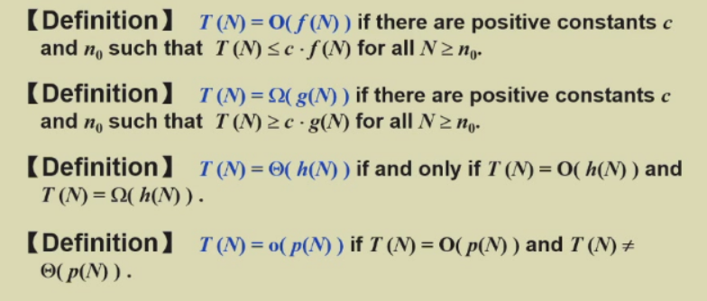
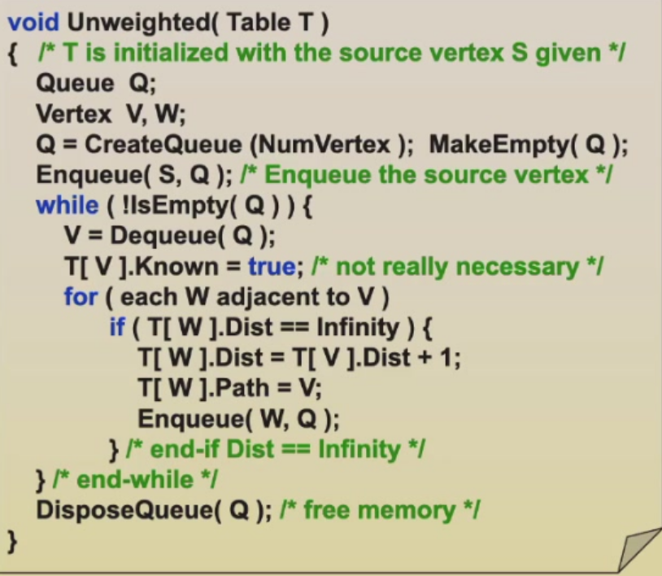
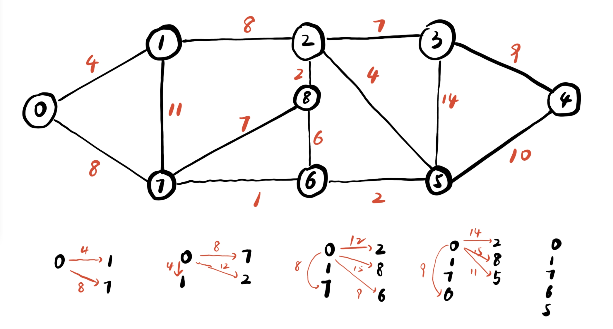
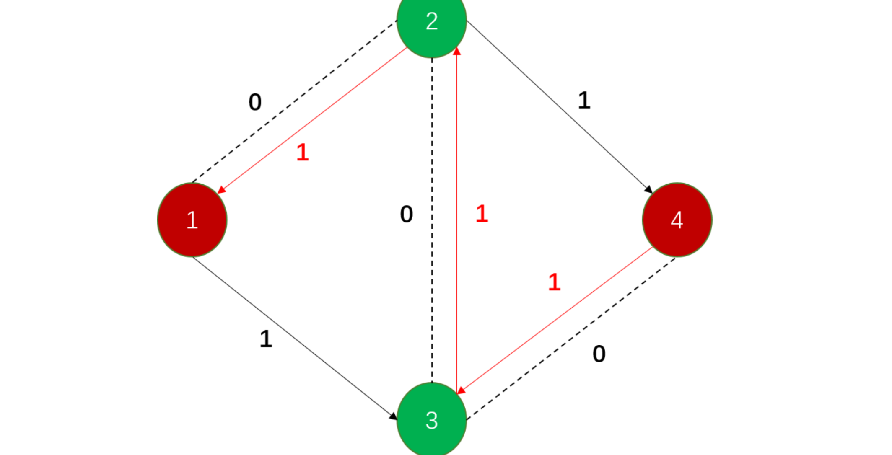
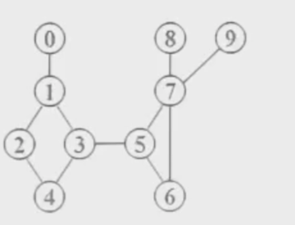

## 课程评分

### 1.1 quiz

> 会使用前几次作业的原题，注意复习

### 1.2 实验

> 查重：done independently

> 会有一个分组测试，如果编程能力强的话可以做 hard 模式，鼓励参加，hard 模式分数上限会更高

> **（全匿名不能带自己个人信息**
>
> 作业会分给 ABC 三个同学，进行打分，求平均
>
> 一星期做作业时间+两天调整（peer review)
>
> 一共三个 project

### 1.3 诚信守则

> 必须参加诚信考试，要拿满分

**==查重==**

## Class 1 算法

> in 2.17

### 1.1 算法定义

> - 输入
> - 输出
> - 清晰
> - 定义合适
> - 基础语句，能被拆分的

### 1.2 复杂度分析

##### 复杂度定义

> 是一个*函数*（函数式）：F(N)，没办法计算具体时间，要计算**次数**（因为机器不同）
>
> 评论一个算法复杂度，并不是按照其时间分析的，只考虑程序本身的复杂程度

- 时间复杂度（主要考虑）

> 运行的快慢

- 空间复杂度（一般不考虑）

> 运行所占的额外空间

> 一般讨论平均复杂度和最差复杂度

```c
for(i=0;i<rows;i++){             //rows+1
	for(j=0;j<cols;j++){         //rows(cols+1)
		c[i][j]=a[i][j]+b[i][j]; //rows*cols
	}
}
```

> 综合为 T(rows,cols)=2rows\*cols+2rows+1

> 所以行列相差较大时，可以交换行列，使复杂度降低

所以常数级别的优化很少考虑，一般考虑**n^2^,n**等实质性的

```c
float sum(float list[],int n){
    float tem=0;//1
    int i;
    for(i=0;i<n;i++)//n+1
        tem += list[i];//n
    return tem;//1
}

```

> 时间复杂度为 2n+3

```c
float rsum(float list[],int n){
    if(n)
        return rsum(list,n-1)+list[n-1];
    return 0;
}
```

> 时间复杂度为 2n+2

> 上程序通过递归时间复杂度为 2n+2,与原 2n+3 相差不多，因此考虑当 n 趋近于无穷的时间复杂度。

> **二分法**查找：log~2~N

> **斐波那契** 时间复杂度：N->N-1,N-2……
>
> Fib(N)=2^0^+2^1^+2^2^+……=2^n^-1 //并不准确
>
> 递归计算斐波那契数列的时间复杂度是 Θ(_ϕ^N^_)，其中 _ϕ_ 是黄金比例（ϕ\*≈1.618）。这是因为递归计算斐波那契数时存在大量的重复计算，导致函数调用次数呈指数级增长。

### 1.3 定义

> 

> O(N)是所有大的，比如 2n+3,上限可以写 n^2^,n^3^等
>
> 欧米伽是小的
>
> 正中间的，就是最大时间复杂度和最小时间复杂度的交集
>
> 真上限，就是最大的集合里面除了中间的

### 1.4 计算

> T(N~1~)+T(N~2~)=max(T(N~1~),T(N~2~))
>
> T(N~1~)\*T(N~2~)=T(N~1~)\*T(N~2~)

## Class 2

### 1 简化例题

> 计算一群数（有正有负）找到连续加和最大的
>
> 最简单：遍历(还要有 k，其实非常麻烦，没必要)

> - **方法 2** 简单的记忆化应用

```c
public int maxSubArraySum_N2(int[] a) {
    int n = a.length;
    if (n == 0) {
        return 0; // 或者抛出异常，视情况而定
    }

    int maxSum = Integer.MIN_VALUE; // 初始化最大和为可能的最小值

    for (int i = 0; i < n; i++) {      // i 是子数组的起始位置
        int currentSum = 0;
        for (int j = i; j < n; j++) {  // j 是子数组的结束位置
            currentSum += a[j];        //累加从 a[i] 到 a[j] 的和
            if (currentSum > maxSum) {
                maxSum = currentSum;
            }
        }
    }
    return maxSum;
}
```

> O(N^2^)

> - **方法 3** 二分查找**divide and conquer**（很容易变成 logN）
>
> > 只适用于静态的数组
> >
> > 在左边，右边或者跨中间最大的，不断迭代。==左边算，右边算，中间算==
> >
> > 从中间向左加最大和向右加最大
> >
> > | 4   | -3  | 5   | -2  | -1  | 2   | 6   | -2  |
> > | --- | --- | --- | --- | --- | --- | --- | --- |
> > | 4   |     | 5   |     |     | 2   | 6   |     |
> >
> > ————6———————————————— ————8————————
> >
> > ————————————————————11————————————————————————————
> >
> > ==时间复杂度==：NlogN

> - **方法 4**
>
>   > ```c
>   > thissum=maxsum=0
>   > for(i=0;i<n;i++){
>   > 	thissum+=a[i];
>   > 	if(thiissum>maxsum){
>   > 		maxsum=thisusm;
>   > 	}else if(thissum<0){
>   > 		thissum=0;
>   > 	}
>   > }
>   > return maxsum;
>   > ```
>   >
>   > 时间复杂度 O(N)

### 2 链表

##### 2.1 抽象数据类型

> objects and operators

##### 2.2 list

> objects : item1,item2...
>
> operations : 增删查（改比较好说）

- 插入

```c
pre.ptr->information.data;
information.ptr->next.data;
```

- 删除

> 先改前一个的代码

- 双向链表

> application : 多项式 P(x)=a~1~x^0^+a~2~x^1^+……
>
> 可以变成给定数组 { a~n~ } 记录就行了。两个多项式计算时，直接两个数组对应项相加就行
>
> > 但存在极限问题：10x^100000^+1
> >
> > 那需要 100000 的数组嘛？
>
> 用链表解决：
>
> > ```c
> > struct node{
> > 	int 项数;
> >     int 幂数;
> >     struct node* next;
> > }
> > ```

> 稀疏怎么解决？用链表统一解决。

- 多重链表

> 可能有多个指针。但这一般是在稀疏的情况下。稠密的完全可以用数组。链表指针比较占地。

### 3 内存管理

> 一块一块可用的内存用链表串起来

## Project 评分方法

#### **项目 1: 6 分**

封面页必须包含标题和完成日期（+2 分）。第 1 章必须完整描述问题（+4 分）。扣分标准如下：

- 封面页不完整（-1）
- 引言部分仅是作业要求的简单复制粘贴（-3）
- 引言部分不够清晰——本章应明确说明需要完成的内容以及其目的（-1 ~ -2）
- 其他问题 - 请在最终评语中具体说明。

#### **项目 2: 12 分**

第 2 章应包含所有关键算法的描述（建议使用伪代码），包括：数据结构描述（+3 分）、算法描述（+7 分）以及主程序概要（+2 分）。扣分标准如下：算法说明不完整——缺少数据结构描述（-2）

-
- 算法说明不完整——缺少关键算法（-3 ~ -7）
- 代码未能比简单程序更容易理解（-2）
- 仅提供程序和注释，不符合要求（-4）
- 其他问题 - 请在最终评语中具体说明。

#### **项目 3: 2 分**

整体文档风格应整洁清晰。以下情况最多扣 2 分：

- 文档杂乱，图表或表格数据缺失（-1）
- 提交的文件未正确打包成压缩包（-1）
- 提交的文件不完整，有缺失（-1）
- 其他问题 - 请在最终评语中具体说明。

#### **项目 4: 20 分**

第 3 章必须包含完整的测试用例表及其测试目的。至少提供 3 个测试用例（+10 分），并至少包括 1 个综合测试（+6 分），还需涵盖最小规模、最大规模及极端情况的测试（+4 分）。扣分标准如下：

- 测试结果包含测试用例，但未说明测试目的（-3）
- 测试结果包含测试用例，但仍存在未发现的错误（-1 ~ -10）
- 测试用例过少，测试方案过于简单，不足以认为是完整测试（-4 ~ -10）
- 其他问题 - 请在最终评语中具体说明。

#### **项目 5: 10 分**

第 4 章必须对算法的时间复杂度（+5 分）和空间复杂度（+5 分）进行分析。如分析多个算法，可额外加 2 分。扣分标准如下：

- 缺少时间或空间复杂度分析——必须说明推导过程，而非仅列出结果（-4）
- 其他问题 - 请在最终评语中具体说明。

#### **项目 6: 50 分**

对于编程工作，扣分标准如下：

- 程序运行不正常（-1 ~ -20）
- 缺少代码注释（-50）
- 编码风格混乱，难以评判（-1 ~ -5）
- 其他问题 - 请在最终评语中具体说明。

#### **项目 7: 诚信声明**

**本人在此声明，本项目《----------》中的所有工作均为本人独立完成。**
该声明必须作为报告的最后一句话。

## Class 3

#### 1 栈

> 先进后出，先处理最顶上的

> eg1.左右括号：用栈寻找，放下一个，查找上一个，如果一样，就消掉
>
> eg2.
>
> ```
> a+b*c-d
> ```
>
> 这样就要先算\*然后-和+平级，就算+

#### 2 队列

> 先进先出

## Class 4

> 本节主要讲树

### 1 树的定义

> 树是一堆节点，由树根引出
>
> 如果有 n 个节点，那么会有==n-1==个树根，即==边数=点数-1==
>
> > 类似的，==边数=点数-树的个数==
> >
> > eg.边数=点数-3，证明有 3 棵树

#### 1.1 度数

> degree:度数，即子树的个数，即这个节点往下连了几条边
>
> dergee(max):找这棵树中最大的 degree

#### 1.2 parent and children

> 就是表面意思，两个节点互为父母关系

#### 1.3 siblings

> 同一个 parent，就是兄弟节点

#### 1.4 path from n1 to nk

> 先走到共同祖先，然后回去。这个路径唯一。

#### 1.5 length of path

> 路径走过边的个数

#### 1.6 depth of n

> length from root to n

#### 1.7 height of n

> from n to leaf

#### 1.8 height(depth) of a tree

> height(root)=depth of tree

### 2 Implementation(表示方法)

#### 2.1 字符

> ```
> (A)
> (A(B,C,D))
> (A(B(E),C(F,G),D(H))
> ```

#### 2.2 链表

> 问题是要分好几个指针来指向他的孩子
>
> > 造成的问题是：浪费空间，另外要添加新的节点会出现问题

!!! important "重要"

> 因此我们只定义他的好大儿，即只知道大儿，大儿两个指针一个指向下一代的好大儿，另一个指向他的兄弟姐妹
>
> **左孩子，右兄弟**
>
> =>这就成为了我们的==二叉树==

#### 2.3 二叉树

> 只有两个节点，左节点和右节点
>
> ##### 2.3.1 语法书
>
> > ```pseudocode
> >           +
> >         a    /
> >        *   d
> >      b   c
> > ```
> >
> > 结果就是`a+b*c/d`

#### 2.4 遍历

> **前序遍历**（深度优先搜索）
>
> ```pseudocode
>             a
>           b   c
>         d  e
>       f  g
> a->b->d>f(到底)->d->g（到底）->b->a->c
> ```
>
> 还有**后续遍历**
>
> 大水漫灌式的搜索==**（宽度优先搜索）**==
>
> > 按照队列的方式储存
>
> **中序遍历**
>
> > 区别就是：先左，然后中间，然后右面
>
> ##### 1. **前序遍历（Preorder）**
>
> 顺序：**根 → 左子树 → 右子树**
> 示例：
>
> ```mathematica
>        A
>       / \
>      B   C
>     / \   \
>    D   E   F
> ```
>
> 前序遍历的顺序是：**A B D E C F**
>
> ##### 2. **中序遍历（Inorder）**
>
> 顺序：**左子树 → 根 → 右子树**
> 示例：
>
> ```mathematica
>        A
>       / \
>      B   C
>     / \   \
>    D   E   F
> ```
>
> 中序遍历的顺序是：**D B E A C F**
>
> > 访问顺序：（栈实现）
> >
> > 初始：栈空，current 指向 `A`
> >
> > A 入栈，current 指向 B
> >
> > B 入栈，current 指向 D
> >
> > `D` 入栈，current 变 `None`（没有左子树）
> >
> > 弹出 `D`，访问 `D`
> >
> > 弹出 `B`，访问 `B`
> >
> > 进入 `E`，`E` 入栈，弹出访问 `E`
> >
> > 弹出 `A`，访问 `A`
> >
> > 进入 `C`，`C` 入栈，进入 `F`，`F` 入栈，弹出访问 `F`
> >
> > 弹出 `C`，访问 `C`
> >
> > ```c
> > void inorder(tree_ptr tree){
> > 	if(tree){
> > 		inorder(tree->left);
> > 		visit(tree->element);
> > 		inorder(tree->right);
> >     }
> > }
> > ```
>
> ##### 3. **后序遍历（Postorder）**
>
> 顺序：**左子树 → 右子树 → 根**
> 示例：
>
> ```mathematica
>        A
>       / \
>      B   C
>     / \   \
>    D   E   F
> ```
>
> 后序遍历的顺序是：**D E B F C A**
>
> !!! warning "注意"
>
> > 注意：每个树要套一个括号，防止由于运算优先级出现问题

### 3 Threaded Binary Trees(线索二叉树)

> ##### **线索二叉树的结构**
>
> 线索二叉树的节点结构在普通二叉树的基础上增加两个标志位：
>
> ```c
> struct ThreadedNode {
>      int val;
>      struct ThreadedNode* left;
>         struct ThreadedNode* right;
>         int leftTag, rightTag;  // 标志位，0 表示普通指针，1 表示线索
>    };
> ```
>
> - **leftTag == 0**：`left` 指向左子树
> - **leftTag == 1**：`left` 指向**前驱节点**（线索）
> - **rightTag == 0**：`right` 指向右子树
> - **rightTag == 1**：`right` 指向**后继节点**（线索）
>
> > 这个顺序就是按照进出栈的顺序算先后的。

### 4 add : chatgpt's note of the tree

> > C 语言树结构学习笔记
>
> #### 4.1 树的基本概念
>
> 树（Tree）是一种非线性数据结构，由若干个节点组成。它具有以下特性：
>
> - 每个节点包含一个数据元素和若干指向子节点的指针。
> - 具有层次结构，每个节点都有唯一的父节点（根节点除外）。
> - 递归定义：树是由根节点和若干子树组成的。
>
> #### 4.2 树的常见类型
>
> - **二叉树（Binary Tree）**：每个节点最多有两个子节点（左子树和右子树）。
> - **二叉搜索树（Binary Search Tree, BST）**：左子树的值小于根节点，右子树的值大于根节点。
>
> > ####### **✅ 例 1：正确的 BST**
>
> > ```mathematica
> >          50
> >           /  \
> >         30    70
> >       /  \   /  \
> >     20  40 60  80
> > ```
>
> > **检查 BST 规则：**
>
> > 1. 左子树的所有值 < 根节点 `50`
> >    - `30 < 50`
> >    - `20 < 30`，`40 < 30` ❌（这里错误，正确应该是 `40 > 30`）
> > 2. 右子树的所有值 > 根节点 `50`
> >    - `70 > 50`
> >    - `60 > 50`，`80 > 70`
>
> > ✅ **这个树是一个正确的 BST！**
>
> > ---
>
> > ##### **❌ 例 2：错误的 BST**
>
> > ```
> >   50
> >       /  \
> >     30    70
> >    /  \   /  \
> >   20  60 40  80
> > ```
>
> > **检查 BST 规则：**
>
> > - `30 < 50` ✅
> > - `20 < 30` ✅
> > - **`60` 在 `30` 的右子树里，但 `60 > 50`，不符合 BST 规则！** ❌
> > - **`40` 在 `70` 的左子树里，但 `40 < 50`，不符合 BST 规则！** ❌
>
> > ❌ **这个树不是 BST，因为 `60` 和 `40` 违反了 BST 的定义。**
>
> - **平衡二叉树（Balanced Binary Tree）**：如 AVL 树，保持树的平衡，避免极端情况退化为链表。
> - **完全二叉树（Complete Binary Tree）**：除了最后一层，所有层的节点都被填满，且最后一层的节点从左到右排列。
> - **满二叉树（Full Binary Tree）**：每个节点要么是叶子节点，要么有两个子节点。
>
> #### 4.3 二叉树的基本操作
>
> ##### 4.3.1 二叉树的定义
>
> ```c
> #include <stdio.h>
> #include <stdlib.h>
>
> // 定义二叉树节点结构体
> typedef struct TreeNode {
>   int data;
>   struct TreeNode* left;
>   struct TreeNode* right;
> } TreeNode;
> ```
>
> ##### 4.3.2 创建节点
>
> ```c
> TreeNode* createNode(int data) {
>   TreeNode* newNode = (TreeNode*)malloc(sizeof(TreeNode));
>   if (!newNode) {
>        printf("Memory allocation failed!\n");
>        return NULL;
>    }
>    newNode->data = data;
>    newNode->left = NULL;
>    newNode->right = NULL;
>    return newNode;
> }
> ```
>
> ##### 4.3.3 插入节点（以二叉搜索树为例）
>
> ```c
> TreeNode* insertNode(TreeNode* root, int data) {
>    if (root == NULL) {
>       return createNode(data);
>    }
>    if (data < root->data) {
>        root->left = insertNode(root->left, data);
>    } else {
>        root->right = insertNode(root->right, data);
>    }
>    return root;
> }
> ```
>
> ##### 4.3.4 遍历二叉树
>
> - **前序遍历（Preorder: 根 -> 左 -> 右）**
>
> ```c
> void preorder(TreeNode* root) {
> if (root != NULL) {
>    printf("%d ", root->data);
>    preorder(root->left);
>    preorder(root->right);
> }
> }
> ```
>
> - **中序遍历（Inorder: 左 -> 根 -> 右）**
>
> ```c
> void inorder(TreeNode* root) {
> if (root != NULL) {
>    inorder(root->left);
>    printf("%d ", root->data);
>    inorder(root->right);
> }
> }
> ```
>
> - **后序遍历（Postorder: 左 -> 右 -> 根）**
>
> ```c
> void postorder(TreeNode* root) {
> if (root != NULL) {
>    postorder(root->left);
>    postorder(root->right);
>    printf("%d ", root->data);
> }
> }
> ```
>
> - **==层序遍历==（Level Order，使用队列）**
>
> ```c
> #include <stdio.h>
> #include <stdlib.h>
>
> #define MAX_SIZE 100
>
> typedef struct {
>   TreeNode* data[MAX_SIZE];
>   int front, rear;
> } Queue;
>
> void initQueue(Queue* q) {
>   q->front = q->rear = 0;
> }
>
> int isEmpty(Queue* q) {
>   return q->front == q->rear;
> }
>
> void enqueue(Queue* q, TreeNode* node) {
>   if ((q->rear + 1) % MAX_SIZE == q->front) return; // 队列满
>   q->data[q->rear] = node;
>   q->rear = (q->rear + 1) % MAX_SIZE;
> }
>
> TreeNode* dequeue(Queue* q) {
>   if (isEmpty(q)) return NULL;
>   TreeNode* node = q->data[q->front];
>   q->front = (q->front + 1) % MAX_SIZE;     //这里感觉应该先让指针后移。奥，在这里面是对的
>   return node;
> }
>
> void levelOrder(TreeNode* root) {
>   if (!root) return;
>   Queue q;
>    initQueue(&q);
>    enqueue(&q, root);
>    while (!isEmpty(&q)) {
>        TreeNode* node = dequeue(&q);
>        printf("%d ", node->data);
>        if (node->left) enqueue(&q, node->left);
>        if (node->right) enqueue(&q, node->right);
>    }
> }
> ```
>
> > > **流程示例**
>
> > 假设我们有这样一棵二叉树：
>
> > ```markdown
> >      1
> >      / \
> >     2   3
> >
> > / \ \
> >  4 5 6
> > ```
>
> > 执行 `levelOrder(root);` 的过程如下：
>
> > 1.  `1` 入队
> >     > 2. **取出 `1`，打印 `1`**，然后 `2` 和 `3` 入队
> > 2.  **取出 `2`，打印 `2`**，然后 `4` 和 `5` 入队
> > 3.  **取出 `3`，打印 `3`**，然后 `6` 入队
> > 4.  **取出 `4`，打印 `4`**（无子节点）
> > 5.  **取出 `5`，打印 `5`**（无子节点）
> > 6.  **取出 `6`，打印 `6`**（无子节点）
> > 7.  队列为空，遍历结束。
>
> ##### 4.3.5 释放二叉树
>
> ```c
> void freeTree(TreeNode* root) {
> if (root != NULL) {
>  freeTree(root->left);
>    freeTree(root->right);
>    free(root);
> }
> }
> ```
>
> #### 4.4 其他高级操作
>
> ##### 4.4.1 查找节点
>
> ```c
> TreeNode* search(TreeNode* root, int key) {
>  if (root == NULL || root->data == key) return root;
>  if (key < root->data) return search(root->left, key);
>   return search(root->right, key);
> }
> ```
>
> ##### 4.4.2 删除节点
>
> ```c
> TreeNode* findMin(TreeNode* node) {
>  while (node->left != NULL) node = node->left;
>  return node;
> }
>
> TreeNode* deleteNode(TreeNode* root, int key) {
>   if (root == NULL) return NULL;
>  if (key < root->data) {
>        root->left = deleteNode(root->left, key);
>    } else if (key > root->data) {
>        root->right = deleteNode(root->right, key);
>    } else {
>        if (root->left == NULL) {
>            TreeNode* temp = root->right;
>            free(root);
>            return temp;
>        } else if (root->right == NULL) {
>            TreeNode* temp = root->left;
>            free(root);
>            return temp;
>        }
>        TreeNode* temp = findMin(root->right);  //用右子树的最小节点替换
>        root->data = temp->data;
>        root->right = deleteNode(root->right, temp->data);
>    }
>    return root;
> }
> ```

### 5 代码实现：录入一棵树

在 C 语言中，输入并构造一棵二叉树通常需要动态分配内存并根据输入规则建立树的结构。下面提供**两种常见的树构建方法**，可以根据需求选择合适的方式：

---

#### **方法 1：递归构建二叉树（适用于已知前序+中序遍历）**

如果输入是**前序遍历 + 中序遍历**，可以递归构建唯一确定的二叉树。

**输入：**

```
前序遍历: A B D E C F G
中序遍历: D B E A F C G
```

**输出：**

```
        A
       / \
      B   C
     / \ / \
    D  E F  G
```

**代码实现**

```c
#include <stdio.h>
#include <stdlib.h>

typedef char ElementType;

typedef struct TreeNode {
    ElementType Element;
    struct TreeNode *Left;
    struct TreeNode *Right;
} TreeNode, *Tree;

// 在中序遍历数组中查找 root 位置
int FindIndex(char inorder[], int start, int end, char value) {
    for (int i = start; i <= end; i++) {
        if (inorder[i] == value)
            return i;
    }
    return -1;
}

// 递归构建二叉树
Tree BuildTreeHelper(char preorder[], char inorder[], int *preIndex, int inStart, int inEnd) {
    if (inStart > inEnd) return NULL;

    // 选取当前前序遍历的元素作为根节点
    Tree root = (Tree)malloc(sizeof(TreeNode));
    root->Element = preorder[*preIndex];
    root->Left = root->Right = NULL;
    (*preIndex)++;

    // 找到根节点在中序遍历的位置
    int inIndex = FindIndex(inorder, inStart, inEnd, root->Element);

    // 递归构造左右子树
    root->Left = BuildTreeHelper(preorder, inorder, preIndex, inStart, inIndex - 1);
    root->Right = BuildTreeHelper(preorder, inorder, preIndex, inIndex + 1, inEnd);

    return root;
}

// 构建二叉树（用户调用的主函数）
Tree BuildTree(char preorder[], char inorder[], int n) {
    int preIndex = 0;
    return BuildTreeHelper(preorder, inorder, &preIndex, 0, n - 1);
}

// 中序遍历检查树的构建
void InorderPrint(Tree root) {
    if (root) {
        InorderPrint(root->Left);
        printf("%c ", root->Element);
        InorderPrint(root->Right);
    }
}

int main() {
    char preorder[] = {'A', 'B', 'D', 'E', 'C', 'F', 'G'};
    char inorder[] = {'D', 'B', 'E', 'A', 'F', 'C', 'G'};
    int n = sizeof(preorder) / sizeof(preorder[0]);

    Tree root = BuildTree(preorder, inorder, n);

    printf("Inorder traversal of constructed tree: ");
    InorderPrint(root);
    printf("\n");

    return 0;
}
```

---

### **方法 2：层序输入构造二叉树**

如果输入是 **层序遍历**，可以使用**队列**构造二叉树。
适用于按**层序顺序输入**的情况，如：

```
输入: A B C D E # F G # # # # # #
(其中 `#` 代表空节点)
```

**对应的树结构:**

```
        A
       / \
      B   C
     / \   \
    D   E   F
   /
  G
```

**代码实现**

```c
#include <stdio.h>
#include <stdlib.h>

typedef char ElementType;

typedef struct TreeNode {
    ElementType Element;
    struct TreeNode *Left;
    struct TreeNode *Right;
} TreeNode, *Tree;

typedef struct QueueNode {
    Tree node;
    struct QueueNode *next;
} QueueNode;

typedef struct {
    QueueNode *front, *rear;
} Queue;

// 队列操作
Queue* CreateQueue() {
    Queue *q = (Queue *)malloc(sizeof(Queue));
    q->front = q->rear = NULL;
    return q;
}

void Enqueue(Queue *q, Tree node) {
    if (!node) return;
    QueueNode *temp = (QueueNode *)malloc(sizeof(QueueNode));
    temp->node = node;
    temp->next = NULL;
    if (q->rear) q->rear->next = temp;
    q->rear = temp;
    if (!q->front) q->front = temp;
}

Tree Dequeue(Queue *q) {
    if (!q->front) return NULL;
    QueueNode *temp = q->front;
    Tree node = temp->node;
    q->front = q->front->next;
    if (!q->front) q->rear = NULL;
    free(temp);
    return node;
}

int IsEmpty(Queue *q) {
    return q->front == NULL;
}

// 构建二叉树（层序输入）
Tree BuildTree_LevelOrder() {
    char val;
    scanf(" %c", &val);
    if (val == '#') return NULL;

    Tree root = (Tree)malloc(sizeof(TreeNode));
    root->Element = val;
    root->Left = root->Right = NULL;

    Queue *q = CreateQueue();
    Enqueue(q, root);

    while (!IsEmpty(q)) {
        Tree parent = Dequeue(q);

        // 读取左子节点
        scanf(" %c", &val);
        if (val != '#') {
            Tree leftNode = (Tree)malloc(sizeof(TreeNode));
            leftNode->Element = val;
            leftNode->Left = leftNode->Right = NULL;
            parent->Left = leftNode;
            Enqueue(q, leftNode);
        }

        // 读取右子节点
        scanf(" %c", &val);
        if (val != '#') {
            Tree rightNode = (Tree)malloc(sizeof(TreeNode));
            rightNode->Element = val;
            rightNode->Left = rightNode->Right = NULL;
            parent->Right = rightNode;
            Enqueue(q, rightNode);
        }
    }

    return root;
}

// 层序遍历打印
void LevelOrderPrint(Tree root) {
    if (!root) return;

    Queue *q = CreateQueue();
    Enqueue(q, root);

    while (!IsEmpty(q)) {
        Tree node = Dequeue(q);
        printf("%c ", node->Element);
        if (node->Left) Enqueue(q, node->Left);
        if (node->Right) Enqueue(q, node->Right);
    }
}

int main() {
    printf("Enter tree nodes in level-order (use '#' for NULL):\n");
    Tree root = BuildTree_LevelOrder();

    printf("Level-order traversal of constructed tree: ");
    LevelOrderPrint(root);
    printf("\n");

    return 0;
}
```

---

**总结**

| **输入类型**        | **适用方法** | **复杂度** |
| ------------------- | ------------ | ---------- |
| **前序 + 中序遍历** | 递归构建     | $O(n)$     |
| **层序遍历**        | 队列构建     | $O(n)$     |

## Class 5

> 引入：我们查找很容易，但是如果想插入呢，插入的时间复杂度就变成 n 了（每个元素后移）。这个时间复杂度不是我们能接受的
>
> 因此我们考略到用二叉树进行解决（感觉就是我上节课所学到的搜索二叉树）

### 1 搜索二叉树

> 可以迅速找到想要的节点。只要让新插入的数据按照大小进行插入即可

#### 1.1 design

> 在搜索二叉树中，向左拐和向右拐就有很大的区别了
>
> **基本要求**：所有的叶子节点==深度差不能超过 1==。
>
> > 我们想尽所能压缩树的高度。更容易遍历
>
> 满二叉树：应该就是都填满了的数。阿布，就是我们上面说的那个

#### 1.2 满二叉树

- 每一层元素个数为 2^i-1^个(最大)
- 总元素个数为 2^k^-1
- 对所有不空的树，==n~0~=n~2~+1==。即度数是 0 的点比 2 的点多一。

> N=n~0~+n~1~+n~2~
>
> E(边数) = n~1~+2n~2~
>
> 所有的点（除了根节点）都向上提供边，得 E=n~0~+n~1~+n~2~-1
>
> 联立 ==n~0~=n~2~+1==

#### 1.3 搜索二叉树

- 左边比根节点小，右面都比根节点大

### 2 实现

#### 2.1 查找

```c
TreeNode* search(TreeNode* root, int key) {
     if (root == NULL || root->data == key) return root;
     if (key < root->data) return search(root->left, key);
     return search(root->right, key);
}
```

> 注：尾递归：不用调用栈就能改成循环

> 还有 findmin,findmax 函数，即一直找左节点，一直找右节点，时间复杂度还是 O(d)

#### 2.2 插入

> 先找找在不在里面，如果在就不用再插入了

```c
                        30
                      /    \
                     5      40
                    /         \
                   2           80
                        30
                      /    \
                     5      40
                    /      /   \
                   2      35     80
```

inert 35
35<40,is the left child of 40

> 但是按照*1,2,3，4,5,6,7* 顺序插入的就会是这个效果
>
> ```c
>                1
>                 \
>                  2
>                   \
>                    3
>                     \
>                      4
>                      ……
> ```
>
> 这个和链表就没有区别。

> find 返回的就是一个指针。最终返回的是一个可以插入的节点
>
> 比如同上图
>
> ```c
>                         30
>                       /    \
>                      5      40
>                     /         \
>                    2           80
> ```
>
> 想插入 25。到 5 的右边返回的是一个空指针，无法返回。但是直接`root->left`容易出问题
>
> 一次有第二种方法：就使用两个指针，相当于一个 pre，一个 now，最后让`pre->right=now`
>
> 现在还有方法三：
>
> 先`malloc`一下，分配成功后把要分配的数放在这里，然后 return
>
> 如果正常下来，就是大不了再连接一遍呗，问题不大
>
> 时间复杂度同样是 O(d)

#### 2.3 删除

> 这个就比较麻烦。因为这个位置空了。
>
> ```c
>                         30
>                       /    \
>                      5      40
>                     /  \    /  \
>                    2    25  35  80
> ```
>
> 现在把 30 删了。要找另外一个来替换他。用左边选最小，右面选大（但是还是有一些问题的）

- 如果是 leaf，直接删掉
- 如果是 degree 是 1 的话，直接把字节点抬上来
- 如果 degree 是 2，就抬上来左面最小或右面最大

> 但是具体怎么抬呢？如果我抬上来，相当于我把这个数抬上来了，这样就继续递归就好了，递归到他是 leaf 或者是 degree 是 1 的情况就好了
>
> > 这个 0 个或 1 个的情况可以一起处理

#### 2.4 lazy delection

> 每个节点加一个 flag，若果删了还要加回来就可以直接弄回来，比较省时间（就是频繁删除，增加的）

### 3 Average-Case Analysis

> 就死同上面那个情景，放入 1234567，应该按照二分顺序进行放入。先放 4（二分序）这样就是一个满树，不然就会退化成一个直线。
>
> 几个朴素的想法是 abl 树，红黑树（abs：给节点上标注一些红黑色，通过一定手段来限制二叉树的深度）等

### 4 优先队列

> 先说堆的问题：时间优先（先到先得），还会有老板（他的优先级更高）

## Class 6

> 二叉搜索树，有很多任务一起走。cpu 可能有多线程运算（每个核处理一个）。但是如果核的数量不够的话，如何应对多任务？可能在不同的场景下切换（先把某个任务中断掉，然后完成优先级更高的任务，回来再完成）。**分时策略**，时间是毫秒级别的，肉眼观察不出来。总之就是谁优先级高运行谁。我们只关心谁的优先级最高。我们先要找最小值（最小优先值，因为 1 肯定是先执行的嘛）。这个复杂度是$log~n~$。但是我们插入删除的时候就比较麻烦。
>
> 我们想在一个数据结构内最快的找最大值和最小值。
>
> 今天我们要用堆来进行讲解。
>
> 我们最重要的其实就是插入和删除。
>
> 我们要用最小的时间复杂度找到最小值。

### 1 时间复杂度分析

> 链表删除就是 O(1)，找到最大值最小值是 O(N)
>
> 至于二叉查找树，可能存在退化问题等。

### 2 二叉堆

> 二叉堆一定**complete**的。注意区分**perfect**（必须完美三角形）。**complete**就是最下面可以不完整。

如果高度是**h**的话，那么我们的节点个数是 **2^h^~2^h+1^-1** 之间的（注意这里是高度，是根到叶子的边的数量）

#### 2.1 排列的数组表达

> ==左孩子，Index = index\*2，右孩子 index = index\*+1。后面这个是父节点==
>
> > 就是按照队列进行排序。
>
> 如果要找父亲的话就是直接除以 2 就可以找到了（有余数但整除就是对的）。下标能够直接对应
>
> **注意前提是满二叉树**
>
> 好处就是直接能通过孩子/父亲 找到 父亲/孩子
>
> ```pseudocode
> PriorityQueue Initialize(int MaxElements) {
>     PriorityQueue H;
>     if (MaxElements < MinPQSize)
>         return Error("Priority queue size is too small!");
>     H = malloc(sizeof(struct HeapStruct));
>     if (H == NULL)
>         return FatalError("Out of space!!!");
>     /* Allocate the array plus one extra for sentinel */
>     H->Elements = malloc((MaxElements + 1) * sizeof(ElementType));
>     if (H->Elements == NULL)
>         return FatalError("Out of space!!!");
>     H->Capacity = MaxElements;
>     H->Size = 0;
>     H->Elements[0] = MinData; /* set the sentinel */
>     return H;
> }
> ```
>
> 设置一个极小值。
>
> -2147483648 这种，不可能再比他小。在后面写堆的时候，如果判断是不是堆的话要判断很多。
>
> 根节点一定是最小的值。那么我们写代码的时候永远不会放到他的前面。

### 3 堆的种类

> 大顶堆，小顶堆。就是父亲比儿子大（小）。这样就是纵向有序。
>
> 如果每个父亲都比孩子大，那么最上面一定是最大的。

### 4 代码实现

#### 4.1 插入

> 一个一个放进来。我们要让堆保持 complete 的状态。
>
> ```\
>             10
>            /   \
>          12     20
>        /   \   /  \
>       15    18
> ```
>
> 那一定会先放到 20 左节点来保证 complete
>
> 如果不保持堆的状态，如 17，我们进行调整，17 与 20 进行上下调整。这里不会破坏其他的性质。因为 20 比他的右节点小，那么 17 肯定会更小。
>
> 综上，找到数组最后一个位置放置，然后进行一个调整。
>
> 时间复杂度就是树的高度就是$logN$
>
> ```pseudocode
> /* H->Element[ 0 ] is a sentinel */
> void Insert( ElementType X, PriorityQueue H ) {
>     int i;
>     if ( IsFull( H ) ) {
>         Error( "Priority queue is full" );
>         return;
>     }
>     for ( i = ++H->Size; H->Elements[ i / 2 ] > X; i /= 2 )
>         H->Elements[ i ] = H->Elements[ i / 2 ];    /* 循环往下挪动 */
>     H->Elements[ i ] = X;
> }
> ```
>
> 我们不进行交换，太麻烦，只是找到一个合适的位置，把这个数放进去
>
> > 交换要三步，过于麻烦。

#### 4.2 删除

> 这个比较麻烦。不特殊说明的话，一般删除的是根节点。一个自然的想法是把后面的数提上来。
>
> ```
>                18
>               /  \
>             12    20
>            /  \  /  \
>           15
> ```
>
> 这样，就是选择堆中最后一个元素放到 top 上面，然后再恢复堆的属性
>
> 想放进去，然后再调整。
>
> ```pseudocode
> ElementType DeleteMin( PriorityQueue H ) {
>         int i, Child;
>         ElementType MinElement, LastElement;
>         if ( IsEmpty( H ) ) {
>             Error( "Priority queue is empty" );
>             return H->Elements[ 0 ];
>         }
>         MinElement = H->Elements[ 1 ]; /* save the min element */
>         LastElement = H->Elements[ H->Size-- ]; /* take last and reset size */
>         for ( i = 1; i * 2 <= H->Size; i = Child ) { /* Find smaller child */
>             Child = i * 2;
>             if (Child != H->Size && H->Elements[Child+1] < H->Elements[Child])
>                 Child++;
>             if ( LastElement > H->Elements[ Child ] ) /* Percolate one level */
>                 H->Elements[ i ] = H->Elements[ Child ];
>             else
>                 break; /* find the proper position */
>         }
>         H->Elements[ i ] = LastElement;
>         return MinElement;
> }
> ```
>
> 相当于让最后一个元素进行一个插入操作。

#### 4.3 二叉树调整为堆

> 从下往上，调整位置

### 5 K 大树

> 思想：不断把最小的数拿走，拿走 K 次就是剩下的就是第 K 大的数

### 6 多叉树

> 为什么不用三叉数呢，因为可能有的时候要设计比较左右子树的大小，这样很麻烦。
>
> 如果考虑把他拍扁变成 n 叉树，这样就完全退化成数组了。退化了相当于，没有意义
>
> 所以找到一个平衡其实就是二叉树。
>
> 同时二的运算更方便，2 的计算直接可以通过左移和右移来解决。比特的计算是最快的

## Class 7

### 1 等价

> #### **1.1 等价关系 (Equivalence Relation)**
>
> > 等价关系是指在集合 $S$ 上定义的**自反**、**对称**、**传递**的二元关系 $R$。
>
> **满足的三个性质：**
>
> - **自反性 (Reflexive)**：$\forall a \in S, \quad (a, a) \in R$（即任何元素都与自身相关）
> - **对称性 (Symmetric)**：$\forall a, b \in S, \quad (a, b) \in R \Rightarrow (b, a) \in R$（如果 $a$ 与 $b$ 相关，则 $b$ 也与 $a$ 相关）
> - **传递性 (Transitive)**：$\forall a, b, c \in S, \quad (a, b) \in R \land (b, c) \in R \Rightarrow (a, c) \in R$（如果 $a$ 与 $b$ 相关，$b$ 又与 $c$ 相关，则 $a$ 也与 $c$ 相关）
>
> ✅ **示例**：
>
> - 设 $S = \mathbb{Z}$（整数集合），定义关系 $R$：
>   “$a \equiv b \pmod{3}$”（即 $a - b$ 能被 3 整除）
>   这个关系满足：
> - **自反性**：$a - a = 0$ 能被 3 整除
> - **对称性**：如果 $a - b$ 能被 3 整除，则 $b - a$ 也能被 3 整除
> - **传递性**：如果 $a - b$ 和 $b - c$ 都能被 3 整除，则 $a - c$ 也能被 3 整除
>
> 因此，“模 3 同余”是一个等价关系。
>
> ---
>
> #### **1.2 等价类 (Equivalence Class)**
>
> 等价关系把集合划分成**若干个不相交的子集**，这些子集称为**等价类**。
>
> 定义：
> 对于某个元素 $a \in S$，它的等价类 $[a]$ 是
>
> $$
> [a] = \{ x \in S \mid (a, x) \in R \}
> $$
>
> 即所有与 $a$ 具有等价关系的元素的集合。
>
> ✅ **示例（继续上面的“模 3 同余”）**：
>
> - 在整数集合 $\mathbb{Z}$ 中，按“模 3 同余”划分，所有整数可以被分为 3 个等价类：
>
> 1.  $[0] = \{ \dots, -6, -3, 0, 3, 6, 9, \dots \}$（被 3 整除的数）
> 2.  $[1] = \{ \dots, -5, -2, 1, 4, 7, 10, \dots \}$（余数为 1 的数）
> 3.  $[2] = \{ \dots, -4, -1, 2, 5, 8, 11, \dots \}$（余数为 2 的数）
>
> 每个整数都属于其中一个等价类，且等价类之间**互不相交**。
>
> > 摘自 gpt

### 2 并查集

> 要合并和查找，所以叫并查集

> 相当于把两棵树合起来
>
> find 来说就是不断网上找，找到族群的代表
>
> ```mathematica
>               10
>             / |  \     \
>           6   7    8    4
>                        / \
>                       1   9
> ```
>
> 直接把他们连接起来就好
>
> 合并其实和好做，但是 find 和树的深度直接挂钩。最差的情况就直接变成一条链了。
>
> 所以怎么决定谁指向谁？
>
> 这里提供几种办法

### 3 算法

#### 3.1 聪明的合并算法(Union by size)

> #### **1. Union-by-Size（按大小合并）**
>
> - 规则：**总是让小树合并到大树上**，这样可以减少树的高度，优化查找效率。
> - 代码实现：通常 `S[Root] = -size`，用负值表示集合大小，初始时每个元素大小为 `-1`（表示单个节点）。
> - 这样做的**主要目的是减少树的高度**，从而加速 `Find` 操作。
>
> ---
>
> #### **2. 引理（Lemma）**
>
> **“如果采用 Union-by-Size 方式合并 N 个节点的集合，则树的高度至多为 ⌊log₂N⌋ + 1。”**
>
> - **推导思路**：
> - 每次合并时，小的树挂到大的树上，因此树的高度增长速度变慢。
> - 最坏情况是，每次合并的两个集合大小相等，那么一个包含 `N` 个节点的集合的高度不会超过 `log₂ N`。
> - 也就是说，每个元素最多经历 `log₂N` 次合并。
>
> ---
>
> #### **3. 时间复杂度分析**
>
> - 在最坏情况下，进行 `N` 次 Union 和 `M` 次 Find 操作的**总时间复杂度**是：
>
>   $$
>    O(N + M \log_2 N)
>   $$
>
> - 这比普通的 `O(N + M N)` 复杂度优化了很多，因为 `log₂ N` 的增长速度比 `N` 慢很多。

#### 3.2 **Union-by-Height（按高度合并）**

`Union-by-Height`（按高度合并）和 `Union-by-Size`（按大小合并）类似，都是用于优化并查集的合并方式，目的是**减少树的高度，提高查找效率**。

- **规则**：总是让**高度较小的树**合并到**高度较大的树**上，而不是按节点数来决定。
- **优势**：能够更直接地控制树的高度，避免树变得过高。
- **实现方式**：
  - 记录每棵树的高度（rank 或 height）。
  - 当合并两个集合时：
    - 如果一棵树的高度小于另一棵树的高度，则小树直接挂到大树上。
    - 如果两棵树的高度相同，则随便选一个作为根，并将其高度增加 `+1`。

### 4 路径压缩

> 以最快的速度找到他的代表节点

想法：不用每次都从头到根节点。只要找到 A 节点的父亲是 B 节点，B 节点的代表节点是 C，那么 A 的代表节点就是 C 了

只要找一次就可以把路径上所有经历的节点全都标记上。

> ---
>
> #### 1. **Tarjan 引理**
>
> - **定义**：令 $T(M, N)$ 表示处理 $M \geq N$ 次查找（find）和 $N-1$ 次合并（union）操作的最大时间。
>
> - **结论**：存在正常数 $k_1$ 和 $k_2$，使得：
>
> $$ k_1 M \alpha(M, N) \leq T(M, N) \leq k_2 M \alpha(M, N) $$
>
> 其中 $\alpha(M, N)$ 是 **反阿克曼函数**，增长极其缓慢。
>
> - **意义**：
>   该引理表明，在联合使用 Union-by-Rank 和路径压缩优化时，并查集操作的时间复杂度几乎为线性（即 $O(M \alpha(M, N))$）。由于 $\alpha(M, N)$ 在实际应用中不超过 4，因此效率极高。
>
> ---
>
> #### 2. **阿克曼函数（Ackermann’s Function）**
>
> - **定义**：阿克曼函数是递归定义的函数，通常表示为 $A(i, j)$。用户提供的分段定义可能是其简化版本：
>
>   $$
>    A(i, j) = \begin{cases}
>    A(i-1, 2) & \text{if } i \geq 2 \text{ and } j = 1, \\
>    A(i-1, A(i, j-1)) & \text{if } i \geq 2 \text{ and } j \geq 2.
>    \end{cases}
>   $$

$$
>
>- **特点**：
>   阿克曼函数增长极快，远超指数函数。例如：
>
>  - $A(1, j) = j + 2$,
>  - $A(2, j) = 2j + 3$,
>  - $A(3, j)$ 已接近 $2^{j+3}$。
>
>------
>
>#### 3. **反阿克曼函数 $\alpha(M, N)$**
>
>- **定义**：$\alpha(M, N)$ 是阿克曼函数的逆函数，表示满足 $A(k, \cdot) \geq \text{目标值}$ 的最小整数 $k$。
>- **特性**：
>   反阿克曼函数增长极其缓慢。例如：
>  - $\alpha(2^{2^{16}}, 1) = 4$（即使输入极大，结果仍接近常数）。
>
>------
>
>#### 4. **核心结论**
>
>- 使用 **Union-by-Rank** 和 **路径压缩** 优化的并查集，其时间复杂度为 $O(M \alpha(M, N))$，几乎是线性的。
>- 该复杂度由阿克曼函数的逆函数主导，表明并查集在处理动态连通性问题时效率极高。
>
>------
>
>#### 示例解释
>
>假设 $M = 10^6$ 次操作，$N = 10^5$ 个元素，则 $\alpha(M, N) \approx 4$。此时总时间 $T(M, N) \approx k \cdot 10^6 \cdot 4$，即接近线性时间。
>
>------
>
>**总结**：Tarjan 的引理通过阿克曼函数及其逆函数，严格证明了并查集在优化后的时间复杂度的紧确界，这为分析高效数据结构的理论性能提供了重要工具。

### 5 ==图==（版本前瞻）

> 分为无向图和有向图

基本要求：

* 不能有自环
* 不能有多边情况

完全图：边数最大

有向图：两个点之间有两个互相相连，为有向线段。

子图：点是子集，边也是子集

环：转圈

路径长度：走的边的个数

联通的子图：connected component

>在图论中，**联通的子图（connected component）** 是图的一部分，其中每一对节点都通过一条路径相连，并且没有任何节点属于图的其他部分。
>
>#### 定义：
>
>- **联通子图**：在无向图中，一个子图是**联通的**，当且仅当该子图中任意两个节点都有路径相连。
>- **联通分量**：无向图中的**联通分量**是指一个最大联通子图，换句话说，就是图中所有节点被分成若干个不相交的连通部分，每个部分就是一个联通分量

#### 5.1 无环图

>**Acyclic**（无环的）是图论中的一个重要概念，表示图中没有环的存在。具体来说，无环图是指图中不存在从某个节点出发，沿着边返回到该节点的路径。
>
>#### 1. **无环图（Acyclic Graph）**
>
>- **定义**：一个图如果没有环，那么这个图就是无环图（Acyclic Graph）。换句话说，图中的任何路径都不会形成一个回路。
>- **无环图的分类**：
>  - **无向无环图**：如果一个无向图没有任何环，则该图被称为**无环无向图**。例如：树是一个无环无向图。
>  - **有向无环图（DAG，Directed Acyclic Graph）**：如果一个有向图没有任何有向环路，那么它就是有向无环图，简称 DAG。DAG 在很多计算机科学领域中都有应用，例如任务调度、数据依赖图等。
>
>#### 2. **有向无环图（DAG）**
>
>- **定义**：DAG 是一个有向图，其中没有任何从某个节点出发并最终返回到该节点的有向环路。
>- **性质**：
>  - DAG 中的顶点可以按照某种顺序进行排序，使得每条边都从排序中的前一个顶点指向后一个顶点。这个顺序称为**拓扑排序**。
>  - DAG 适用于表示存在依赖关系的场景，如任务调度、编译器中的依赖分析等。

#### 5.2 强连通

>**Strongly connected**（强连通）是有向图中的一个概念，表示图中任意一对节点之间都存在一条有向路径，可以从一个节点到达另一个节点，并且反之亦然。
>
>#### 1. **强连通图（Strongly Connected Graph）**
>
>- **定义**：一个有向图被称为**强连通**，当且仅当图中的每一对节点 $u$ 和 $v$ 都存在从 $u$ 到 $v$ 的有向路径，同时也存在从 $v$ 到 $u$ 的有向路径。
>- **强连通分量**：图中的最大强连通子图称为**强连通分量（SCC，Strongly Connected Component）**。一个强连通分量中的任意两个节点都是互相可达的。
>
>#### 2. **强连通分量（SCC）**
>
>- **定义**：在有向图中，强连通分量是一个子图，其中每一对节点都存在有向路径，且该子图是最大可能的，即无法再加入其他节点使得图保持强连通。
>- **计算强连通分量**：常用的算法有 **Tarjan 算法** 和 **Kosaraju 算法**，它们能有效地找出一个有向图的所有强连通分量。
>
>#### 3. **强连通与弱连通**
>
>- **强连通**：如果图中任意两节点之间都存在双向路径（即每一对节点之间既能互相到达），那么这个图是强连通的。
>- **弱连通**：如果将图中的所有有向边看作无向边后，图仍然是连通的，那么该图是弱连通的。即使有向边的方向不同，仍然可以通过无向路径连接所有节点。

强连通分量：有向图中能够两两抵达。弱连通分量：无向图中能够两两抵达的子图。

#### 5.3 degree

>在图论中，**degree(v)**（节点 $v$ 的度）是指与节点 $v$ 相连接的边的数量。度可以根据图的类型分为两种不同的情况：
>
>#### 1. **无向图中的度（degree in undirected graph）**
>
>- 在**无向图**中，度 $\text{degree}(v)$ 是指与节点 $v$ 相连的边的数量，也就是节点 $v$ 的邻接节点的数量。
>- **定义**：无向图中，节点 $v$ 的度是与 $v$ 相连接的边的总数，记作 $\deg(v)$。
>- **表示方法**：如果节点 $v$ 与 $n$ 个节点相连接，那么它的度 $\deg(v) = n$。
>
>**示例**：
> 对于下图：
>
>```less
>  A - B - C
>    |
>    D
>```
>
>- 节点 $A$ 的度是 2（与 $B$ 和 $D$ 相连接）
>- 节点 $B$ 的度是 3（与 $A$, $C$ 和 $D$ 相连接）
>- 节点 $C$ 的度是 1（与 $B$ 相连接）
>- 节点 $D$ 的度是 2（与 $A$ 和 $B$ 相连接）
>
>#### 2. **有向图中的度（degree in directed graph）**
>
>在**有向图**中，度分为**入度**（in-degree）和**出度**（out-degree）：
>
>- **入度（in-degree）**：节点 $v$ 的入度是指有多少条边指向节点 $v$，即有多少个邻接节点指向 $v$。
>- **出度（out-degree）**：节点 $v$ 的出度是指节点 $v$ 向外指向多少个其他节点，或者说有多少条边从 $v$ 出发。
>- **总度**：节点 $v$ 的总度（通常指出度和入度之和）为 $\deg(v) = \text{in-degree}(v) + \text{out-degree}(v)$。
>
>**示例**：
> 对于下图：
>
>```mathematica
>  A → B → C
>  ↑    ↓
>  D ← E
>```
>
>- 节点 $A$ 的入度是 0（没有任何边指向 $A$），出度是 1（从 $A$ 到 $B$）
>- 节点 $B$ 的入度是 1（从 $A$ 到 $B$），出度是 1（从 $B$ 到 $C$）
>- 节点 $C$ 的入度是 1（从 $B$ 到 $C$），出度是 0（没有边从 $C$ 出发）
>- 节点 $D$ 的入度是 1（从 $A$ 到 $D$），出度是 1（从 $D$ 到 $B$）
>- 节点 $E$ 的入度是 2（从 $B$ 和 $D$ 都有边指向 $E$），出度是 0（没有边从 $E$ 出发）

#### 5.4 表示方法

用二维数组表达。如果是有向图，那么是一个矩阵。如果是无向图，那么就是一个对称矩阵

> 非常的好写

但是用数组会有一个问题。如果这个图没有这么密集的话（很多没有链接），那么只会有寥寥几个边是1的，就变成稀疏矩阵了，就会浪费大量空间。

我们想到了链表。

##### 链表表示法

> 先把所有的节点都列出来
>
> ```pseudocode
> 1 -> 2 -> 3 -> 4
> 2 -> NULL
> 3 -> 4
> 4 -> NULL
> ```
>
> 那么谁指向我呢？
>
> ```pseudocode
> 1 -> NULL
> 2 -> 1
> 3 -> 1
> 4 -> 1 -> 3
> ```
>
> 这个就是入度了。我们基本就是用一个就好了。
>
> 那么出度和入度能不能放在一起？
>
> 可以，就是bi'jiao

https://blog.csdn.net/the_zed/article/details/105126583

>一个很有意思的链接。可以参考一下，还是很有意思的。==并查集==


## Class 8

> 引入：我们选课需要前序课程的
> 这样我们就引入了我们的拓扑排序

### 1 基本概念

**AOV network**

**dag** : 有向无环图

> 我们什么是一个成功的排序？

### 2 算法思想（拓扑排序）

#### 2.1 算法1

> 首先没有依赖的点都可以成为我们的起始点。（拓扑序不是唯一的）
>
> 然后选择一个没有依赖的点选出，然后把这个点从graph中删除，然后再找下一个没有依赖的点。
>
> 我们寻找入度和出度为0即可
>
> 如果没有入度为0的点，说明成环了，就报错
>
> ```c
> void Topsort(Graph G) {
>     int Counter;
>     Vertex V, W;
>     for (Counter = 0; Counter < NumVertex; Counter++) {
>         V = FindNewVertexOfDegreeZero();  /* 找一个入度为 0 的节点 */
>         if (V == NotAVertex) {
>             Error("Graph has a cycle");
>             break;
>         }
>         TopNum[V] = Counter; /* 记录排序编号，或者输出 V */
>         for (each W adjacent from V) {  /* 遍历 V 的每个邻接点 W */
>             Indegree[W]--; /* W 的入度减一 */
>         }
>     }
> }
> ```
>
> **核心思路**
>
> - 维护每个点的 **入度数组 Indegree[]**。
> - **每次找一个入度为 0 的点 V**（即当前可以执行的任务）。
> - 将 V 排序（输出或编号），并将它的所有相邻节点的入度减一。
> - 重复直到所有点都被排序完成。
> - 如果中途找不到入度为 0 的点，说明有环（错误）。

#### 2.2 算法2 队列优化

> 上遍历入度为0的点显然很耗时间
>
> 我们想到，入度为0，只能因为刚刚删除的
>
> 所以我们可以减少时间
>
> ```c
> // 拓扑排序（Topological Sort）：用于有向无环图 (DAG)，输出顶点的线性排序
> void Topsort(Graph G) {
>     Queue Q;                 // 创建一个队列 Q，用来存储入度为 0 的顶点
>     int Counter = 0;          // Counter 记录输出了多少个顶点（即排序到了第几个）
>     Vertex V, W;              // V 表示当前要处理的顶点，W 表示 V 的邻居（即 V 指向的顶点）
>
>     Q = CreateQueue(NumVertex);   // 创建一个空队列，大小为顶点数
>     MakeEmpty(Q);                 // 初始化队列为空
>
>     // 初始化：把所有入度为 0 的顶点先放进队列
>     for (each vertex V)
>         if (Indegree[V] == 0)      // 如果顶点 V 没有入边
>             Enqueue(V, Q);         // 把 V 加入队列
>
>     // 主循环：不断从队列取出顶点，并“删除”它对其他顶点的影响
>     while (!IsEmpty(Q)) {          // 当队列不空时，循环处理
>         V = Dequeue(Q);            // 取出一个入度为 0 的顶点 V
>         TopNum[V] = ++Counter;     // 给 V 分配一个拓扑序号（比如第 1 个、2 个、3 个...）
>
>         // 遍历 V 所有的邻居（即 V 指向的每一个顶点 W）
>         for (each W adjacent from V)
>             if (--Indegree[W] == 0)   // 把 W 的入度减 1，如果 W 的入度变成 0
>                 Enqueue(W, Q);        // W 也可以进入队列了（没有前驱了）
>     }
>
>     // 最后检查：如果处理的顶点数 < 总顶点数，说明图里有环
>     if (Counter != NumVertex)
>         Error("Graph has a cycle");   // 有环就报错（因为有环就无法拓扑排序）
>
>     DisposeQueue(Q);                  // 清理内存，释放掉队列
> }
> ```
>
> 数组比较好写，但性能更好是链表

### 3 最短路

> 计算从一个点到另一个点的最短路径
>
> * 边上有权重
> * 边上没有权重
>
> 我们先解决没有权重的。
>
> 注意一定不能有负权环。这样就可以刷分了。（但言外之意就是可以有负权边）

#### 3.1 不带边权

> **BFS** 宽度优先搜索 ：大水漫灌。
>
> > 先找一步可达，再找二步可达 这么往下寻找
>
> **DFS** 深度优先搜索
>
> ```c
> // 无权图的最短路径算法（基于 Table 和 CurrDist 实现）
> // 注意：这里是"按距离逐层扫描"的实现方式，而不是队列版BFS。
>
> for (CurrDist = 0; CurrDist < NumVertex; CurrDist++) {
>
>     // 遍历所有顶点
>     for (each vertex V) {
>
>         // 如果 V 还没有被处理，且它的最短距离等于当前层数 CurrDist
>         if (!T[V].Known && T[V].Dist == CurrDist) {
>
>             // 将 V 标记为已知，表示已经处理过了
>             T[V].Known = true;
>
>             // 遍历所有与 V 相邻的顶点 W
>             for (each W adjacent to V) {
>
>                 // 如果 W 还没有被访问过（距离是无穷大）
>                 if (T[W].Dist == Infinity) {
>
>                     // 更新 W 的最短距离为 V 的距离 + 1
>                     T[W].Dist = CurrDist + 1;
>
>                     // 记录 W 的前驱节点为 V
>                     T[W].Path = V;
>                 }
>             }
>         }
>     }
> }
> ```
>
>同时还有类似拓扑排序的队列优化
>
>

### 4 Dijkstra算法

> 有权边的算法。
>
> 说白了就是两个集合，然后最短的（已知的）放到左边的集合，再用新拿来的点更新所有的点，然后再从所有路径里面挑选一个最短的，找到对应的点，然后再放到左边的集合，如此递归下去
>
> ```c
> #include <stdio.h>
> #include <limits.h>
>
> #define V 9 // 顶点数
> #define INF INT_MAX
>
> // 最短路径算法
> void dijkstra(int graph[V][V], int start) {
>      int dist[V];  // 存储每个顶点的最短路径
>      int visited[V] = {0};  // 标记顶点是否已经确定最短路径
>
>      // 初始化dist数组，设置起点到自己的距离为0，其他顶点为无穷大
>      for (int i = 0; i < V; i++) {
>          dist[i] = INF;
>      }
>      dist[start] = 0;
>
>      for (int count = 0; count < V - 1; count++) {
>          // 找到当前未访问顶点中，dist最小的顶点
>          int u = -1;
>          int minDist = INF;
>          for (int i = 0; i < V; i++) {
>              if (!visited[i] && dist[i] < minDist) {
>                  u = i;
>                  minDist = dist[i];
>              }
>          }
>
>
>          // 如果没有找到可达的顶点，说明剩下的顶点都不可达，退出循环
>          if (u == -1) {
>              break;
>          }
>
>          // 标记当前顶点为已访问
>          visited[u] = 1;
>
>          // 更新当前顶点u的邻接点的最短路径
>          for (int v = 0; v < V; v++) {
>              // 如果v是u的邻接点，且v未被访问过，并且从u到v的路径更短
>              if (graph[u][v] != 0 && !visited[v] && dist[u] != INF && dist[u] + graph[u][v] < dist[v])
>              {
>                  dist[v] = dist[u] + graph[u][v];
>              }
>          }
>      }
>
>
>      // 输出从起点start到其他顶点的最短距离
>      printf("从起点 %d 到各顶点的最短距离:\n", start);
>      for (int i = 0; i < V; i++) {
>          if (dist[i] == INF) {
>              printf("%d: 不可达\n", i);
>          } else {
>              printf("%d: %d\n", i, dist[i]);
>          }
>      }
> }
>
> int main() {
>  // 图的邻接矩阵表示，0表示没有边
>  int graph[V][V] = {
>      {0, 4, 0, 0, 0, 0, 0, 8, 0},
>      {4, 0, 8, 0, 0, 0, 0, 11, 0},
>      {0, 8, 0, 7, 0, 4, 0, 0, 2},
>      {0, 0, 7, 0, 9, 14, 0, 0, 0},
>      {0, 0, 0, 9, 0, 10, 0, 0, 0},
>      {0, 0, 4, 14, 10, 0, 2, 0, 0},
>      {0, 0, 0, 0, 0, 2, 0, 1, 6},
>      {8, 11, 0, 0, 0, 0, 1, 0, 7},
>      {0, 0, 2, 0, 0, 0, 6, 7, 0}
>  };
>
>  int start = 0; // 从顶点0开始
>  dijkstra(graph, start);
>
>  return 0;
> }
>
> ```
>
> 


## HW8

> **邻接表**（Adjacency List）表示的图（Graph）结构
>
> ```c
> typedef struct AdjVNode *PtrToAdjVNode;
> struct AdjVNode{
>         Vertex AdjV;
>         PtrToAdjVNode Next;
> };
>
> typedef struct Vnode{
>         PtrToAdjVNode FirstEdge;
> } AdjList[MaxVertexNum];
>
> typedef struct GNode *PtrToGNode;
> struct GNode{
>         int Nv;
>         int Ne;
>         AdjList G;
> };
> typedef PtrToGNode LGraph;
> ```


## Class 9

> 期中考试 Dijkstra算法，以及关于图的简单应用

#### 一个简单的工程应用

> 关键路径算法
>
> >关键路径法（Critical Path Method, CPM）是一种用于项目管理的算法，它可以帮助确定一个项目的最短完成时间，并识别影响项目进度的关键任务。通过这种方法，项目管理者能够优化资源配置、控制时间进度以及预测可能的延误。
> >
> >#### 关键路径法的基本概念
> >
> >在项目管理中，一个项目通常由多个任务组成，这些任务之间可能存在依赖关系。关键路径法通过以下几个步骤来分析和安排这些任务：
> >
> >1. **任务和依赖关系图**：首先，将项目分解为多个任务，并绘制出任务之间的依赖关系图。每个任务有一个开始时间、结束时间以及持续时间。
> >2. **计算各任务的最早开始时间（ES）和最晚开始时间（LS）**：
> >   - **最早开始时间（ES）**：任务最早可以开始的时间。
> >   - **最晚开始时间（LS）**：任务最后可以开始的时间，而不影响项目的整体进度。
> >3. **计算各任务的最早完成时间（EF）和最晚完成时间（LF）**：
> >   - **最早完成时间（EF）**：任务最早可以完成的时间，计算公式为 `EF = ES + 持续时间`。
> >   - **最晚完成时间（LF）**：任务最晚可以完成的时间，计算公式为 `LF = LS + 持续时间`。
> >4. **计算总浮动时间（Slack）**：任务的浮动时间是指任务在不影响项目总体完成时间的情况下，可以延迟的最大时间。计算公式为：
> >   - `Slack = LS - ES` 或 `Slack = LF - EF`
> >   - 关键任务的浮动时间为 0，意味着这些任务不能延误。
> >5. **关键路径**：关键路径是指在项目中，所有浮动时间为零的任务所组成的路径。任何一个关键路径上的任务延迟都会导致项目整体完成时间的延迟。
> >
> >#### 关键路径法的步骤
> >
> >1. **确定任务列表**：列出所有任务，并为每个任务指定持续时间和依赖关系。
> >2. **绘制网络图**：根据任务之间的依赖关系，绘制网络图。
> >3. **计算最早和最晚时间**：通过前向和后向计算来得到每个任务的最早开始时间、最早完成时间、最晚开始时间和最晚完成时间。
> >4. **识别关键路径**：确定关键路径并优化项目调度。
> >
> >#### 关键路径法的优缺点
> >
> >**优点**：
> >
> >- **优化资源利用**：帮助项目经理合理安排时间和资源。
> >- **识别关键任务**：明确哪些任务是关键任务，能够帮助预防项目延期。
> >- **进度控制**：提供项目完成的时间框架，帮助识别潜在的延误风险。
> >
> >**缺点**：
> >
> >- **依赖准确数据**：该方法依赖于准确的任务持续时间和依赖关系，任何错误的估算都会影响最终结果。
> >- **不适用于复杂动态变化的项目**：对于任务之间有频繁变化或复杂关系的项目，CPM 可能不太适用。
> >
> >#### 示例
> >
> >假设有一个项目包含以下任务：
> >
> >- 任务 A：持续 4 天
> >- 任务 B：持续 2 天，依赖于 A
> >- 任务 C：持续 3 天，依赖于 A
> >- 任务 D：持续 2 天，依赖于 B 和 C
> >
> >可以计算出：
> >
> >- **关键路径**：A → B → D 或 A → C → D（根据最早开始时间和最晚完成时间确定）
> >- 关键路径的总持续时间为 4 + 2 + 2 = 8 天。
> >
> >通过关键路径法，项目经理能够明确哪些任务不能延迟，确保项目按时完成。


## Class 10

### 1 动态规划

> 递归是从上往下的
>
> 但是**动态规划**（DP）是从下往上的
>
> ```python
> def fib(n):
>     if n <= 1:
>         return n
>     dp = [0] * (n + 1)
>     dp[1] = 1
>     for i in range(2, n+1):
>         dp[i] = dp[i-1] + dp[i-2]
>     return dp[n]
> ```
>
> 这就是动态规划

### 2 最大流算法（网络流）

把原边流过去后，加入一个同权的反向边



> 我的一些疑问以及解答
>
> **Q** :
>
> 那这张图，先走的是1->2->3->4，这个时候流量为1，然后通过反向边1->3->2->4，又走了一条边，流量又加了1，所以为什么之前那个+1了，通过走回流，又加了你？我的理解是，既然走了3->2的反向边，那么1->2->3->4不应该撤回吗？

**A  :**

>#### 第一次增广路径：
>
>路径是：`1 → 2 → 3 → 4`
> 所有边容量 ≥ 1，所以我们沿这个路径增广流量 1。
>
>于是你会看到残量图中：
>
>- 正向边（黑色）：容量 -1（变成 0），不能再用了
>- 新增反向边（红色）：容量 1，用于“退回来”这条路的流量
>
>------
>
>####  第二次增广路径：
>
>路径是：`1 → 3 → 2 → 4`
>
>重点来了：
>
>- `3 → 2` 是反向边，它的意义是“把 `2 → 3` 的 1 单位流挤回去”
>- 所以第二次增广的过程中，相当于我们在“撤销” `2 → 3` 那一段的 1 单位流量
>- 然后用 `3 → 2 → 4` 替代了之前的一部分路径，让水绕了一下，但**还是流到了终点**
>
>------
>
>####  所以，最后的网络流是怎么构成的？
>
>1. 第一次走了 `1 → 2 → 3 → 4`，加了 1 单位流
>2. 第二次走了 `1 → 3 → 2 → 4`，**撤销了 `2 → 3` 的 1 单位流**，但仍然通过 `2 → 4` 输送流量
>
>最后的“有效路径”其实是：
>
>- `1 → 3 → 4`（经过第二次的那部分）
>- `1 → 2 → 4`（因为我们从 `3 → 2 → 4` 推回来了）


### 3 堆优化

所谓的堆优化，就是在寻找最小值的时候，如果直接用数组的话，需要 $n^2$ 过的时间复杂度。所以我们选择利用最小堆来优化这个问题，我们使用最大堆或者最小堆的话，最大值或者最小值就会落在堆顶，这样非常的good


### 4 Kruskal Algorithm

#### 4.1 Kruskal 算法

让一个长得乱七八糟的图生成一个树，使得这个生成的树连通且边权和最小

*算法思想*：将边权从小到大进行一个排序，那么如果两个点有两种方法相连，先出现的一定比后出现的要好。因此我们从小到大进行选择，如果发现这条边连接的连个点已经连通，那么就不再选择这条边

参考文献：https://blog.csdn.net/Floatiy/article/details/79424763

#### 4.2 Prim算法

>> Prim 算法是一种 **贪心算法**，用于在一个**无向连通图**中，找到一棵 **包含所有节点且边权和最小的生成树**。
>
>------
>
>####  基本思想（贪心）
>
>> 从一个起点开始，不断选择“连接树中节点和树外节点的最小权值边”，直到所有节点都被包括进来。
>
>------
>
>#### 算法步骤
>
>1. 从任意一个顶点开始（比如顶点 0）
>2. 把这个点加入“生成树集合”
>3. 在“已加入的点” 和 “未加入的点”之间，找一条 **权值最小的边**
>4. 把连接的那个点加入集合
>5. 重复步骤 3~4，直到所有点都被加入
>
>------
>
>#### 时间复杂度：
>
>- 使用 **邻接矩阵 + 线性查找**：O(n²)
>- 使用 **优先队列（堆）+ 邻接表**：O(mlogn)，更快，适合稀疏图

#### 4.3 两种算法的区别

##### Prim 算法不需要判断成环

**原理**：Prim 从任意一个点出发，每次选择一条连接已选节点集合与未选节点集合之间**权值最小的边**，逐步扩展生成树。

- 每次都只连接一个**未访问节点**，始终保持树的结构。
- 因此不可能形成环，也无需进行环路检测。

------

#####  Kruskal 算法需要判断成环

**原理**：Kruskal 将所有边按权值排序，从小到大依次选择。

- 选边时不考虑节点是否已在生成树中，可能会连接**已连通的两个点**，从而产生环。
- 为避免成环，必须使用**并查集（Union-Find）**判断两个端点是否属于同一连通分量。


## HW10

### 最大流算法

```c
#include<stdio.h>
#include<string.h>
#include<stdlib.h>
#include<limits.h>
#define  INF INT_MAX
#define MAX 1000
int now_flow_capacity[MAX][MAX];        //每条边的容量。这个定义一个就可以了
int parent[MAX];
int visited[MAX];
char stations_name[MAX][4];
int name_Count = 0;

int find_index(char *name){
 for(int i = 0;i<name_Count;i++){
     if(strcmp(stations_name[i],name)==0)
         return i;
 }
 strcpy(stations_name[name_Count++],name);
 return name_Count-1;
}

int find_path(int start,int end){
//初始化parent数组
for(int i = 0;i<name_Count;i++){
    parent[i] = -1;
}
//初始化visited数组
for(int i = 0;i<name_Count;i++){
    visited[i] = 0;
}
int array[MAX];
int head = 0,tail = 0;
array[tail++] = start;
visited[start] = 1;
while(head<tail){
    int temp = array[head++];
    for(int i = 0;i<name_Count;i++){
        if(visited[i]==0&&now_flow_capacity[temp][i]>0){     //visited确保本轮bfs中不会重复访问一个点，优先找到最先遍历到的路径，而容量问题确保不会走已经满流的路
            array[tail++] = i;
            parent[i] = temp;
            visited[i] = 1;  //返回1后，所有路径的信息就全部储存到parent数组中了，因此每次重新调用find_path时，都需要重新初始化parent数组和visited数组
            if(i==end)
                return 1;
         }
     }
 }
 return 0;
}
int Karp(int start,int end){
int result = 0;
while(find_path(start,end)){
   int min_flow = INT_MAX;  //当前这一循环中各路径的最小流量即当前汇入终点的值
   for(int i = end;i!=start;i=parent[i]){  //从终点开始，沿着parent数组向前遍历，找到最小流量
       if(min_flow>now_flow_capacity[parent[i]][i])
           min_flow = now_flow_capacity[parent[i]][i];
   }
   //更新流量
   for(int i = end;i!=start;i=parent[i]){
       now_flow_capacity[parent[i]][i] -= min_flow;
       now_flow_capacity[i][parent[i]] += min_flow;
   }
   result += min_flow;
}
return result;
}
int main(){
 char starting_point[4],ending_point[4];
 int N;
 scanf("%s %s %d",&starting_point,&ending_point,&N);
 int start = find_index(starting_point);
 int end = find_index(ending_point);

    //初始化容量为0
 for(int i = 0;i<name_Count;i++){
     for(int j = 0;j<name_Count;j++){
         now_flow_capacity[i][j] = 0;
     }
 }
 for(int i = 0;i<N;i++){
     char station1[4],station2[4];
     int capacity;
     scanf("%s %s %d",&station1,&station2,&capacity);
     int index1 = find_index(station1);
     int index2 = find_index(station2);
     now_flow_capacity[index1][index2] += capacity;
 }
 int final_result = Karp(start,end);
 printf("%d",final_result);
 return 0;
}
```


### 判断最小生成树是否唯一

**这是我多次尝试过后的错误解法**

```c
 for(int i=0;i<m;i++){
     int j = i;
     while(j<m-1&&edges[j].weight == edges[j+1].weight){
         if((find(edges[j].v1)==find(edges[j+1].v1)&&find(edges[j].v2)==find(edges[j+1].v2))||(find(edges[j].v1)==find(edges[j+1].v2)&&find(edges[j].v2)==find(edges[j+1].v1))){
             is_unique = 0;
             break;
         }
         j++;
     }
     if(combine(edges[i].v1,edges[i].v2)){
         Edge_count++;
         final_weight += edges[i].weight;
     }
     if(Edge_count == n-1){
         break;
     }
 }
```

> 为什么错呢？这里判断最小生成树是否唯一的方法是：
>
> 首先找到权重相等的两条边
>
> 如果有左右两个连通分量，没有被连接，这两条边恰好都连接了这两个连通分量，那么这个图就不是唯一的
>
> > 上面我为什么错呢，就是因为我没有判断这两个连接的是不是两个未连通的分量。可能他们都在连通分量里，这样无论如何，find都是相等的。

**更正版如下**

```c
#include <stdio.h>
#include <stdlib.h>
#define MAX 1000
int pre[MAX];
int rank[MAX];
int init(int n){
 for(int i=0;i<n;i++){
     pre[i] = i;
     rank[i] = 1;
 }
}
int find(int x){
 if(pre[x] == x)
     return x;
 pre[x] = find(pre[x]);
 return pre[x];
}
int combine(int x,int y){
 int root_x = find(x);
 int root_y = find(y);
 if(root_x != root_y){
     if(rank[root_x]>rank[root_y]){
         pre[root_y] = root_x;
     }else if(rank[root_x]<rank[root_y]){
         pre[root_x] = root_y;
     }else{
         pre[root_y] = root_x;
         rank[root_x]++;
     }
     return 1;  //合并成功
 }
 return 0 ;//已经是一体了，不需要合并
}

typedef struct edge{
 int v1;
 int v2;
 long long weight;
}edge;

// 快速排序比较函数
int cmp(const void *a, const void *b) {
 return ((edge*)a)->weight - ((edge*)b)->weight;
}

int find_root(int x,int y){
 if(find(x) == find(y)){
     return 1;
 }
 return 0;
}

int main(){
 int n,m;
 scanf("%d%d",&n,&m);
 if(n==0){
     printf("0\n");
     printf("Yes\n");
     return 0;
 }
 edge* edges = (edge*)malloc(sizeof(edge)*m);
 for(int i=0;i<m;i++){
     scanf("%d %d %lld",&edges[i].v1,&edges[i].v2,&edges[i].weight);
 }
 qsort(edges, m, sizeof(edge), cmp);
 init(n);
 int is_unique = 1;
 int final_weight = 0;
 int Edge_count = 0;
 for(int i=0;i<m;i++){
     int j = i;
     while(j<m-1&&edges[j].weight == edges[j+1].weight){
         if(find_root(edges[j].v1,edges[j].v2)==0&&find_root(edges[j+1].v1,edges[j+1].v2)==0){    //否则他们可能是无效边，这里要确定是有效的边
             if((find(edges[j].v1)==find(edges[j+1].v1)&&find(edges[j].v2)==find(edges[j+1].v2))||(find(edges[j].v1)==find(edges[j+1].v2)&&find(edges[j].v2)==find(edges[j+1].v1))){
                 is_unique = 0;
                 break;
             }
         }
         j++;
     }
     if(combine(edges[i].v1,edges[i].v2)){
         Edge_count++;
         final_weight += edges[i].weight;
     }
     if(Edge_count == n-1){
         break;
     }
 }
 if(Edge_count == n-1){
         printf("%d\n",final_weight);
         if(is_unique==1){
             printf("Yes\n");
         }else{
             printf("No\n");
         }
 }else{
     int count = 0;
     for(int i=0;i<n;i++){
         if(pre[i]==i){   //如果父节点是自己，说明是根节点，就有一个分量
             count++;
         }
     }
     printf("No MST\n");
     printf("%d\n",count);
 }
 free(edges);
 return 0;
}
```


## Class 11

> DFS：一个特点是如果访问过了，就不要再访问了
> 利用栈来进行遍历，从哪个点遍历的深度是不一样的

### 1 DFS

> BFS用队列，这个DFS用的是栈。这个用递归来写
>
> 一旦一个点访问了，就不会再访问了。
>
> 如果没有再能访问的点了之后，就踢出去，让他出栈

!!! note "注意"
>
> 简单的DFS
>
> ```c
> typedef int Vertex;
>
> typedef struct VNode *PtrToVNode;
> struct VNode {
>     Vertex Vert;
>     PtrToVNode Next;
> };
>
> typedef struct GNode *Graph;
> struct GNode {
>     int NumOfVertices;
>     int NumOfEdges;
>     PtrToVNode *Array;
> };
>
> // 递归DFS函数
> void DFS(Graph G, Vertex v, int *visited) {
>     // 访问当前顶点
>     printf("%d ", v);
>     visited[v] = 1;  // 标记当前顶点已访问
>
>     // 遍历当前顶点的所有邻接顶点
>     PtrToVNode w = G->Array[v];
>     while (w != NULL) {
>         if (!visited[w->Vert]) {  // 如果邻接顶点未访问过
>             DFS(G, w->Vert, visited);   //这里肯定已经是其他节点了
>         }
>         w = w->Next;
>     }
> }
> ```

#### 1.1 双连通

如果一个点（关节点：比较关键的点）被打掉，就没法正常连接了

我们可以把其他的点也连接上，确保不会使得图断掉

> 判断方法：如果把这个点去掉就变成两个图了，那这个就是关键的点（关节点）

如果G任何一个节点都拿掉都是一个图，那么这个图就是一个**双连通图**

如果我们拿出一个子图（最大的），加入任何一个节点都会变成有关节点的图，就叫做最大**连通分量**

> 我们要研究的问题：关节点，最大联通分量

#### 1.2 找到关节点的算法

如果我们按照DFS，选择任何一个节点进行遍历（比如说0），那么我们过了3之后遍历的节点和遍历3之前连接的节点就没有任何的关系了（没有机会连接到一起了）



如果我们后面的和前面的没法沟通，那他就是一个关节点（怎么看先后呢，就是看遍历的编号，第几个被访问到的）

> 选择的起步的节点：如果左边和右边各有一个孩子的话，那他就是根节点
>
> > 如果左右两边不一样，图就不长成这样的了，就不会切成左右两部分了。这个root只有退栈回来才可能的
> >
> > > 所以不存在左右两边连起来的情况的

对于子节点，我们要看他的孩子是否能达到比他更高的层级。如果可以的话，那他就不是一个关节点了。

> 子节点能达到最高的部分比本身自己还高，就不是一个关节点了
>
> 定义为**low**，即能达到最浅的点

所以我们就做DFS，查出自己的节点，然后分出层级，一旦有通到上面的，就不是关节点了

由于有Low的存在，所以Low值是一个不断更新的状态，需要更新子节点的Low值取其最小的进行一个更新作为自己的Low值

### 2 欧拉回路

> 就是一笔画问题，给你一个图，从某一个点开始，一笔画完

基本结论：要不全是偶数的度，要不就是奇数度的点为2个

为什么呢，奇数只能是从这里出（比如1，只能从这里出；3，过一次，也不能再回来。所以只能是两个奇数度，一个进，一个出）

### 3 排序

> 三种O(N^2^)的排序方式（三大排序方式）
>
> 选择排序，冒泡排序，插入排序。

**插入排序**如果是比较有序的话，如果前面比他小，就不用动了（因为先插入到最后面）

>1. 初始状态下，将第一个元素当作已排序序列，此时已排序序列只有这一个元素。
>2. 从第二个元素开始，将其作为待插入元素。
>3. 把待插入元素与已排序序列中的元素从后往前逐个比较。
>   - 若待插入元素小于已排序序列中的某个元素，就把该元素往后移动一位。
>   - 若待插入元素大于或等于已排序序列中的某个元素，就把待插入元素插入到该元素后面。
>4. 重复步骤 2 和 3，直至所有元素都插入到已排序序列中。

所以插入排序只要部分有序，都能显著降低时间复杂度

```c
void insertionSort(int arr[], int n) {
 int i, key, j;
 // 从第二个元素开始遍历数组
 for (i = 1; i < n; i++) {
     key = arr[i]; // 选定当前要插入的元素
     j = i - 1;

     // 将大于key的元素移动到右侧
     while (j >= 0 && arr[j] > key) {
         arr[j + 1] = arr[j]; // 移动元素
         j = j - 1;
     }
     // 插入key到合适的位置
     arr[j + 1] = key;
 }
}
```

#### 3.1 希尔排序

先以4个为间隔进行排序，然后以3个为间隔进行排序，再以2个为间隔进行排序，最后以一个为间隔进行排序。逐步变得有序

最好的选择分组时按照素数的。如果是$2^n$就很可能白弄了，因为有重复计算

但是我们没有掌握素数的规律，打印大素数还是有不少的工作量的。因此我们采取妥协：

* 分组按照$2^n-1$来
* 还有其他很多分组来优化时间

这个的极限状态能到$n^{7/6}$的时间复杂度

```c
void shellSort(int arr[], int n) {
 // 选择增量序列，通常使用 n/2, n/4, ..., 1，不过感觉最好用素数表
 for (int gap = n / 2; gap > 0; gap /= 2) {
     // 对每个增量进行插入排序
     for (int i = gap; i < n; i++) {
         int temp = arr[i];
         int j = i;
         // 插入排序的过程
         while (j >= gap && arr[j - gap] > temp) {
             arr[j] = arr[j - gap];
             j -= gap;
         }
         arr[j] = temp;
     }
 }
}
```

#### 4.1 堆排

对一个小顶堆进行维护，这样就是nlogn的复杂度。

```c
void swap(int *a, int *b) {
 int temp = *a;
 *a = *b;
 *b = temp;
}

// 调整堆的性质，使得根节点最大，这是是只针对只有堆顶元素不满足堆的性质的
void heapify(int arr[], int n, int i) {
 int largest = i;       // 根节点
 int left = 2 * i + 1;  // 左子节点
 int right = 2 * i + 2; // 右子节点

    // 如果左子节点比根节点大
 if (left < n && arr[left] > arr[largest]) {
     largest = left;
 }

    // 如果右子节点比根节点更大
 if (right < n && arr[right] > arr[largest]) {
     largest = right;
 }

    // 如果根节点不是最大元素，交换并递归调用 heapify
 if (largest != i) {
     swap(&arr[i], &arr[largest]);
     heapify(arr, n, largest); // 递归调整
 }
}

// 堆排序函数
void heapSort(int arr[], int n) {
 // 构建最大堆（从最后一个非叶子节点开始）
 for (int i = n / 2 - 1; i >= 0; i--) {
     heapify(arr, n, i);
 }

    // 一个个取出元素，从堆顶交换到数组末尾
 for (int i = n - 1; i >= 1; i--) {
     swap(&arr[0], &arr[i]); // 交换堆顶元素和当前元素
     heapify(arr, i, 0);      // 调整堆
 }
}
```

!!! important "重要"
>
> 如果数组是从1开始的话，子节点就是2n和2n+1，父节点就是n/2
>
> 但是数组是从0开始的话，子节点就是2n+1和2n+2，父节点就是n/2-1


## Class 12

堆排：从上往下走（接上节）

### 1 归并排序

> 分而治之

```c
void merge(int arr[], int left, int mid, int right) {
 int n1 = mid - left + 1; // 左半部分长度
 int n2 = right - mid;    // 右半部分长度

    // 临时数组
 int L[n1], R[n2];

    // 拷贝数据到临时数组
 for (int i = 0; i < n1; i++) L[i] = arr[left + i];
 for (int j = 0; j < n2; j++) R[j] = arr[mid + 1 + j];

    int i = 0, j = 0, k = left;

    // 合并过程
 while (i < n1 && j < n2) {
     if (L[i] <= R[j]) arr[k++] = L[i++];
     else              arr[k++] = R[j++];
 }

    // 拷贝剩余部分
 while (i < n1) arr[k++] = L[i++];
 while (j < n2) arr[k++] = R[j++];
}

// 归并排序主函数
void mergeSort(int arr[], int left, int right) {
 if (left < right) {
     int mid = left + (right - left) / 2;

        // 递归排序左右两部分
     mergeSort(arr, left, mid);
     mergeSort(arr, mid + 1, right);

        // 合并
     merge(arr, left, mid, right);
 }
}
```

参考：https://blog.csdn.net/justidle/article/details/104203958

### 2 快速排序

https://blog.csdn.net/D5486789_/article/details/143131291

https://blog.csdn.net/justidle/article/details/104203963

选中间的作为中间值还是选最左边的还是最右边的其实有一些玄学的

```c
int partition(int arr[], int low, int high) {
 int pivot = arr[high]; // 选最后一个为基准
 int i = low;        // 小元素的边界

    for (int j = low; j < high; j++) {
     if (arr[j] <= pivot) {
         // 交换 arr[i] 和 arr[j]
         int temp = arr[i]; arr[i] = arr[j]; arr[j] = temp;
         i++;
     }
 }
 // 把 pivot 放到中间
 int temp = arr[i]; arr[i] = arr[high]; arr[high] = temp;
 return i; // 返回基准位置
}

// 快速排序主函数
void quickSort(int arr[], int low, int high) {
 if (low < high) {
     // 分区并获取基准位置
     int pi = partition(arr, low, high);

        // 递归排序左右子数组
     quickSort(arr, low, pi - 1);
     quickSort(arr, pi + 1, high);
 }
}
```

!!! tip "提示"
>
> 好的，我们来用一个普通的数组示例讲解一下 `qsort()` 的使用。我们从最简单的整数数组开始。
>
> ### 1. **普通数组排序 - `qsort()` 介绍**
>
> 假设你有一个整数数组，需要对其进行排序。`qsort()` 是一个标准库函数，用于排序任意类型的数组。为了用 `qsort()` 排序一个整数数组，你需要提供以下几个参数：
>
> 1. **待排序的数组指针**；
> 2. **数组元素的数量**；
> 3. **每个元素的大小**（通常可以通过 `sizeof` 来计算）；
> 4. **比较函数**，用于定义两个元素之间的大小关系。
>
> ### 2. **`qsort` 基本用法示例**
>
> 假设我们有一个整数数组 `arr`，我们想要对它进行升序排序：
>
> ```c
> #include <stdio.h>
> #include <stdlib.h>
>
> // 比较函数：返回值为负数时 a < b，返回值为正数时 a > b，返回 0 时 a == b
> int cmp(const void *a, const void *b) {
>     return (*(int*)a - *(int*)b);  // 强制转换为 int 指针并进行比较
> }
>
> int main() {
>     int arr[] = {5, 2, 8, 1, 6};
>     int n = sizeof(arr) / sizeof(arr[0]);  // 数组元素的个数
>
>     // 调用 qsort 排序
>     qsort(arr, n, sizeof(int), cmp);
>
>     // 打印排序后的数组
>     for (int i = 0; i < n; i++) {
>         printf("%d ", arr[i]);
>     }
>
>     return 0;
> }
> ```


## Class 13

快排和归并的空间复杂度基本是都是**O(N)**

对一个很大的数据结构进行排序，对结构体进行排序什么的

### 1 桶排（Bucket Sort）

>基于有特定范围

基于关键值得匹配，时间按复杂度就是O(N)

唯一得问题是同一个数可能有多个人

那么我们拉一个链表就可以了

如果桶远大于这个人数，那么就会很稀疏，比如一个人有10元，另一个人有1亿，那我们使用**radix sort**

### 2 radix sort

基数排序（Radix Sort）是一种非比较型整数排序算法，其原理是将整数按位数切割成不同的数字，然后按每个位数分别比较。由于整数也可以表达字符串（比如名字或日期）和特定格式的浮点数，所以基数排序也不是只能使用于整数。

**核心思想：**

基数排序的核心思想是“多关键字排序”的过程。它首先按照最低有效位（Least Significant Digit, LSD）进行排序，然后依次向最高有效位（Most Significant Digit, MSD）进行，直到所有位数都排序完毕。也可以反过来，从最高有效位开始排序。

**排序过程（以LSD为例）：**

1. **确定最大位数：** 找到待排序数组中最大数字的位数。这个位数决定了需要进行几轮排序。
2. 按位分配 (Distribution Pass)：
- 从最低位（个位）开始，对待排序数组中的每个数字，根据当前位的数值，将其分配到相应的“桶”（Bucket）中。通常有10个桶，分别对应数字0到9。
- 例如，如果当前处理的是个位数，数字25会被放入索引为5的桶，数字123会被放入索引为3的桶。
3. 收集 (Collection Pass)：
- 按照桶的顺序（从0到9），依次将桶中的数字收集起来，形成新的序列。
4. 重复：
- 移动到下一个更高的位数（十位、百位等），重复步骤2和3。
5. **完成：** 当最高有效位也完成分配和收集后，整个数组就排序完成了。

**图示（LSD基数排序示例）：**

假设我们要对以下数组进行排序：`[170, 45, 75, 90, 802, 24, 2, 66]`

1. **按个位数排序：**
- 桶0: 170, 90
- 桶2: 802, 2
- 桶4: 24
- 桶5: 45, 75
- 桶6: 66
- 收集后：`[170, 90, 802, 2, 24, 45, 75, 66]`
2. **按十位数排序：**
- 桶0: 802, 2  (注意：这里的2，十位数为0)
- 桶2: 24
- 桶4: 45
- 桶6: 66
- 桶7: 170, 75
- 桶9: 90
- 收集后：`[802, 2, 24, 45, 66, 170, 75, 90]`
3. **按百位数排序：**
- 桶0: 2, 24, 45, 66, 75, 90 (这些数最高位都看作0)
- 桶1: 170
- 桶8: 802
- 收集后：`[2, 24, 45, 66, 75, 90, 170, 802]`

排序完成。

> 个位大得会后下去，所以排出来直接是有序的

**基数排序的种类：**

- **LSD (Least Significant Digit) 基数排序：** 从最低有效位开始排序，如上例所示。这是最常用的基数排序方法。
- **MSD (Most Significant Digit) 基数排序：** 从最高有效位开始排序。MSD基数排序在处理完一个位的排序后，会将数据分成多个子组，然后对每个子组递归地进行MSD排序。这种方法对于字符串排序等场景可能更直观。

**时间复杂度：**

基数排序的时间复杂度为 O(d⋅(n+k))，其中：

- n 是待排序元素的个数。
- d 是数字的最大位数（或关键字的个数）。
- k 是每一位上数字的范围（对于十进制数，k通常是10；对于二进制数，k是2）。

当 k 不太大时（例如，对于十进制数字，k=10），基数排序可以看作是线性时间复杂度的排序算法 O(d⋅n)。如果 d 也是一个常数（例如，所有数字都在一个已知的固定范围内），那么基数排序的时间复杂度可以接近 O(n)。

**空间复杂度：**

基数排序的空间复杂度为 O(n+k)，因为需要额外的空间来存储桶和临时数组。


## Class 14

哈希：https://www.bilibili.com/video/BV1SZ4y1z7wT/?spm_id_from=333.337.search-card.all.click&vd_source=47f903011c96ee0729b73b35fe07ad7e
$$
