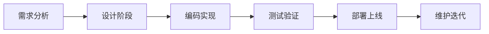

# 项目记录

记录个人项目的开发过程、技术选型、架构设计和经验总结。

## 🚀 项目列表

### Web开发项目
- **个人博客系统** - 基于Django的博客平台
- **在线笔记应用** - 使用React + Node.js开发
- **电商网站** - Vue.js + Express.js全栈项目

### 数据科学项目
- **数据可视化仪表板** - 使用Python + Streamlit
- **机器学习预测模型** - scikit-learn项目实践
- **爬虫项目** - 网站数据采集与分析

### 移动应用
- **待办事项App** - React Native跨平台应用
- **天气预报App** - Flutter开发的移动应用

## 📋 项目模板

### 项目记录模板
```markdown
# 项目名称

## 项目概述
- **项目描述**：简要描述项目功能和目标
- **开发时间**：2024年1月 - 2024年3月
- **项目状态**：开发中/已完成/维护中
- **在线演示**：项目演示链接
- **源码地址**：GitHub仓库链接

## 技术栈
- **前端**：React, TypeScript, Tailwind CSS
- **后端**：Node.js, Express, MongoDB
- **部署**：Docker, AWS/阿里云
- **其他**：Redis, Nginx

## 项目架构
[架构图或设计说明]

## 核心功能
1. 功能一：具体描述
2. 功能二：具体描述
3. 功能三：具体描述

## 开发过程
### 需求分析
[需求分析过程记录]

### 技术选型
[为什么选择这些技术]

### 遇到的问题
1. **问题描述**：具体问题
   - 解决方案：如何解决的
   - 学到的经验：总结经验

## 项目收获
- 技术收获
- 经验总结
- 改进方向

## 相关资源
- 参考文档
- 学习资料
- 第三方库
```

## 🛠️ 开发流程

### 项目初始化
1. **需求分析**：明确项目目标和功能需求
2. **技术调研**：评估可行的技术方案
3. **架构设计**：设计系统架构和数据库
4. **环境搭建**：配置开发环境和工具链

### 开发阶段


### 代码管理
- 使用Git进行版本控制
- 遵循代码规范和最佳实践
- 编写清晰的提交信息
- 定期备份重要数据

## 📊 项目统计

| 项目类型 | 完成数量 | 进行中 | 计划中 |
|---------|---------|-------|-------|
| Web应用  | 3       | 1     | 2     |
| 数据科学 | 2       | 1     | 1     |
| 移动应用 | 1       | 0     | 1     |
| 工具类   | 4       | 0     | 0     |

## 💡 经验总结

!!! tip "项目开发经验"
    
    1. **前期规划很重要**：需求不明确会导致后期大量返工
    2. **选择合适的技术栈**：不要为了技术而技术，要考虑项目实际需要
    3. **持续集成和部署**：自动化流程可以大大提高效率
    4. **代码质量**：好的代码结构便于维护和扩展
    5. **文档记录**：及时记录开发过程和决策原因

## 🎯 下一步计划

- [ ] 完善现有项目的文档
- [ ] 学习新的前端框架
- [ ] 尝试微服务架构
- [ ] 参与开源项目贡献
- [ ] 构建个人技术品牌

---

Tags: #项目记录 #开发经验 #技术成长 