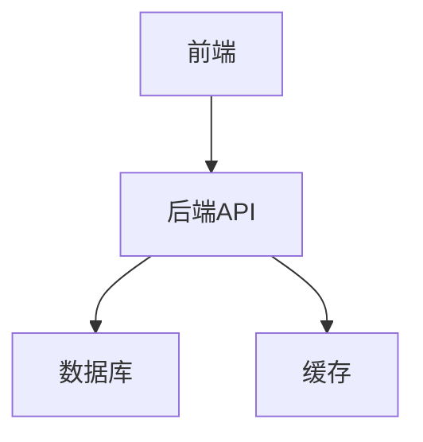

# 项目名称

## 📋 项目信息
- **项目类型**：Web应用/数据分析/工具开发
- **开发时间**：2024年X月 - Y月
- **项目状态**：🟢 进行中 / 🔵 已完成 / 🟡 暂停 / 🔴 已终止
- **技术栈**：Python, Django, PostgreSQL
- **团队规模**：个人项目 / X人团队

## 🎯 项目目标
描述项目要解决的问题和预期目标。

## 🏗️ 系统架构

## 🛠️ 技术选型

| 组件 | 技术 | 原因 |
|------|------|------|
| 前端 | React | 组件化开发 |
| 后端 | Django | 快速开发 |
| 数据库 | PostgreSQL | 数据一致性 |

## 📅 开发进度

### 已完成
- [x] 需求分析
- [x] 技术调研
- [x] 原型设计

### 进行中
- [ ] 后端API开发
- [ ] 前端界面开发

### 计划中
- [ ] 测试部署
- [ ] 性能优化

## 🐛 问题记录

### 问题1：数据库连接超时
**描述**：在高并发情况下出现连接超时
**解决方案**：增加连接池大小，优化查询语句
**学到的经验**：数据库连接池配置的重要性

### 问题2：前端页面加载慢
**描述**：首页加载时间超过3秒
**解决方案**：代码分割，懒加载
**学到的经验**：前端性能优化技巧

## 📈 项目亮点
- 功能特色1
- 技术创新点2
- 解决的难题3

## 🎓 经验总结
- **技术收获**：
- **项目管理**：
- **团队协作**：
- **改进方向**：

## 🔗 相关链接
- **源码仓库**：[GitHub](链接)
- **在线演示**：[Demo](链接)
- **设计文档**：[文档](链接)

---
**标签**：#项目记录 #Web开发 #Django
**创建时间**：2024-01-01
**最后更新**：2024-01-01 